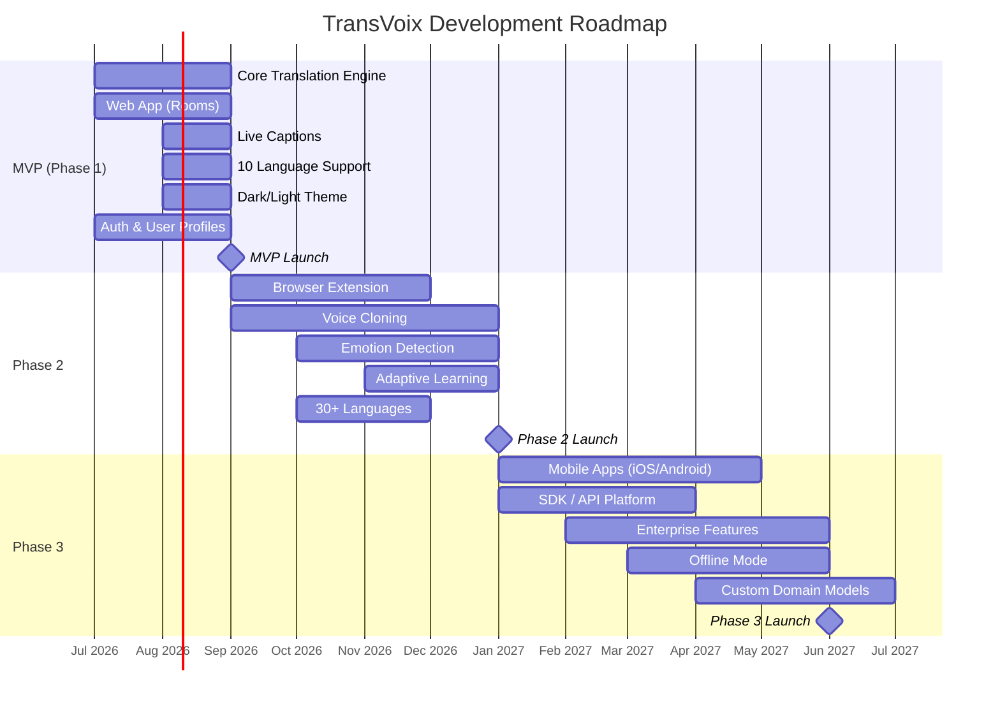
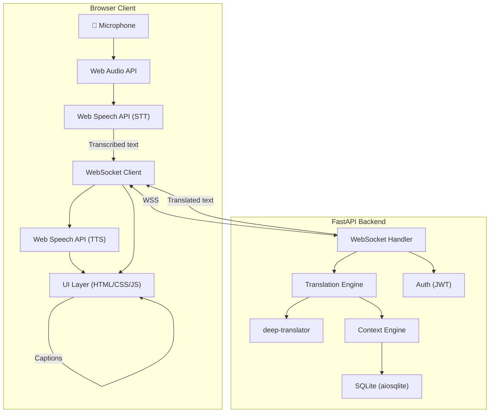
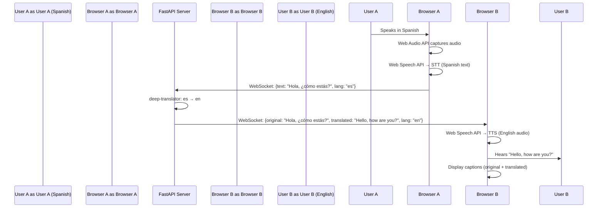
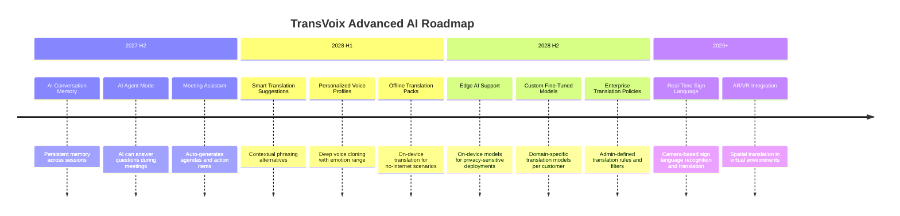

# TransVoix — Product Requirements Document (PRD)

> **Document Version:** 1.0  
> **Last Updated:** July 10, 2026  
> **Author:** TransVoix Product Team  
> **Status:** Draft — Pending Stakeholder Review  
> **Confidentiality:** Internal Use Only

---

## Table of Contents

1. [Vision](#1-vision)
2. [Problem Statement](#2-problem-statement)
3. [Goals & Objectives](#3-goals--objectives)
4. [User Personas](#4-user-personas)
5. [Success Metrics](#5-success-metrics)
6. [MVP Definition & Phasing](#6-mvp-definition--phasing)
7. [Feature List](#7-feature-list)
8. [User Stories](#8-user-stories)
9. [Technical Architecture Overview](#9-technical-architecture-overview)
10. [Future Roadmap](#10-future-roadmap)
11. [Competitive Analysis](#11-competitive-analysis)
12. [Monetization Strategy](#12-monetization-strategy)
13. [Risks & Mitigations](#13-risks--mitigations)
14. [Appendix](#14-appendix)

---

## 1. Vision

> [!IMPORTANT]
> **TransVoix is a universal AI communication layer that enables anyone, anywhere, to converse naturally — regardless of the language they speak.**

Every participant speaks in their own language and hears others in their preferred language, in real time. Voice cloning technology preserves each speaker's **tone, pitch, emotion, and personality**, making translated speech feel authentic and human — not robotic.

TransVoix aims to make language invisible. Whether you're chatting with a stranger on a random video platform, presenting in a boardroom, coordinating with teammates in a game, or consulting a doctor across continents — TransVoix ensures the conversation flows as if everyone spoke the same language.

### Vision Statement

```
"A world where language is never a barrier — where every voice is heard, 
understood, and felt, exactly as it was meant to be."
```

### Core Principles

| Principle | Description |
|---|---|
| **Invisibility** | Translation should be seamless — users should forget it's happening |
| **Authenticity** | Cloned voices and preserved emotion make speech feel real |
| **Universality** | Works everywhere — any platform, any device, any language |
| **Privacy-First** | Audio is processed, never stored without consent; E2E encryption by default |
| **Speed** | Sub-second latency makes conversations feel natural |

---

## 2. Problem Statement

### The Language Barrier Crisis

The world has **7,000+ languages** and **8 billion people**. Yet most communication tools assume everyone speaks the same language. When they don't, conversations break down:

- **Random Video Chat** (Monkey, Omegle alternatives) — Users are matched with strangers worldwide but can't communicate if they don't share a language. The experience is frustrating and leads to immediate disconnection.
- **Professional Meetings** (Zoom, Teams, Google Meet) — International teams lose productivity to miscommunication. Hiring interpreters is expensive and doesn't scale.
- **Social Messaging** (Discord, WhatsApp, Telegram) — Global communities fragment along language lines. Cross-language friendships never form.
- **Gaming** — Competitive and cooperative games require real-time coordination. Language mismatch leads to lost games and toxic experiences.
- **Education** — International students struggle with lecture content. Language limits access to knowledge.
- **Healthcare** — Misdiagnosis, medication errors, and poor outcomes result from provider-patient language gaps. Lives are at risk.
- **Legal & Government** — Individuals cannot advocate for themselves in legal proceedings conducted in a language they don't understand.

### Why Current Solutions Fail

| Limitation | Impact |
|---|---|
| **Robotic voice output** | Listeners disengage; translated speech feels unnatural and impersonal |
| **High latency (2–5+ seconds)** | Conversations lose their natural rhythm; speakers talk over each other |
| **Loss of emotion and context** | Sarcasm, urgency, warmth, and nuance are stripped away |
| **Manual setup required** | Users must select languages, copy-paste text, or switch apps |
| **No platform integration** | Solutions are standalone apps, not embedded where conversations happen |
| **Privacy concerns** | Audio is uploaded to third-party servers with unclear retention policies |
| **Limited language support** | Most tools support 10–20 languages well; long-tail languages are ignored |

> [!CAUTION]
> In healthcare and legal contexts, poor translation can have life-altering consequences. TransVoix treats accuracy in these domains as a safety-critical requirement.

---

## 3. Goals & Objectives

### Primary Goals

| # | Goal | Target |
|---|---|---|
| G1 | **Real-time bidirectional translation** | < 1 second end-to-end latency (STT → Translate → TTS) |
| G2 | **Voice cloning** | Preserve speaker identity so translated speech sounds like the original speaker |
| G3 | **Emotion preservation** | Detect and reproduce emotion (joy, anger, urgency, sarcasm) across languages |
| G4 | **Broad language support** | 50+ languages with high-quality translation |
| G5 | **Universal platform reach** | Work across 30+ communication platforms via browser extension |
| G6 | **Adaptive learning** | Learn user vocabulary, preferences, and domain jargon over time |
| G7 | **Enterprise-grade security** | End-to-end encryption, SOC 2 compliance, GDPR/HIPAA readiness |

### Measurable Objectives (12-Month Targets)

| Objective | Metric | Target |
|---|---|---|
| Latency | P50 end-to-end | ≤ 500ms |
| Latency | P95 end-to-end | ≤ 1,000ms |
| Accuracy | BLEU score (common pairs) | ≥ 0.45 |
| Retention | 30-day user retention | ≥ 40% |
| Scale | Concurrent translation sessions | 10,000+ |
| Languages | Supported languages | 50+ |
| Platforms | Browser extension compatibility | 30+ platforms |

---

## 4. User Personas

### Persona 1: Casual Chatter — "Luna"

| Attribute | Detail |
|---|---|
| **Age** | 19 |
| **Location** | São Paulo, Brazil |
| **Language** | Portuguese (native), basic English |
| **Platforms** | Monkey, Omegle alternatives, Discord |
| **Goal** | Meet and chat with people worldwide without language anxiety |
| **Pain Point** | Gets matched with non-Portuguese speakers and has to skip; feels isolated |
| **TransVoix Value** | Can speak Portuguese and hear the other person in Portuguese, making every match a real conversation |

### Persona 2: Business Professional — "Raj"

| Attribute | Detail |
|---|---|
| **Age** | 38 |
| **Location** | Bangalore, India |
| **Language** | Hindi, English, basic Japanese |
| **Platforms** | Zoom, Google Meet, Slack |
| **Goal** | Run meetings with Japanese and German clients without an interpreter |
| **Pain Point** | Hiring interpreters costs $200+/hour; automated tools sound robotic and lose nuance |
| **TransVoix Value** | Real-time translation with voice cloning makes him sound natural in every language; custom dictionaries handle industry jargon |

### Persona 3: Gamer — "Kai"

| Attribute | Detail |
|---|---|
| **Age** | 22 |
| **Location** | Seoul, South Korea |
| **Language** | Korean (native) |
| **Platforms** | Discord, in-game voice chat (Valorant, League of Legends) |
| **Goal** | Coordinate with international teammates in real time |
| **Pain Point** | Can't call out strategies fast enough through text translation; voice chat is unusable with non-Korean speakers |
| **TransVoix Value** | Speaks Korean, teammates hear callouts in their language with <1 second delay — fast enough for competitive play |

### Persona 4: Healthcare Worker — "Dr. Amara"

| Attribute | Detail |
|---|---|
| **Age** | 45 |
| **Location** | London, UK |
| **Language** | English (native), French |
| **Platforms** | Hospital telehealth system, WhatsApp (patient follow-ups) |
| **Goal** | Communicate accurately with patients who speak Arabic, Urdu, or Somali |
| **Pain Point** | Hospital interpreters are unavailable for emergency consultations; machine translation misses medical terms |
| **TransVoix Value** | Medical-domain custom dictionary ensures accurate translation of symptoms, medications, and instructions; emotion detection flags patient distress |

### Persona 5: International Student — "Yuki"

| Attribute | Detail |
|---|---|
| **Age** | 20 |
| **Location** | Tokyo, Japan (studying in Berlin) |
| **Language** | Japanese (native), beginner German |
| **Platforms** | University lecture platforms, study group chats, WhatsApp |
| **Goal** | Understand lectures in German and participate in study groups |
| **Pain Point** | Misses key concepts in lectures; too embarrassed to ask questions in broken German |
| **TransVoix Value** | Live captions in Japanese during lectures; can ask questions in Japanese that are heard in German by the professor |

### Persona 6: Developer — "Alex"

| Attribute | Detail |
|---|---|
| **Age** | 30 |
| **Location** | San Francisco, USA |
| **Language** | English |
| **Platforms** | Custom-built apps, internal tools |
| **Goal** | Integrate real-time translation into their company's customer support platform |
| **Pain Point** | Building translation infrastructure from scratch is expensive and unreliable |
| **TransVoix Value** | SDK/API provides drop-in real-time translation with voice cloning; pay-per-minute pricing scales with usage |

### Persona 7: Enterprise Admin — "Fatima"

| Attribute | Detail |
|---|---|
| **Age** | 42 |
| **Location** | Dubai, UAE |
| **Language** | Arabic, English |
| **Platforms** | Microsoft Teams, internal enterprise tools |
| **Goal** | Deploy translation across a 5,000-person multinational organization |
| **Pain Point** | Needs SSO integration, usage analytics, custom translation policies, and compliance guarantees |
| **TransVoix Value** | Enterprise dashboard with per-department analytics, custom dictionaries per team, SSO via SAML/OIDC, SLA-backed uptime |

---

## 5. Success Metrics

### Core KPIs

| Category | Metric | Definition | Target (MVP) | Target (12-mo) |
|---|---|---|---|---|
| **Performance** | Translation Latency (P50) | 50th percentile end-to-end time from speech input to translated audio output | ≤ 800ms | ≤ 500ms |
| **Performance** | Translation Latency (P95) | 95th percentile | ≤ 1,500ms | ≤ 1,000ms |
| **Performance** | Translation Latency (P99) | 99th percentile | ≤ 3,000ms | ≤ 1,500ms |
| **Quality** | Translation Accuracy (BLEU) | BLEU score on standardized test sets for supported language pairs | ≥ 0.35 | ≥ 0.45 |
| **Quality** | Voice Quality (MOS) | Mean Opinion Score for synthesized voice output (1–5 scale) | ≥ 3.5 | ≥ 4.2 |
| **Engagement** | DAU | Daily Active Users | 1,000 | 50,000 |
| **Engagement** | MAU | Monthly Active Users | 5,000 | 200,000 |
| **Engagement** | Session Duration | Average time spent in a translation session | ≥ 5 min | ≥ 12 min |
| **Retention** | D1 Retention | % of users returning the day after first use | ≥ 30% | ≥ 50% |
| **Retention** | D30 Retention | % of users returning 30 days after first use | ≥ 15% | ≥ 40% |
| **Growth** | Languages Used | Unique language pairs used per week | ≥ 20 pairs | ≥ 200 pairs |
| **Platform** | API Adoption Rate | Number of registered API developers | — | 500+ |
| **Platform** | API Calls/Day | Daily API translation requests | — | 100,000+ |
| **Revenue** | MRR | Monthly Recurring Revenue | — | $50,000 |
| **Reliability** | Uptime | Service availability | 99.5% | 99.9% |

### Tracking & Instrumentation

- All latency metrics tracked via server-side tracing (OpenTelemetry)
- BLEU scores evaluated weekly against curated test sets
- MOS scores collected via periodic user surveys and automated PESQ analysis
- Engagement metrics via Mixpanel/PostHog integration
- API metrics via internal analytics dashboard

---

## 6. MVP Definition & Phasing



### Phase 1 — MVP

> [!IMPORTANT]
> MVP goal: Prove that real-time voice-to-voice translation in a browser works well enough for users to have natural conversations.

| Feature | Description |
|---|---|
| **Web Application** | Vanilla HTML/CSS/JS frontend served by FastAPI backend |
| **Translation Rooms** | Create or join a room via shareable link; each participant selects their language |
| **Real-Time STT** | Browser-based speech-to-text via Web Speech API |
| **Translation Engine** | Server-side translation via `deep-translator` (Google Translate backend) |
| **Real-Time TTS** | Browser-based text-to-speech via Web Speech API + Web Audio API |
| **WebSocket Streaming** | Full-duplex communication for real-time audio/text transport |
| **Live Captions** | Scrolling captions showing original and translated text |
| **10 Languages** | English, Spanish, French, German, Mandarin, Japanese, Korean, Portuguese, Arabic, Hindi |
| **Dark/Light Theme** | User-selectable UI theme with system preference detection |
| **User Authentication** | Email/password registration and login |
| **Session Persistence** | SQLite via `aiosqlite` for user profiles, preferences, and session history |
| **Basic Analytics** | Session count, language pair usage, average session duration |

### Phase 2 — Platform Expansion

| Feature | Description |
|---|---|
| **Browser Extension** | Chrome/Firefox/Edge extension that overlays translation on any voice-enabled website |
| **Voice Cloning** | Generate a voice model from 30 seconds of user speech; use it for TTS output |
| **Emotion Detection** | Analyze speech prosody (pitch, rate, volume) to detect emotion; apply to TTS |
| **Adaptive Learning** | Learn user vocabulary, preferred phrasings, and domain-specific terms |
| **30+ Languages** | Expand to 30+ languages including Thai, Vietnamese, Turkish, Dutch, Polish, etc. |
| **Custom Dictionaries** | User-defined term mappings for jargon, brand names, and domain-specific vocabulary |
| **Recording & Export** | Record translated sessions; export as audio, text transcript, or SRT subtitles |
| **Enhanced Audio Processing** | Noise suppression, echo cancellation, automatic gain control |

### Phase 3 — Enterprise & Scale

| Feature | Description |
|---|---|
| **Mobile Apps** | Native iOS and Android applications |
| **SDK / API Platform** | RESTful API and WebSocket SDK for third-party integration |
| **Enterprise Dashboard** | Organization-level user management, analytics, and billing |
| **SSO Integration** | SAML 2.0 and OIDC single sign-on |
| **Offline Mode** | Download language packs for offline translation (reduced quality) |
| **Custom Domain Models** | Fine-tuned translation models for medical, legal, and technical domains |
| **On-Premise Deployment** | Self-hosted option for regulated industries |
| **50+ Languages** | Full language expansion including low-resource languages |

---

## 7. Feature List

### Priority Definitions

| Priority | Label | Definition |
|---|---|---|
| **P0** | Critical | Must have for MVP launch. Blocks release if missing. |
| **P1** | High | Required within 3 months of MVP. Core to product value. |
| **P2** | Medium | Important for competitive differentiation. Target Phase 2–3. |
| **P3** | Low | Nice-to-have. Future roadmap or community-requested. |

### 7.1 Translation Engine

| # | Feature | Priority | Phase | Description |
|---|---|---|---|---|
| TE-01 | Real-Time STT | P0 | MVP | Browser-based speech recognition via Web Speech API with streaming interim results |
| TE-02 | Server-Side Translation | P0 | MVP | `deep-translator` integration for text translation across language pairs |
| TE-03 | Real-Time TTS | P0 | MVP | Browser-based speech synthesis via Web Speech API with language-appropriate voices |
| TE-04 | WebSocket Transport | P0 | MVP | Full-duplex WebSocket connections for streaming text/audio between clients and server |
| TE-05 | Streaming Translation | P1 | 2 | Translate partial sentences as they're spoken (incremental/streaming mode) |
| TE-06 | Context-Aware Translation | P1 | 2 | Use conversation history to improve translation accuracy (pronouns, references) |
| TE-07 | Multi-Engine Fallback | P2 | 2 | Fall back to alternative translation engines if primary engine fails or returns low confidence |
| TE-08 | Custom Translation Models | P3 | 3 | Fine-tuned models per domain (medical, legal, gaming) for higher accuracy |

### 7.2 Language Negotiation

| # | Feature | Priority | Phase | Description |
|---|---|---|---|---|
| LN-01 | Manual Language Selection | P0 | MVP | User selects their spoken language and preferred listening language |
| LN-02 | Auto Language Detection | P1 | 2 | Automatically detect the language being spoken and configure translation accordingly |
| LN-03 | Multi-Language Rooms | P1 | 2 | Rooms with 3+ participants, each speaking different languages, all hearing in their preferred language |
| LN-04 | Language Preference Profiles | P2 | 2 | Save language preferences per user; auto-apply when joining rooms |
| LN-05 | Dialect Support | P3 | 3 | Distinguish between dialects (e.g., Brazilian Portuguese vs. European Portuguese) |

### 7.3 Voice Cloning & Synthesis

| # | Feature | Priority | Phase | Description |
|---|---|---|---|---|
| VC-01 | Default TTS Voices | P0 | MVP | High-quality default voices per language via Web Speech API |
| VC-02 | Voice Enrollment | P1 | 2 | Capture 30-second voice sample to create personalized voice model |
| VC-03 | Real-Time Voice Cloning | P2 | 2 | Apply voice model to TTS output so translated speech sounds like the original speaker |
| VC-04 | Voice Profile Storage | P2 | 2 | Securely store and manage voice profiles; allow deletion at any time |
| VC-05 | Cross-Language Voice Consistency | P3 | 3 | Maintain voice identity across all target languages |

### 7.4 Emotion Preservation

| # | Feature | Priority | Phase | Description |
|---|---|---|---|---|
| EP-01 | Prosody Analysis | P1 | 2 | Analyze pitch, speaking rate, volume, and intonation patterns |
| EP-02 | Emotion Classification | P2 | 2 | Classify detected emotion (happy, sad, angry, urgent, neutral, sarcastic) |
| EP-03 | Emotion-Aware TTS | P2 | 2 | Modulate TTS output to reflect detected emotion |
| EP-04 | Emotion Indicators | P2 | 2 | Display subtle emoji or color indicators in captions to show detected emotion |
| EP-05 | Cultural Emotion Mapping | P3 | 3 | Adapt emotional expression to cultural norms of the target language |

### 7.5 Live Captions & Display

| # | Feature | Priority | Phase | Description |
|---|---|---|---|---|
| LC-01 | Real-Time Captions | P0 | MVP | Scrolling text display of original speech and translation |
| LC-02 | Dual-Language Captions | P0 | MVP | Show both original and translated text side-by-side or stacked |
| LC-03 | Caption Customization | P1 | 2 | Adjustable font size, position, background opacity, and color |
| LC-04 | Caption Search | P2 | 2 | Search through caption history within a session |
| LC-05 | Caption Export | P2 | 2 | Export captions as SRT, VTT, or plain text |

### 7.6 AI Context Engine

| # | Feature | Priority | Phase | Description |
|---|---|---|---|---|
| CE-01 | Conversation Context Tracking | P1 | 2 | Maintain rolling context window to improve translation coherence |
| CE-02 | Named Entity Recognition | P2 | 2 | Detect and preserve proper nouns, brand names, and technical terms |
| CE-03 | Domain Detection | P2 | 3 | Auto-detect conversation domain (medical, legal, casual) and apply appropriate terminology |
| CE-04 | Disambiguation | P3 | 3 | Resolve ambiguous words using conversation context |

### 7.7 Custom Dictionaries

| # | Feature | Priority | Phase | Description |
|---|---|---|---|---|
| CD-01 | Personal Dictionary | P1 | 2 | Users add custom term→translation mappings |
| CD-02 | Team Dictionaries | P2 | 3 | Shared dictionaries within an organization or team |
| CD-03 | Dictionary Import/Export | P2 | 3 | Import/export dictionaries as CSV or JSON |
| CD-04 | Auto-Suggest Entries | P3 | 3 | AI suggests dictionary entries based on frequently corrected translations |

### 7.8 Audio Processing

| # | Feature | Priority | Phase | Description |
|---|---|---|---|---|
| AP-01 | Echo Cancellation | P0 | MVP | Prevent feedback loops when speaker and listener are in the same room |
| AP-02 | Noise Suppression | P1 | 2 | AI-based background noise removal |
| AP-03 | Automatic Gain Control | P1 | 2 | Normalize volume levels across speakers |
| AP-04 | Voice Activity Detection | P0 | MVP | Detect when a user is speaking vs. silent to avoid sending noise |
| AP-05 | Audio Mixing | P2 | 2 | Mix original audio at low volume under translated audio for natural feel |

### 7.9 Recording & Export

| # | Feature | Priority | Phase | Description |
|---|---|---|---|---|
| RE-01 | Session Recording | P1 | 2 | Record full translated sessions (audio + captions) |
| RE-02 | Transcript Export | P1 | 2 | Export conversation transcript as text, PDF, or DOCX |
| RE-03 | Audio Export | P2 | 2 | Export translated audio as MP3 or WAV |
| RE-04 | Meeting Summary | P2 | 3 | AI-generated summary of the conversation with action items |

### 7.10 Browser Extension

| # | Feature | Priority | Phase | Description |
|---|---|---|---|---|
| BE-01 | Chrome Extension | P1 | 2 | Manifest V3 extension that intercepts and translates audio on any website |
| BE-02 | Firefox Extension | P2 | 2 | Firefox-compatible version |
| BE-03 | Edge Extension | P2 | 2 | Edge-compatible version |
| BE-04 | Platform Detection | P1 | 2 | Auto-detect supported platforms (Zoom, Discord, etc.) and optimize integration |
| BE-05 | Floating Widget | P1 | 2 | Minimal floating UI for controlling translation without leaving the platform |
| BE-06 | Hotkey Controls | P2 | 2 | Keyboard shortcuts for mute, language switch, and toggle translation |

### 7.11 Accessibility

| # | Feature | Priority | Phase | Description |
|---|---|---|---|---|
| AC-01 | Keyboard Navigation | P0 | MVP | Full keyboard accessibility for all UI controls |
| AC-02 | Screen Reader Support | P1 | MVP | ARIA labels and roles for screen reader compatibility |
| AC-03 | High Contrast Mode | P1 | 2 | High contrast color scheme option |
| AC-04 | Caption-Only Mode | P1 | 2 | Text-only mode for hearing-impaired users |
| AC-05 | Sign Language (Future) | P3 | 3+ | Real-time sign language recognition and translation |

### 7.12 Privacy & Security

| # | Feature | Priority | Phase | Description |
|---|---|---|---|---|
| PS-01 | User Authentication | P0 | MVP | Secure email/password authentication with hashed passwords |
| PS-02 | HTTPS Enforcement | P0 | MVP | All connections via TLS 1.3 |
| PS-03 | WebSocket Security | P0 | MVP | WSS (WebSocket Secure) for all real-time connections |
| PS-04 | E2E Encryption | P1 | 2 | End-to-end encryption for audio streams |
| PS-05 | Data Minimization | P0 | MVP | Audio processed in real-time and discarded; no persistent audio storage by default |
| PS-06 | GDPR Compliance | P1 | 2 | Data export, deletion, and consent management |
| PS-07 | HIPAA Readiness | P2 | 3 | BAA support, audit logs, access controls for healthcare deployments |
| PS-08 | SOC 2 Type II | P2 | 3 | Compliance certification for enterprise customers |
| PS-09 | Consent Management | P1 | 2 | All participants must consent to translation and recording |

### 7.13 Analytics & Insights

| # | Feature | Priority | Phase | Description |
|---|---|---|---|---|
| AN-01 | Personal Usage Stats | P1 | MVP | Minutes translated, languages used, session count |
| AN-02 | Admin Dashboard | P2 | 3 | Organization-level usage analytics and cost tracking |
| AN-03 | Translation Quality Feedback | P1 | 2 | Users can rate/flag translations for quality improvement |
| AN-04 | Language Pair Analytics | P2 | 3 | Most/least used language pairs, quality scores per pair |
| AN-05 | Real-Time Monitoring | P2 | 3 | Live dashboard of active sessions, latency, and error rates |

### 7.14 Monetization & Billing

| # | Feature | Priority | Phase | Description |
|---|---|---|---|---|
| MB-01 | Free Tier Enforcement | P0 | MVP | 30 min/day usage limit with 5 languages |
| MB-02 | Subscription Management | P1 | 2 | Stripe integration for Premium/Business plan billing |
| MB-03 | Usage Metering | P1 | 2 | Track per-minute usage for billing and limits |
| MB-04 | API Key Management | P2 | 3 | Generate and manage API keys for developer access |
| MB-05 | Invoice & Receipts | P2 | 3 | Automated billing documents for business/enterprise customers |

---

## 8. User Stories

### Translation Core

| ID | Story | Priority | Persona |
|---|---|---|---|
| US-01 | As a **casual chatter**, I want to speak in Portuguese and hear the other person's speech in Portuguese so that I can chat with anyone regardless of their language. | P0 | Luna |
| US-02 | As a **business professional**, I want to see live captions in both the original language and my language so that I can follow along when translation audio overlaps with speaking. | P0 | Raj |
| US-03 | As a **gamer**, I want translation latency under 1 second so that voice callouts are useful in fast-paced competitive games. | P0 | Kai |
| US-04 | As a **healthcare worker**, I want a medical-domain custom dictionary so that symptoms, medications, and procedures are translated accurately. | P1 | Dr. Amara |
| US-05 | As a **student**, I want to record translated lectures so that I can review them later in my native language. | P1 | Yuki |

### Voice & Emotion

| ID | Story | Priority | Persona |
|---|---|---|---|
| US-06 | As a **casual chatter**, I want the translated voice to sound like the person I'm talking to so that the conversation feels personal and real. | P2 | Luna |
| US-07 | As a **healthcare worker**, I want the system to detect when a patient sounds distressed so that I can respond with appropriate urgency. | P2 | Dr. Amara |
| US-08 | As a **business professional**, I want my translated voice to preserve my tone and authority so that I maintain credibility in negotiations. | P2 | Raj |

### Platform & Integration

| ID | Story | Priority | Persona |
|---|---|---|---|
| US-09 | As a **gamer**, I want a browser extension that works with Discord so that I don't have to leave my gaming workflow for translation. | P1 | Kai |
| US-10 | As a **developer**, I want a WebSocket API so that I can integrate real-time translation into my company's customer support chat. | P2 | Alex |
| US-11 | As an **enterprise admin**, I want SSO integration so that my employees can log in with their corporate credentials. | P2 | Fatima |

### Management & Control

| ID | Story | Priority | Persona |
|---|---|---|---|
| US-12 | As an **enterprise admin**, I want a dashboard showing translation usage per department so that I can manage costs and justify ROI. | P2 | Fatima |
| US-13 | As a **student**, I want to save my language preferences so that I don't have to set them up every time I join a class. | P1 | Yuki |
| US-14 | As a **business professional**, I want to export meeting transcripts as a PDF so that I can share them with colleagues who weren't present. | P1 | Raj |
| US-15 | As a **casual chatter**, I want dark mode so that I can chat comfortably at night without eye strain. | P0 | Luna |

### Privacy & Trust

| ID | Story | Priority | Persona |
|---|---|---|---|
| US-16 | As a **healthcare worker**, I want all audio to be processed in real time and never stored on servers so that I comply with patient privacy regulations. | P0 | Dr. Amara |
| US-17 | As an **enterprise admin**, I want E2E encryption for all translation streams so that confidential business discussions remain secure. | P1 | Fatima |
| US-18 | As a **casual chatter**, I want to delete my voice profile at any time so that I maintain control over my biometric data. | P1 | Luna |

### Growth & Learning

| ID | Story | Priority | Persona |
|---|---|---|---|
| US-19 | As a **student**, I want the system to learn the technical vocabulary used in my computer science classes so that translations improve over time. | P2 | Yuki |
| US-20 | As a **developer**, I want per-minute API pricing so that I only pay for what I use during development and testing. | P2 | Alex |

---

## 9. Technical Architecture Overview

### Tech Stack

| Layer | Technology | Purpose |
|---|---|---|
| **Frontend** | Vanilla HTML / CSS / JavaScript | Lightweight, no framework overhead; maximum browser compatibility |
| **Backend** | FastAPI (Python 3.11+) | Async API server with WebSocket support |
| **Real-Time** | WebSockets (native + FastAPI) | Full-duplex bidirectional communication |
| **Translation** | `deep-translator` | Multi-engine translation (Google, DeepL, MyMemory, etc.) |
| **Database** | SQLite via `aiosqlite` | Async database for user data, preferences, and session history |
| **Audio (Client)** | Web Audio API | Audio capture, processing, and playback |
| **Speech (Client)** | Web Speech API | Speech recognition (STT) and speech synthesis (TTS) |
| **Auth** | JWT tokens | Stateless authentication |

### Architecture Diagram



### Data Flow (Single Translation)



---

## 10. Future Roadmap

### Phase 4+ — Advanced AI Features



#### AI Conversation Memory

| Attribute | Detail |
|---|---|
| **Description** | Persist conversation context across sessions. The system remembers previous discussions with the same participants, including names, topics, decisions, and action items. |
| **Use Case** | "When I last spoke with Tanaka-san, we agreed on Q3 pricing. TransVoix remembers this and provides context when we reconnect." |
| **Technical Approach** | Vector embeddings of conversation summaries stored per user pair; retrieved via semantic search at session start. |
| **Privacy** | Opt-in only. Users control what is remembered. Full deletion available. |

#### AI Agent Mode

| Attribute | Detail |
|---|---|
| **Description** | An AI participant that can answer factual questions, look up data, or provide context during a live conversation — without interrupting the flow. |
| **Use Case** | During a sales call: "What's the current exchange rate for EUR to JPY?" — the AI responds in the target language without either party needing to leave the conversation. |
| **Technical Approach** | LLM integration (e.g., Gemini API) triggered by wake word or @ mention; response injected into the translation stream. |

#### Meeting Assistant

| Attribute | Detail |
|---|---|
| **Description** | Automatically generates meeting agendas from previous conversations, takes notes during the meeting, produces summaries with action items, and sends follow-up reminders. |
| **Use Case** | After a 30-minute cross-language meeting, all participants receive a summary in their language with assigned action items and deadlines. |
| **Technical Approach** | LLM-based summarization pipeline; structured output with entity extraction for participants, decisions, and action items. |

#### Smart Translation Suggestions

| Attribute | Detail |
|---|---|
| **Description** | When the system detects that a translation might be ambiguous or culturally sensitive, it suggests alternative phrasings and lets the speaker choose before sending. |
| **Use Case** | A Japanese speaker uses an idiom that doesn't translate directly. TransVoix suggests three English alternatives ranked by formality and offers the speaker a quick pick. |
| **Technical Approach** | Confidence scoring on translations; low-confidence triggers suggestion UI with alternative translations from multiple engines. |

#### Personalized Voice Profiles (Deep Voice Cloning)

| Attribute | Detail |
|---|---|
| **Description** | Advanced voice cloning that captures not just timbre but the full range of a speaker's emotional expression — laughter, whisper, emphasis, sarcasm. |
| **Use Case** | A CEO's translated speech sounds exactly like them in every language — including their characteristic pauses and emphasis patterns. |
| **Technical Approach** | Neural voice synthesis (e.g., XTTS, Bark) trained on extended voice samples (5+ minutes). Speaker embedding stored securely. |

#### Offline Translation Packs

| Attribute | Detail |
|---|---|
| **Description** | Downloadable language packs that enable translation without an internet connection. Lower quality than cloud-based translation but functional for essential communication. |
| **Use Case** | A humanitarian worker in a disaster zone with no internet can still communicate with local communities. |
| **Technical Approach** | Quantized on-device translation models (e.g., CTranslate2, ONNX); packaged with offline STT/TTS models. |

#### Edge AI Support

| Attribute | Detail |
|---|---|
| **Description** | Run translation models entirely on-device for maximum privacy and minimum latency. No data leaves the user's machine. |
| **Use Case** | A government agency requires that no audio or text data leaves their secure network. TransVoix runs entirely on their local infrastructure. |
| **Technical Approach** | WebAssembly or WebGPU-based inference; quantized transformer models; progressive enhancement (edge when possible, cloud fallback). |

#### Custom Fine-Tuned Translation Models

| Attribute | Detail |
|---|---|
| **Description** | Enterprise customers can fine-tune translation models on their proprietary terminology, style guides, and domain-specific corpora. |
| **Use Case** | A pharmaceutical company fine-tunes the EN↔DE model on their drug names, clinical trial terminology, and regulatory language. |
| **Technical Approach** | LoRA or adapter-based fine-tuning on base translation models; model versioning and A/B testing. |

#### Enterprise Translation Policies

| Attribute | Detail |
|---|---|
| **Description** | Admins define rules governing translation behavior: blocked terms, mandatory disclaimers, approved terminology, and content filters. |
| **Use Case** | A legal firm requires that specific contract terms are never translated (kept in original language) and that a disclaimer is appended to all translated legal documents. |
| **Technical Approach** | Rule engine applied post-translation; configurable via admin dashboard; audit log for policy violations. |

#### Real-Time Sign Language Translation

| Attribute | Detail |
|---|---|
| **Description** | Camera-based recognition of sign language (ASL, BSL, JSL, etc.) converted to text and speech, and vice versa — spoken language converted to avatar-based sign language. |
| **Use Case** | A deaf user signs in ASL; the hearing participant hears the translation in English. The hearing participant speaks, and the deaf user sees a signing avatar. |
| **Technical Approach** | Pose estimation (MediaPipe) + sign language classification model; avatar rendering for sign output. |

#### AR/VR Integration

| Attribute | Detail |
|---|---|
| **Description** | Spatial translation in augmented and virtual reality environments. Translated captions float near the speaker; voice translation is spatialized in 3D audio. |
| **Use Case** | In a VR meeting room, each participant hears others in their language with 3D positional audio. Captions float above each avatar. |
| **Technical Approach** | WebXR API integration; spatial audio rendering; head-tracked caption positioning. |

---

## 11. Competitive Analysis

| Feature | **TransVoix** | **Google Translate** | **Microsoft Translator** | **iTranslate** | **Interprefy** |
|---|---|---|---|---|---|
| **Real-Time Voice Translation** | ✅ < 1s latency | ⚠️ 2–3s latency | ⚠️ 2–3s latency | ⚠️ 2–4s latency | ✅ 1–2s (human-assisted) |
| **Voice Cloning** | ✅ Speaker sounds like themselves | ❌ Generic voice | ❌ Generic voice | ❌ Generic voice | ❌ N/A (human interpreters) |
| **Emotion Preservation** | ✅ Prosody + emotion transfer | ❌ Flat, robotic | ❌ Flat, robotic | ❌ Flat, robotic | ✅ Human interpreters |
| **Platform Integration** | ✅ Browser extension (30+ platforms) | ❌ Standalone app only | ⚠️ Teams/Skype only | ❌ Standalone app | ⚠️ Custom integrations |
| **Live Captions** | ✅ Dual-language, customizable | ✅ Basic | ✅ Good | ⚠️ Basic | ✅ Professional |
| **Languages** | 50+ (target) | 130+ | 100+ | 40+ | 20+ (human) |
| **Custom Dictionaries** | ✅ Personal + team | ❌ | ⚠️ Microsoft Translator Hub | ❌ | ✅ Glossaries |
| **Offline Mode** | ✅ (Phase 3) | ✅ Limited | ✅ Limited | ✅ | ❌ |
| **API / SDK** | ✅ (Phase 3) | ✅ Cloud Translation API | ✅ Translator API | ❌ | ❌ |
| **E2E Encryption** | ✅ | ❌ | ⚠️ Enterprise only | ❌ | ✅ |
| **Pricing** | Freemium ($0–$29.99/mo) | Free (API paid) | Free (API paid) | $5.99/mo | $$$$ (enterprise) |

### TransVoix Differentiators

> [!TIP]
> TransVoix's unique moat is the combination of **real-time voice cloning + emotion preservation + universal platform integration**. No competitor offers all three.

1. **Voice Cloning** — Translated speech sounds like the original speaker, not a robot
2. **Emotion Preservation** — Urgency, warmth, sarcasm all carry through translation
3. **Universal Platform Reach** — Works on Zoom, Discord, WhatsApp, and 30+ other platforms via browser extension
4. **Sub-Second Latency** — Fast enough for gaming and competitive conversations
5. **Privacy-First Architecture** — Audio processed and discarded; E2E encryption by default
6. **Adaptive Learning** — System improves with each conversation, learning user vocabulary and preferences

---

## 12. Monetization Strategy

### Tier Overview


### Detailed Tier Comparison

| Feature | Free | Premium | Business | Enterprise |
|---|---|---|---|---|
| **Price** | $0 | $9.99/mo | $29.99/mo per seat | Custom |
| **Daily Usage** | 30 minutes | Unlimited | Unlimited | Unlimited |
| **Languages** | 5 | 50+ | 50+ | 50+ + custom |
| **TTS Voice** | Default system voice | High-quality voices | High-quality voices | Custom voice models |
| **Voice Cloning** | ❌ | ✅ | ✅ | ✅ + deep cloning |
| **Live Captions** | ✅ | ✅ Customizable | ✅ Customizable | ✅ Customizable |
| **Recording** | ❌ | ✅ | ✅ | ✅ |
| **Transcript Export** | ❌ | ✅ (Text) | ✅ (Text, PDF, DOCX) | ✅ (All formats) |
| **Custom Dictionaries** | ❌ | ✅ Personal | ✅ Personal + Team | ✅ + managed |
| **Emotion Detection** | ❌ | ✅ | ✅ | ✅ |
| **Analytics** | Basic stats | Personal analytics | Team analytics dashboard | Enterprise dashboard |
| **Admin Controls** | ❌ | ❌ | ✅ | ✅ Advanced |
| **SSO** | ❌ | ❌ | ✅ SAML | ✅ SAML + OIDC |
| **SLA** | Best effort | 99.5% | 99.9% | Custom (99.99%) |
| **Support** | Community | Email (24h) | Priority (4h) | Dedicated CSM |
| **On-Premise** | ❌ | ❌ | ❌ | ✅ |
| **Compliance** | — | GDPR | GDPR | GDPR + HIPAA + SOC 2 |

### API Pricing

| Tier | Rate | Includes |
|---|---|---|
| **Developer (Free)** | 60 min/month free | Testing and prototyping |
| **Pay-As-You-Go** | $0.02/min (STT + Translate + TTS) | No commitment |
| **Volume** | $0.015/min (10,000+ min/mo) | Committed usage discount |
| **Enterprise API** | Custom | Dedicated infrastructure, SLA |

### Revenue Projections (12-Month)

| Quarter | Free Users | Paid Users | MRR |
|---|---|---|---|
| Q1 | 5,000 | 250 | $3,750 |
| Q2 | 15,000 | 1,000 | $15,000 |
| Q3 | 40,000 | 3,000 | $45,000 |
| Q4 | 100,000 | 8,000 | $120,000 |

> [!NOTE]
> Revenue projections assume a 5% free-to-paid conversion rate and an average of $15/mo blended ARPU across Premium and Business tiers.

---

## 13. Risks & Mitigations

| # | Risk | Severity | Probability | Mitigation |
|---|---|---|---|---|
| R1 | **Translation quality insufficient for professional use** | High | Medium | Multi-engine fallback; domain-specific fine-tuning; user feedback loop for continuous improvement |
| R2 | **Latency exceeds 1 second** | High | Medium | Edge caching; streaming translation; WebSocket optimization; CDN for static assets |
| R3 | **Web Speech API browser compatibility** | Medium | High | Feature detection with graceful fallback to server-side STT; polyfill for unsupported browsers |
| R4 | **Voice cloning used for fraud/impersonation** | High | Low | Watermark cloned audio; require consent from all parties; limit cloning to authenticated users |
| R5 | **Privacy regulations (GDPR, HIPAA) compliance gaps** | High | Medium | Privacy-by-design architecture; external compliance audit before enterprise launch |
| R6 | **Dependency on third-party translation APIs** | Medium | Medium | Abstract translation engine behind interface; support multiple providers; build toward self-hosted models |
| R7 | **Scaling WebSocket connections** | Medium | Medium | Horizontal scaling with connection pooling; load balancing; consider message broker (Redis Pub/Sub) |
| R8 | **Competitor launches similar feature** | Medium | High | Execute fast on voice cloning + emotion (unique differentiator); build community and switching costs |
| R9 | **Low free-to-paid conversion** | Medium | Medium | Ensure free tier is useful enough to demonstrate value; strategic feature gating; in-app upgrade prompts |
| R10 | **Audio quality degradation over WebSocket** | Low | Medium | Opus codec for compression; adaptive bitrate; quality monitoring and alerting |

---

## 14. Appendix

### A. Glossary

| Term | Definition |
|---|---|
| **STT** | Speech-to-Text — converting spoken audio to written text |
| **TTS** | Text-to-Speech — converting written text to spoken audio |
| **BLEU** | Bilingual Evaluation Understudy — automated metric for translation quality (0–1 scale) |
| **MOS** | Mean Opinion Score — subjective audio quality rating (1–5 scale) |
| **E2E Encryption** | End-to-end encryption — data encrypted on sender's device, decrypted only on receiver's device |
| **Voice Cloning** | Generating synthetic speech that mimics a specific person's voice characteristics |
| **Prosody** | The patterns of stress, rhythm, and intonation in speech |
| **WebSocket** | Protocol providing full-duplex communication channels over a single TCP connection |
| **DAU/MAU** | Daily/Monthly Active Users |
| **ARPU** | Average Revenue Per User |
| **LoRA** | Low-Rank Adaptation — efficient fine-tuning method for large language models |
| **SSO** | Single Sign-On — authentication mechanism allowing one login for multiple services |

### B. Supported Languages (MVP — Phase 1)

| # | Language | Code | STT Support | TTS Support |
|---|---|---|---|---|
| 1 | English | `en` | ✅ | ✅ |
| 2 | Spanish | `es` | ✅ | ✅ |
| 3 | French | `fr` | ✅ | ✅ |
| 4 | German | `de` | ✅ | ✅ |
| 5 | Mandarin Chinese | `zh` | ✅ | ✅ |
| 6 | Japanese | `ja` | ✅ | ✅ |
| 7 | Korean | `ko` | ✅ | ✅ |
| 8 | Portuguese | `pt` | ✅ | ✅ |
| 9 | Arabic | `ar` | ✅ | ✅ |
| 10 | Hindi | `hi` | ✅ | ✅ |

### C. References

- [Web Speech API Specification](https://wicg.github.io/speech-api/)
- [Web Audio API Specification](https://www.w3.org/TR/webaudio/)
- [FastAPI Documentation](https://fastapi.tiangolo.com/)
- [deep-translator Documentation](https://deep-translator.readthedocs.io/)
- [aiosqlite Documentation](https://aiosqlite.omnilib.dev/)
- [WebSocket Protocol (RFC 6455)](https://datatracker.ietf.org/doc/html/rfc6455)

---

> **Document Control**
> 
> | Version | Date | Author | Changes |
> |---|---|---|---|
> | 1.0 | July 10, 2026 | TransVoix Product Team | Initial PRD creation |
> 
> **Next Review Date:** July 24, 2026  
> **Approvers:** [Pending stakeholder assignment]
