# TransVoix — Software Design Document (SDD)

> **Project:** TransVoix — Universal Real-Time AI Communication Platform
> **Version:** 1.0.0
> **Date:** 2026-07-10
> **Authors:** TransVoix Engineering Team
> **Status:** Living Document

---

## Table of Contents

1. [High-Level Design](#1-high-level-design)
2. [Low-Level Design](#2-low-level-design)
3. [Component Diagram](#3-component-diagram)
4. [Deployment Diagram](#4-deployment-diagram)
5. [Database Design](#5-database-design)
6. [API Design](#6-api-design)
7. [WebSocket Protocol](#7-websocket-protocol)
8. [Sequence Diagrams](#8-sequence-diagrams)
9. [State Machine Diagrams](#9-state-machine-diagrams)
10. [Browser Extension Architecture](#10-browser-extension-architecture)
11. [AI Model Pipeline](#11-ai-model-pipeline)
12. [Scalability Architecture](#12-scalability-architecture)

---

## 1. High-Level Design

### 1.1 System Overview

TransVoix is a real-time, multi-participant voice translation platform that enables seamless cross-language communication. Users speak in their native language, and every other participant hears the translated message in their preferred language — all in real time.

### 1.2 Architectural Principles

| Principle | Description |
|---|---|
| **Layered Separation** | Each architectural layer has a single responsibility and communicates only with adjacent layers |
| **Stateless Application Layer** | FastAPI instances hold no persistent state; all state is externalized to the Data Layer or Redis |
| **Progressive Enhancement** | Browser APIs (Web Speech, Web Audio) provide the baseline; production upgrades (Whisper, XTTS) drop in without architectural change |
| **Graceful Degradation** | Every engine has a fallback chain — if the primary service fails, a secondary or cached result is used |
| **Real-Time First** | WebSocket is the primary transport for all latency-sensitive flows; REST is used only for CRUD and configuration |

### 1.3 Layered Architecture

```
┌─────────────────────────────────────────────────────────────────────┐
│                    PRESENTATION LAYER (Browser)                     │
│  ┌──────────┐  ┌──────────┐  ┌───────────┐  ┌───────────────────┐  │
│  │ Web Audio │  │Web Speech│  │  Caption   │  │  Session UI       │  │
│  │   API     │  │   API    │  │  Overlay   │  │  (Vanilla JS)     │  │
│  └──────────┘  └──────────┘  └───────────┘  └───────────────────┘  │
│  ┌──────────────────────────────────────────────────────────────┐   │
│  │              WebSocket Client (ws:// / wss://)               │   │
│  └──────────────────────────────────────────────────────────────┘   │
├─────────────────────────────────────────────────────────────────────┤
│                   APPLICATION LAYER (FastAPI)                       │
│  ┌──────────┐  ┌──────────┐  ┌───────────┐  ┌───────────────────┐  │
│  │  REST     │  │WebSocket │  │   Auth     │  │   Middleware      │  │
│  │  Routes   │  │  Handler │  │  (JWT)     │  │ (CORS, Rate Lim) │  │
│  └──────────┘  └──────────┘  └───────────┘  └───────────────────┘  │
├─────────────────────────────────────────────────────────────────────┤
│                    ENGINE LAYER (Python Modules)                    │
│  ┌──────────────┐ ┌───────────────┐ ┌──────────────┐              │
│  │ Translation   │ │   Language     │ │   Session     │              │
│  │ Engine        │ │  Negotiator    │ │   Manager     │              │
│  ├──────────────┤ ├───────────────┤ ├──────────────┤              │
│  │ Adaptive     │ │   Caption      │ │  Recording    │              │
│  │ Learner      │ │   Manager      │ │   Manager     │              │
│  ├──────────────┤ ├───────────────┤ ├──────────────┤              │
│  │ Security     │ │  Analytics     │ │  Voice        │              │
│  │ Manager      │ │   Engine       │ │  Engine       │              │
│  └──────────────┘ └───────────────┘ └──────────────┘              │
├─────────────────────────────────────────────────────────────────────┤
│                      DATA LAYER (SQLite / PostgreSQL)              │
│  ┌──────────┐  ┌──────────┐  ┌───────────┐  ┌──────────────────┐  │
│  │  Users    │  │ Sessions │  │ Profiles   │  │ Analytics Events │  │
│  ├──────────┤  ├──────────┤  ├───────────┤  ├──────────────────┤  │
│  │Recordings│  │  API Keys│  │Dictionaries│  │ Learned Prefs    │  │
│  └──────────┘  └──────────┘  └───────────┘  └──────────────────┘  │
├─────────────────────────────────────────────────────────────────────┤
│                   EXTERNAL SERVICES                                │
│  ┌──────────┐  ┌──────────┐  ┌───────────┐  ┌──────────────────┐  │
│  │ Google    │  │  MyMemory│  │  LibreTrans│  │  NLLB-200        │  │
│  │ Translate │  │  API     │  │  late      │  │  (future)        │  │
│  └──────────┘  └──────────┘  └───────────┘  └──────────────────┘  │
└─────────────────────────────────────────────────────────────────────┘
```

### 1.4 Data Flow Summary

1. **Speech Capture:** Browser captures audio via Web Audio API → applies noise gate + AGC → feeds to Web Speech API for STT.
2. **Text Transmission:** Recognized text is sent over WebSocket to FastAPI with language metadata and confidence score.
3. **Translation Routing:** `LanguageNegotiator` determines which language pairs are needed. `TranslationEngine` translates the text for each unique target language in the session.
4. **Fan-Out Delivery:** FastAPI broadcasts personalized translation payloads to each participant's WebSocket connection.
5. **Audio Synthesis:** Browser receives translated text → Web Speech Synthesis API renders TTS with emotion modulation → plays through speaker.
6. **Persistence:** Captions, recordings, analytics events, and learned preferences are asynchronously persisted to the Data Layer.

### 1.5 Cross-Cutting Concerns

| Concern | Implementation |
|---|---|
| **Authentication** | JWT (access + refresh tokens), OAuth 2.0 (Google, GitHub) |
| **Authorization** | Role-based (user / admin / enterprise), resource-level permissions |
| **Rate Limiting** | Token-bucket per API key, sliding window per IP |
| **Logging** | Structured JSON logs (structlog), correlation IDs per request |
| **Error Handling** | Global exception handlers, typed error codes, graceful WebSocket close |
| **CORS** | Configurable allowed origins, credentials support |
| **Encryption** | TLS 1.3 in transit, bcrypt password hashing, AES-256 for recordings at rest |

---

## 2. Low-Level Design

### 2.1 TranslationEngine

**Module:** `engines/translation_engine.py`

**Purpose:** Translates text between any supported language pair using a provider chain with intelligent caching.

#### Class Design

```python
class TranslationEngine:
    """Core translation engine with multi-provider fallback and caching."""

    def __init__(self, cache: TranslationCache, dictionary_store: DictionaryStore):
        self._cache = cache            # LRU + TTL cache
        self._dictionary_store = dictionary_store
        self._providers: list[TranslationProvider] = [
            GoogleTranslatorProvider(),
            MyMemoryProvider(),
            LibreTranslateProvider(),
        ]
        self._metrics = TranslationMetrics()

    async def translate(
        self,
        text: str,
        source_lang: str,
        target_lang: str,
        dictionary_id: str | None = None,
        context: str | None = None,
    ) -> TranslationResult:
        """Translate text with caching, dictionary overlay, and fallback."""
        ...

    async def translate_batch(
        self,
        items: list[TranslationRequest],
    ) -> list[TranslationResult]:
        """Batch translate multiple texts, optimizing provider calls."""
        ...

    def _apply_dictionary_overlay(
        self,
        text: str,
        translated: str,
        dictionary_id: str,
    ) -> str:
        """Replace terms using custom dictionary entries."""
        ...

    async def _translate_with_fallback(
        self,
        text: str,
        source: str,
        target: str,
    ) -> ProviderResult:
        """Try each provider in order until one succeeds."""
        ...

    def get_supported_languages(self) -> list[LanguageInfo]:
        """Return all supported languages across all providers."""
        ...
```

#### Caching Strategy

```
┌─────────────────────────────────────────────────┐
│              TranslationCache                    │
│                                                  │
│  Key: SHA-256(source_lang + target_lang + text)  │
│  Value: TranslationResult                        │
│                                                  │
│  ┌──────────────┐    ┌──────────────────┐       │
│  │  L1: In-Memory│───→│ L2: Redis (prod) │       │
│  │  LRU (10,000) │    │   TTL: 24 hours  │       │
│  │  TTL: 1 hour  │    │   Max: 1M entries│       │
│  └──────────────┘    └──────────────────┘       │
│                                                  │
│  Hit Rate Target: >60% for repeat phrases        │
│  Eviction: LRU with frequency-boosted scoring    │
└─────────────────────────────────────────────────┘
```

#### Fallback Chain

```
GoogleTranslator (primary, highest quality)
       │ fails
       ▼
MyMemoryTranslator (secondary, free tier)
       │ fails
       ▼
LibreTranslate (tertiary, self-hosted option)
       │ fails
       ▼
Return cached stale result (if available)
       │ fails
       ▼
Return error with original text as passthrough
```

---

### 2.2 LanguageNegotiator

**Module:** `engines/language_negotiator.py`

**Purpose:** Manages per-participant language preferences and computes optimal translation routes for a session.

#### Profile Structure

```python
@dataclass
class ParticipantProfile:
    """Language profile for a single session participant."""
    participant_id: str
    display_name: str
    spoken_language: str          # e.g., "hi" (Hindi)
    listening_language: str       # e.g., "ja" (Japanese)
    confidence_threshold: float   # 0.0–1.0, minimum detection confidence
    auto_detect_enabled: bool     # Whether to accept langdetect corrections
    understood_languages: list[str]  # Languages this participant can read/understand
```

#### Routing Algorithm

```python
class LanguageNegotiator:
    """Computes and maintains translation routes for a session."""

    def __init__(self):
        self._profiles: dict[str, ParticipantProfile] = {}
        self._route_table: dict[str, list[TranslationRoute]] = {}

    def add_participant(self, profile: ParticipantProfile) -> None:
        """Register a participant and recompute routes."""
        self._profiles[profile.participant_id] = profile
        self._recompute_routes()

    def remove_participant(self, participant_id: str) -> None:
        """Remove a participant and prune orphan routes."""
        del self._profiles[participant_id]
        self._recompute_routes()

    def update_language(
        self,
        participant_id: str,
        spoken_lang: str | None = None,
        listen_lang: str | None = None,
    ) -> list[str]:
        """Update participant languages, return list of affected participant IDs."""
        ...

    def get_routes_for_speaker(
        self,
        speaker_id: str,
    ) -> list[TranslationRoute]:
        """Return all translation routes needed when this participant speaks."""
        ...

    def _recompute_routes(self) -> None:
        """
        Compute optimal translation routes.

        Algorithm:
        1. For each participant P_speaker:
           a. For each other participant P_listener:
              - If P_speaker.spoken_lang == P_listener.listening_lang:
                → PassthroughRoute (no translation needed)
              - Elif P_speaker.spoken_lang in P_listener.understood_languages:
                → PassthroughRoute (listener understands source)
              - Else:
                → TranslationRoute(source=spoken_lang, target=listening_lang)
        2. Deduplicate: group listeners needing the same target language
           → one translation call serves multiple listeners
        3. Store in route_table keyed by speaker_id
        """
        ...

    def detect_and_negotiate(
        self,
        participant_id: str,
        text: str,
        declared_lang: str,
        detected_confidence: float,
    ) -> str:
        """
        Resolve language conflict between declared and detected.

        Confidence Scoring:
        - If detected_confidence >= participant.confidence_threshold
          AND detected_lang != declared_lang:
          → Use detected_lang, emit language_updated event
        - If detected_confidence < 0.5:
          → Fall back to declared_lang (low-confidence detection)
        - If detected_lang == declared_lang:
          → Confirmed, use as-is
        """
        ...
```

#### Route Deduplication

```
Session: 5 participants
  - Alice speaks English, listens English
  - Bob speaks Hindi, listens Japanese
  - Carol speaks Japanese, listens English
  - Dave speaks French, listens English
  - Eve speaks English, listens Hindi

When Bob speaks (Hindi):
  Routes needed:
    hi → en  (for Alice, Dave — deduplicated, single translation)
    hi → ja  (for Carol — but Carol listens English, so hi → en is reused)
    hi → hi  (for Eve — passthrough, no translation)

Optimized: Only 2 unique translation calls (hi→en, hi→ja) instead of 4
```

---

### 2.3 SessionManager

**Module:** `engines/session_manager.py`

**Purpose:** Manages room lifecycle, participant join/leave, and the WebSocket connection pool.

```python
class SessionManager:
    """Manages session rooms and WebSocket connection pools."""

    def __init__(self, db: Database, negotiator_factory: Callable):
        self._active_sessions: dict[str, SessionState] = {}
        self._ws_pools: dict[str, dict[str, WebSocket]] = {}  # session_id → {participant_id → ws}
        self._db = db
        self._negotiator_factory = negotiator_factory

    async def create_session(
        self,
        creator_id: str,
        title: str,
        max_participants: int = 20,
        settings: dict | None = None,
    ) -> SessionInfo:
        """
        Create a new session room.
        1. Generate unique 6-character room code (alphanumeric, uppercase)
        2. Persist to database
        3. Initialize SessionState with LanguageNegotiator
        4. Return SessionInfo with room_code
        """
        ...

    async def join_session(
        self,
        room_code: str,
        user_id: str | None,
        display_name: str,
        spoken_lang: str,
        listen_lang: str,
        websocket: WebSocket,
    ) -> ParticipantInfo:
        """
        Join a session room.
        1. Validate room exists and is active
        2. Check participant count < max_participants
        3. Register WebSocket in pool
        4. Add participant to LanguageNegotiator
        5. Broadcast participant_joined to all others
        6. Return participant info with current participant list
        """
        ...

    async def leave_session(
        self,
        session_id: str,
        participant_id: str,
    ) -> None:
        """
        Remove participant from session.
        1. Close WebSocket connection
        2. Remove from pool and negotiator
        3. Broadcast participant_left
        4. If last participant, trigger end_session
        """
        ...

    async def end_session(self, session_id: str) -> None:
        """
        End a session.
        1. Broadcast session_ended to all participants
        2. Close all WebSocket connections
        3. Persist ended_at timestamp
        4. Trigger recording finalization (async)
        5. Clean up in-memory state after grace period
        """
        ...

    async def broadcast(
        self,
        session_id: str,
        message: dict,
        exclude: str | None = None,
    ) -> None:
        """Send message to all participants in a session, optionally excluding one."""
        ...

    async def send_to_participant(
        self,
        session_id: str,
        participant_id: str,
        message: dict,
    ) -> None:
        """Send a personalized message to a specific participant."""
        ...

    def _generate_room_code(self) -> str:
        """Generate a unique 6-character alphanumeric room code."""
        ...
```

#### Room Lifecycle

```
Created ──→ WaitingForParticipants ──→ Active ──→ Ended ──→ Archived
                                        │  ▲
                                        ▼  │
                                      Paused
```

#### WebSocket Pool Structure

```
SessionPool:
  session_id: "abc123"
  ├── participant_001 → WebSocket (connected)
  ├── participant_002 → WebSocket (connected)
  ├── participant_003 → WebSocket (reconnecting, buffered)
  └── participant_004 → WebSocket (connected)

Features:
  - Heartbeat ping/pong every 30 seconds
  - Auto-reconnect with exponential backoff (1s, 2s, 4s, 8s, max 30s)
  - Message buffering during reconnection (max 100 messages, 60s TTL)
  - Graceful degradation: if WebSocket fails, fall back to HTTP long-polling
```

---

### 2.4 AdaptiveLearner

**Module:** `engines/adaptive_learner.py`

**Purpose:** Learns user translation preferences over time and auto-applies them in future sessions.

```python
class AdaptiveLearner:
    """Learns and applies translation preferences based on usage patterns."""

    FREQUENCY_THRESHOLD: int = 5        # Minimum uses before auto-apply
    DECAY_WINDOW: timedelta = timedelta(days=30)  # Preference decay window

    def __init__(self, db: Database):
        self._db = db
        self._active_preferences: dict[str, list[LearnedPreference]] = {}

    async def log_translation(
        self,
        user_id: str,
        source_lang: str,
        target_lang: str,
        domain: str | None = None,
    ) -> None:
        """
        Log a translation event and update frequency counts.
        1. Compute language_pair key (e.g., "hi→ja")
        2. Upsert into learned_preferences table (increment frequency, update last_used)
        3. Check if frequency >= FREQUENCY_THRESHOLD
        4. If threshold met and auto_apply is False, set auto_apply = True
        5. Emit preference_learned event
        """
        ...

    async def get_preferred_language(
        self,
        user_id: str,
        spoken_lang: str,
    ) -> str | None:
        """
        Infer preferred listening language for the user.
        1. Fetch all learned_preferences for user where source == spoken_lang
        2. Filter by auto_apply == True and last_used within DECAY_WINDOW
        3. Score each by: frequency * recency_weight
           recency_weight = 1.0 - (days_since_last_use / DECAY_WINDOW.days)
        4. Return target_lang with highest score, or None if no preferences
        """
        ...

    async def get_domain_preference(
        self,
        user_id: str,
        language_pair: str,
    ) -> str | None:
        """Return the most-used domain for a language pair (e.g., 'medical')."""
        ...

    async def apply_preferences(
        self,
        user_id: str,
        session_id: str,
    ) -> AppliedPreferences:
        """
        Apply all learned preferences to a new session.
        Returns the auto-configured spoken_lang, listen_lang, and dictionary.
        """
        ...

    async def reset_preferences(self, user_id: str) -> None:
        """Clear all learned preferences for a user."""
        ...
```

#### Learning Algorithm

```
                 ┌──────────────────┐
                 │ Translation Event│
                 │ (hi → ja)        │
                 └────────┬─────────┘
                          │
                          ▼
                 ┌──────────────────┐
                 │ Increment freq   │
                 │ counter for pair │
                 └────────┬─────────┘
                          │
                   freq >= 5?
                  ╱          ╲
                Yes           No
                 │             │
                 ▼             ▼
        ┌────────────┐  ┌──────────┐
        │ Set         │  │ Continue │
        │ auto_apply  │  │ logging  │
        │ = True      │  └──────────┘
        └──────┬─────┘
               │
               ▼
        ┌────────────────┐
        │ Next session:  │
        │ Auto-configure │
        │ listen_lang=ja │
        └────────────────┘
```

---

### 2.5 CaptionManager

**Module:** `engines/caption_manager.py`

**Purpose:** Manages real-time caption buffering, formatting, and export (SRT/VTT).

```python
class CaptionManager:
    """Manages real-time captions and exports."""

    MAX_BUFFER_SIZE: int = 1000        # Max captions per session in memory
    CAPTION_MERGE_WINDOW: float = 2.0  # Seconds to merge consecutive same-speaker captions

    def __init__(self):
        self._buffers: dict[str, list[CaptionEntry]] = {}  # session_id → captions

    def add_caption(
        self,
        session_id: str,
        speaker: str,
        text: str,
        translated_text: str,
        source_lang: str,
        target_lang: str,
        is_final: bool,
        timestamp: datetime,
    ) -> CaptionEntry:
        """
        Add a caption to the buffer.
        - If is_final is False, update the last interim caption for this speaker
        - If is_final is True, finalize and append
        - Merge with previous if same speaker and within CAPTION_MERGE_WINDOW
        - Evict oldest captions if buffer exceeds MAX_BUFFER_SIZE
        """
        ...

    def get_recent_captions(
        self,
        session_id: str,
        count: int = 50,
    ) -> list[CaptionEntry]:
        """Return the N most recent captions for a session."""
        ...

    def export_srt(self, session_id: str, target_lang: str | None = None) -> str:
        """
        Export captions in SRT format.
        - Sequential numbering
        - Timestamp format: HH:MM:SS,mmm --> HH:MM:SS,mmm
        - If target_lang specified, export translated text; else original
        """
        ...

    def export_vtt(self, session_id: str, target_lang: str | None = None) -> str:
        """
        Export captions in WebVTT format.
        - WEBVTT header
        - Timestamp format: HH:MM:SS.mmm --> HH:MM:SS.mmm
        - Speaker labels via <v> tags
        """
        ...

    def clear_buffer(self, session_id: str) -> None:
        """Clear all captions for a session (after export/archival)."""
        ...
```

#### Buffer Management

```
Caption Buffer (ring buffer with overflow to disk):

  ┌──────────────────────────────────────────────────┐
  │  In-Memory Buffer (max 1000 entries)             │
  │  [caption_001] [caption_002] ... [caption_1000]  │
  │       ▲                              │           │
  │       │         evict oldest         │           │
  │       └──────────────────────────────┘           │
  │                     │                            │
  │                     ▼                            │
  │           ┌──────────────────┐                   │
  │           │  Overflow to     │                   │
  │           │  temp file       │                   │
  │           │  (for export)    │                   │
  │           └──────────────────┘                   │
  └──────────────────────────────────────────────────┘
```

---

### 2.6 RecordingManager

**Module:** `engines/recording_manager.py`

**Purpose:** Manages session recording storage, transcript generation, and AI summary creation.

```python
class RecordingManager:
    """Handles session recording persistence and summary generation."""

    STORAGE_DIR: str = "data/recordings"

    def __init__(self, db: Database, caption_manager: CaptionManager):
        self._db = db
        self._caption_mgr = caption_manager

    async def start_recording(
        self,
        session_id: str,
        user_id: str,
        title: str,
    ) -> str:
        """
        Initialize a recording.
        1. Create recordings DB entry with status 'recording'
        2. Begin capturing captions for this session
        3. Return recording_id
        """
        ...

    async def stop_recording(self, recording_id: str) -> RecordingInfo:
        """
        Finalize a recording.
        1. Compute duration from start/stop timestamps
        2. Compile transcript from caption buffer
        3. Compile translated transcript
        4. Detect languages used
        5. Trigger async summary generation
        6. Export captions to SRT file
        7. Update DB record
        """
        ...

    async def generate_summary(self, recording_id: str) -> str:
        """
        Generate a summary of the recording transcript.
        Current: Extractive summarization (top sentences by TF-IDF score)
        Future: LLM-based abstractive summarization (GPT-4 / Gemini API)
        """
        ...

    async def get_recording(self, recording_id: str) -> RecordingInfo:
        """Retrieve recording metadata and transcript."""
        ...

    async def list_recordings(
        self,
        user_id: str,
        limit: int = 20,
        offset: int = 0,
    ) -> list[RecordingInfo]:
        """List recordings for a user, paginated."""
        ...

    async def delete_recording(self, recording_id: str) -> None:
        """Delete recording data and associated files."""
        ...
```

#### Storage Layout

```
data/
  recordings/
    {session_id}/
      transcript.txt           # Plain text transcript
      transcript_translated.txt # Translated transcript
      captions.srt             # SRT caption file
      captions.vtt             # WebVTT caption file
      summary.txt              # AI-generated summary
      metadata.json            # Duration, languages, participants
```

---

### 2.7 SecurityManager

**Module:** `engines/security_manager.py`

**Purpose:** Handles JWT token lifecycle, API key management, rate limiting, and data encryption.

```python
class SecurityManager:
    """Centralized security: authentication, authorization, and encryption."""

    ACCESS_TOKEN_TTL: timedelta = timedelta(minutes=30)
    REFRESH_TOKEN_TTL: timedelta = timedelta(days=7)
    BCRYPT_ROUNDS: int = 12

    def __init__(self, secret_key: str, db: Database):
        self._secret_key = secret_key
        self._db = db
        self._rate_limiters: dict[str, TokenBucket] = {}

    # ── Token Management ──

    def create_access_token(self, user_id: str, role: str) -> str:
        """Create a JWT access token with user_id, role, and expiry claims."""
        ...

    def create_refresh_token(self, user_id: str) -> str:
        """Create an opaque refresh token, store hash in DB."""
        ...

    def verify_access_token(self, token: str) -> TokenPayload:
        """
        Verify and decode JWT.
        Raises: TokenExpiredError, InvalidTokenError
        """
        ...

    async def refresh_tokens(self, refresh_token: str) -> TokenPair:
        """
        Rotate tokens.
        1. Verify refresh token hash exists in DB and is not revoked
        2. Revoke old refresh token
        3. Issue new access + refresh token pair
        """
        ...

    async def revoke_all_tokens(self, user_id: str) -> None:
        """Revoke all refresh tokens for a user (logout everywhere)."""
        ...

    # ── Password Management ──

    def hash_password(self, password: str) -> str:
        """Hash password using bcrypt with configured rounds."""
        ...

    def verify_password(self, password: str, hash: str) -> bool:
        """Verify password against bcrypt hash."""
        ...

    # ── Rate Limiting ──

    def check_rate_limit(self, key: str, limit: int, window: int) -> bool:
        """
        Token bucket rate limiting.
        key: IP address or API key
        limit: max requests per window
        window: window size in seconds
        Returns: True if request is allowed
        """
        ...

    # ── Encryption ──

    def encrypt_data(self, plaintext: bytes) -> bytes:
        """Encrypt using AES-256-GCM. Returns nonce + ciphertext + tag."""
        ...

    def decrypt_data(self, ciphertext: bytes) -> bytes:
        """Decrypt AES-256-GCM encrypted data."""
        ...

    # ── API Key Management ──

    async def create_api_key(
        self,
        user_id: str,
        name: str,
        permissions: list[str],
        rate_limit: int = 100,
        ttl_days: int = 90,
    ) -> str:
        """Generate a new API key, store hash, return plaintext key (shown once)."""
        ...

    async def verify_api_key(self, key: str) -> APIKeyInfo:
        """Verify API key and return associated permissions."""
        ...
```

---

### 2.8 AnalyticsEngine

**Module:** `engines/analytics_engine.py`

**Purpose:** Collects, stores, and aggregates usage metrics for dashboards and optimization.

```python
class AnalyticsEngine:
    """Collects and aggregates platform analytics."""

    FLUSH_INTERVAL: int = 60  # seconds between DB flushes
    BUFFER_MAX: int = 500      # max events before forced flush

    def __init__(self, db: Database):
        self._db = db
        self._event_buffer: list[AnalyticsEvent] = []
        self._flush_lock = asyncio.Lock()

    async def track(
        self,
        event_type: str,
        user_id: str | None = None,
        session_id: str | None = None,
        data: dict | None = None,
    ) -> None:
        """
        Buffer an analytics event.
        Event types: translation_completed, session_created, session_joined,
                     language_detected, error_occurred, recording_started,
                     api_key_used, login, signup
        Auto-flushes when buffer reaches BUFFER_MAX.
        """
        ...

    async def flush(self) -> int:
        """Flush buffered events to database. Returns count flushed."""
        ...

    async def get_translation_stats(
        self,
        user_id: str | None = None,
        time_range: tuple[datetime, datetime] | None = None,
    ) -> TranslationStats:
        """
        Aggregate translation metrics.
        Returns: total_translations, unique_language_pairs, avg_confidence,
                 top_pairs, translations_per_hour
        """
        ...

    async def get_session_stats(
        self,
        time_range: tuple[datetime, datetime] | None = None,
    ) -> SessionStats:
        """
        Aggregate session metrics.
        Returns: total_sessions, avg_duration, avg_participants,
                 peak_concurrent, sessions_per_day
        """
        ...

    async def get_language_distribution(self) -> dict[str, int]:
        """Return usage count per language across all sessions."""
        ...

    async def get_user_engagement(self, user_id: str) -> UserEngagement:
        """
        Per-user engagement metrics.
        Returns: total_sessions, total_translations, total_minutes,
                 streak_days, preferred_languages, last_active
        """
        ...
```

#### Metric Collection Flow

```
Event occurs → Buffer (in-memory, max 500)
                    │
           ┌───────┴───────┐
           │               │
     Buffer full     60s timer fires
           │               │
           └───────┬───────┘
                   │
                   ▼
          Batch INSERT to
          analytics_events table
                   │
                   ▼
          Aggregation queries
          (on-demand or scheduled)
```

---

### 2.9 AudioProcessor (Browser-Side)

**Module:** `frontend/js/audio_processor.js`

**Purpose:** Handles all browser-side audio capture, processing, and playback.

```javascript
class AudioProcessor {
    /**
     * Browser-side audio processing pipeline.
     * Runs entirely in the client browser.
     */

    constructor(options = {}) {
        this.audioContext = null;
        this.mediaStream = null;
        this.analyserNode = null;
        this.gainNode = null;
        this.vadState = 'idle';      // idle | speaking | silence
        this.silenceTimeout = options.silenceTimeout || 1500; // ms
        this.noiseGateThreshold = options.noiseGateThreshold || -50; // dB
        this.agcTarget = options.agcTarget || -14; // dB LUFS
    }

    // ── Pipeline Stages ──

    async initMicrophone() {
        /**
         * Stage 1: Microphone Access
         * - Request getUserMedia with echoCancellation, noiseSuppression, autoGainControl
         * - Create AudioContext (48kHz sample rate)
         * - Connect source → analyser → gain → destination
         */
    }

    startNoiseGate() {
        /**
         * Stage 2: Noise Gate
         * - Monitor audio levels via AnalyserNode.getFloatFrequencyData()
         * - If RMS level < noiseGateThreshold, mute the gain node
         * - Hysteresis: 50ms attack, 200ms release to avoid choppy gating
         */
    }

    startAGC() {
        /**
         * Stage 3: Automatic Gain Control
         * - Measure current LUFS via sliding window (400ms)
         * - Compute gain adjustment: agcTarget - currentLUFS
         * - Apply smoothed gain change (time constant: 100ms)
         * - Clamp gain between -12dB and +24dB
         */
    }

    startVAD() {
        /**
         * Stage 4: Voice Activity Detection
         * - Energy-based VAD using AnalyserNode
         * - State machine: idle → speaking → silence → idle
         * - Speaking: energy > threshold for > 100ms
         * - Silence: energy < threshold for > silenceTimeout
         * - On speaking→silence transition: emit 'speech_end' event
         */
    }

    startSTT() {
        /**
         * Stage 5: Speech-to-Text
         * - Web Speech API (SpeechRecognition)
         * - continuous = true, interimResults = true
         * - On interim result: send to WebSocket with is_final=false
         * - On final result: send to WebSocket with is_final=true and confidence
         * - Language hint from user's spoken_language setting
         */
    }

    playTTS(text, lang, emotion = 'neutral') {
        /**
         * Stage 6: Text-to-Speech Playback
         * - Web Speech Synthesis API (SpeechSynthesisUtterance)
         * - Select voice matching target language
         * - Apply emotion modulation:
         *   - neutral: rate=1.0, pitch=1.0
         *   - happy: rate=1.1, pitch=1.15
         *   - sad: rate=0.85, pitch=0.9
         *   - angry: rate=1.2, pitch=1.3
         *   - excited: rate=1.25, pitch=1.2
         * - Queue utterances to prevent overlap
         * - Emit 'tts_start' and 'tts_end' events
         */
    }

    destroy() {
        /** Clean up AudioContext, stop media tracks, remove listeners. */
    }
}
```

#### Pipeline Diagram

```
  Microphone
      │
      ▼
  ┌───────────┐
  │ MediaStream│
  │ Source     │
  └─────┬─────┘
        │
        ▼
  ┌───────────┐
  │  Noise    │──→ Below threshold? → Mute
  │  Gate     │
  └─────┬─────┘
        │
        ▼
  ┌───────────┐
  │   AGC     │──→ Normalize to -14 LUFS
  │           │
  └─────┬─────┘
        │
        ▼
  ┌───────────┐
  │   VAD     │──→ Speech detected? → Start recognition
  │           │──→ Silence detected? → Stop recognition
  └─────┬─────┘
        │
        ▼
  ┌───────────┐
  │   STT     │──→ interim/final text → WebSocket
  │ (Web      │
  │  Speech)  │
  └───────────┘
```

---

### 2.10 VoiceEngine

**Module:** `frontend/js/voice_engine.js`

**Purpose:** Controls TTS synthesis with voice selection, emotion modulation, and queue management.

```javascript
class VoiceEngine {
    /**
     * Manages text-to-speech synthesis with emotion and voice control.
     */

    constructor() {
        this.synth = window.speechSynthesis;
        this.voiceCache = {};          // lang → SpeechSynthesisVoice
        this.utteranceQueue = [];       // Queue for sequential playback
        this.isPlaying = false;
        this.emotionProfiles = {
            neutral:  { rate: 1.0,  pitch: 1.0,  volume: 1.0  },
            happy:    { rate: 1.1,  pitch: 1.15, volume: 1.0  },
            sad:      { rate: 0.85, pitch: 0.9,  volume: 0.85 },
            angry:    { rate: 1.2,  pitch: 1.3,  volume: 1.1  },
            excited:  { rate: 1.25, pitch: 1.2,  volume: 1.05 },
            whisper:  { rate: 0.9,  pitch: 0.95, volume: 0.6  },
            formal:   { rate: 0.95, pitch: 1.0,  volume: 0.95 },
        };
    }

    async loadVoices() {
        /**
         * Load and cache available voices by language.
         * Prefer high-quality voices (e.g., Google, Microsoft Neural).
         * Fallback to any available voice for the language.
         */
    }

    getBestVoice(lang) {
        /**
         * Select the best voice for a language.
         * Priority: Neural > Enhanced > Standard > Default
         * Cache result for performance.
         */
    }

    speak(text, lang, emotion = 'neutral', options = {}) {
        /**
         * Synthesize and play text.
         * 1. Create SpeechSynthesisUtterance
         * 2. Set voice via getBestVoice(lang)
         * 3. Apply emotion profile (rate, pitch, volume)
         * 4. Apply custom options (override emotion defaults)
         * 5. Add to utterance queue
         * 6. Process queue (sequential, non-overlapping)
         */
    }

    _processQueue() {
        /**
         * Process utterance queue sequentially.
         * - Dequeue next utterance
         * - Set isPlaying = true
         * - On 'end' event: set isPlaying = false, process next
         * - On 'error' event: log, skip, process next
         */
    }

    stop() {
        /** Cancel current utterance and clear queue. */
    }

    pause() {
        /** Pause current utterance. */
    }

    resume() {
        /** Resume paused utterance. */
    }

    setEmotion(emotion) {
        /** Set default emotion for subsequent utterances. */
    }
}
```

---

## 3. Component Diagram

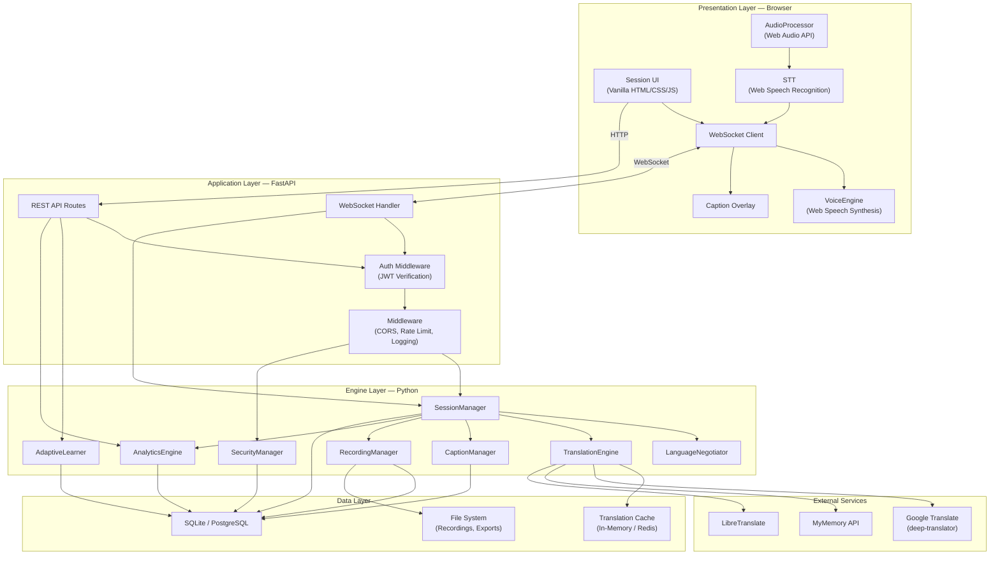

---

## 4. Deployment Diagram

### 4.1 Development Environment

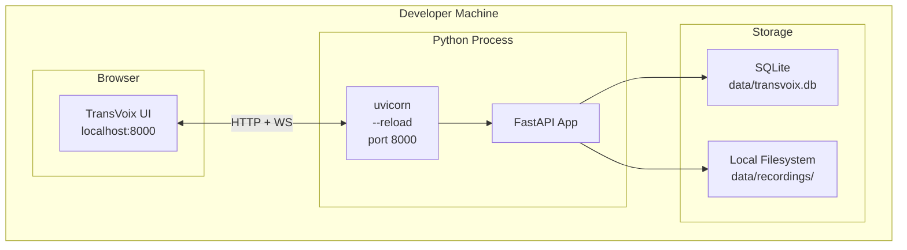

### 4.2 Production Environment

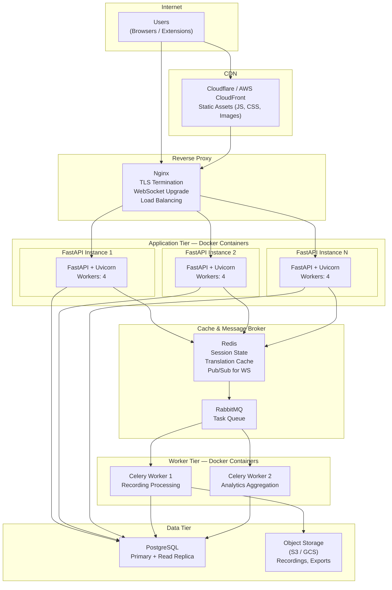

---

## 5. Database Design

### 5.1 Table Schemas

#### `users`

| Column | Type | Constraints | Description |
|---|---|---|---|
| `id` | UUID | PRIMARY KEY | Unique user identifier |
| `email` | VARCHAR(255) | UNIQUE, NOT NULL | User email address |
| `password_hash` | VARCHAR(255) | NOT NULL | bcrypt hashed password |
| `display_name` | VARCHAR(100) | NOT NULL | Display name shown in sessions |
| `avatar_url` | VARCHAR(512) | NULL | URL to user avatar image |
| `native_language` | VARCHAR(10) | NOT NULL, DEFAULT 'en' | ISO 639-1 language code |
| `preferred_language` | VARCHAR(10) | NULL | Preferred listening language |
| `role` | VARCHAR(20) | NOT NULL, DEFAULT 'user' | ENUM: user / admin / enterprise |
| `auth_provider` | VARCHAR(20) | NOT NULL, DEFAULT 'local' | ENUM: local / google / github |
| `oauth_id` | VARCHAR(255) | NULL | External OAuth provider ID |
| `created_at` | TIMESTAMP | NOT NULL, DEFAULT NOW | Account creation timestamp |
| `updated_at` | TIMESTAMP | NOT NULL, DEFAULT NOW | Last profile update |
| `last_login` | TIMESTAMP | NULL | Last successful login |
| `is_active` | BOOLEAN | NOT NULL, DEFAULT TRUE | Account active status |

**Indexes:** `idx_users_email` (UNIQUE), `idx_users_oauth` (auth_provider, oauth_id)

---

#### `sessions`

| Column | Type | Constraints | Description |
|---|---|---|---|
| `id` | UUID | PRIMARY KEY | Unique session identifier |
| `room_code` | VARCHAR(6) | UNIQUE, NOT NULL | 6-character alphanumeric room code |
| `creator_id` | UUID | FOREIGN KEY → users(id) | Session creator |
| `title` | VARCHAR(255) | NOT NULL | Session title/description |
| `max_participants` | INTEGER | NOT NULL, DEFAULT 20 | Maximum allowed participants |
| `is_active` | BOOLEAN | NOT NULL, DEFAULT TRUE | Session is currently live |
| `created_at` | TIMESTAMP | NOT NULL, DEFAULT NOW | Session creation time |
| `ended_at` | TIMESTAMP | NULL | Session end time |
| `settings` | JSON | NULL | Custom session settings |

**Indexes:** `idx_sessions_room_code` (UNIQUE), `idx_sessions_creator` (creator_id), `idx_sessions_active` (is_active)

---

#### `session_participants`

| Column | Type | Constraints | Description |
|---|---|---|---|
| `id` | UUID | PRIMARY KEY | Unique participant record |
| `session_id` | UUID | FK → sessions(id) ON DELETE CASCADE | Parent session |
| `user_id` | UUID | FK → users(id) NULL | Registered user (NULL for guests) |
| `display_name` | VARCHAR(100) | NOT NULL | Participant display name |
| `spoken_language` | VARCHAR(10) | NOT NULL | Language being spoken |
| `listening_language` | VARCHAR(10) | NOT NULL | Language to receive translations in |
| `joined_at` | TIMESTAMP | NOT NULL, DEFAULT NOW | Join timestamp |
| `left_at` | TIMESTAMP | NULL | Leave timestamp |
| `is_active` | BOOLEAN | NOT NULL, DEFAULT TRUE | Currently in session |

**Indexes:** `idx_sp_session` (session_id), `idx_sp_user` (user_id), `idx_sp_active` (session_id, is_active)

---

#### `language_profiles`

| Column | Type | Constraints | Description |
|---|---|---|---|
| `id` | UUID | PRIMARY KEY | Profile identifier |
| `user_id` | UUID | FK → users(id) UNIQUE | One profile per user |
| `native_language` | VARCHAR(10) | NOT NULL | Primary native language |
| `preferred_listening_language` | VARCHAR(10) | NULL | Default listening language |
| `spoken_languages` | JSON | NOT NULL, DEFAULT '[]' | Array of languages user can speak |
| `understood_languages` | JSON | NOT NULL, DEFAULT '[]' | Array of languages user can read |
| `auto_detect_enabled` | BOOLEAN | NOT NULL, DEFAULT TRUE | Enable automatic language detection |
| `confidence_threshold` | FLOAT | NOT NULL, DEFAULT 0.7 | Minimum detection confidence |
| `translation_preferences` | JSON | NULL | Per-pair preferences |

**Indexes:** `idx_lp_user` (UNIQUE on user_id)

---

#### `custom_dictionaries`

| Column | Type | Constraints | Description |
|---|---|---|---|
| `id` | UUID | PRIMARY KEY | Dictionary identifier |
| `user_id` | UUID | FK → users(id) ON DELETE CASCADE | Owner |
| `name` | VARCHAR(100) | NOT NULL | Dictionary name |
| `domain` | VARCHAR(20) | NOT NULL, DEFAULT 'general' | ENUM: legal / medical / gaming / tech / education / finance / general |
| `source_language` | VARCHAR(10) | NOT NULL | Source language code |
| `target_language` | VARCHAR(10) | NOT NULL | Target language code |
| `created_at` | TIMESTAMP | NOT NULL, DEFAULT NOW | Creation timestamp |
| `updated_at` | TIMESTAMP | NOT NULL, DEFAULT NOW | Last update timestamp |

**Indexes:** `idx_cd_user` (user_id), `idx_cd_domain` (user_id, domain)

---

#### `dictionary_entries`

| Column | Type | Constraints | Description |
|---|---|---|---|
| `id` | UUID | PRIMARY KEY | Entry identifier |
| `dictionary_id` | UUID | FK → custom_dictionaries(id) ON DELETE CASCADE | Parent dictionary |
| `source_term` | VARCHAR(500) | NOT NULL | Term in source language |
| `target_term` | VARCHAR(500) | NOT NULL | Translation in target language |
| `context` | VARCHAR(1000) | NULL | Usage context or notes |
| `created_at` | TIMESTAMP | NOT NULL, DEFAULT NOW | Creation timestamp |

**Indexes:** `idx_de_dict` (dictionary_id), `idx_de_source` (dictionary_id, source_term)

---

#### `learned_preferences`

| Column | Type | Constraints | Description |
|---|---|---|---|
| `id` | UUID | PRIMARY KEY | Preference identifier |
| `user_id` | UUID | FK → users(id) ON DELETE CASCADE | User who generated the preference |
| `language_pair` | VARCHAR(20) | NOT NULL | Language pair, e.g., 'hi→ja' |
| `frequency` | INTEGER | NOT NULL, DEFAULT 1 | Times this pair has been used |
| `last_used` | TIMESTAMP | NOT NULL, DEFAULT NOW | Last usage timestamp |
| `auto_apply` | BOOLEAN | NOT NULL, DEFAULT FALSE | Auto-apply when threshold met |
| `domain` | VARCHAR(20) | NULL | Associated domain (if any) |

**Indexes:** `idx_lp_user_pair` (user_id, language_pair), `idx_lp_auto` (user_id, auto_apply)

---

#### `recordings`

| Column | Type | Constraints | Description |
|---|---|---|---|
| `id` | UUID | PRIMARY KEY | Recording identifier |
| `session_id` | UUID | FK → sessions(id) | Source session |
| `user_id` | UUID | FK → users(id) | Recording owner |
| `title` | VARCHAR(255) | NOT NULL | Recording title |
| `duration_seconds` | INTEGER | NOT NULL, DEFAULT 0 | Duration in seconds |
| `transcript` | TEXT | NULL | Original transcript |
| `translated_transcript` | TEXT | NULL | Translated transcript |
| `summary` | TEXT | NULL | AI-generated summary |
| `languages_used` | JSON | NULL | Array of language codes used |
| `created_at` | TIMESTAMP | NOT NULL, DEFAULT NOW | Creation timestamp |
| `file_path` | VARCHAR(512) | NULL | Path to associated files |

**Indexes:** `idx_rec_session` (session_id), `idx_rec_user` (user_id), `idx_rec_created` (created_at DESC)

---

#### `analytics_events`

| Column | Type | Constraints | Description |
|---|---|---|---|
| `id` | UUID | PRIMARY KEY | Event identifier |
| `event_type` | VARCHAR(50) | NOT NULL | Event type string |
| `user_id` | UUID | FK → users(id) NULL | Associated user (if any) |
| `session_id` | UUID | FK → sessions(id) NULL | Associated session (if any) |
| `data` | JSON | NULL | Event-specific data payload |
| `timestamp` | TIMESTAMP | NOT NULL, DEFAULT NOW | Event timestamp |

**Indexes:** `idx_ae_type` (event_type), `idx_ae_user` (user_id), `idx_ae_session` (session_id), `idx_ae_time` (timestamp DESC)

---

#### `api_keys`

| Column | Type | Constraints | Description |
|---|---|---|---|
| `id` | UUID | PRIMARY KEY | Key identifier |
| `user_id` | UUID | FK → users(id) ON DELETE CASCADE | Key owner |
| `key_hash` | VARCHAR(255) | NOT NULL | SHA-256 hash of the API key |
| `name` | VARCHAR(100) | NOT NULL | Human-readable key name |
| `permissions` | JSON | NOT NULL | Array of permission strings |
| `rate_limit` | INTEGER | NOT NULL, DEFAULT 100 | Requests per minute |
| `created_at` | TIMESTAMP | NOT NULL, DEFAULT NOW | Key creation time |
| `expires_at` | TIMESTAMP | NOT NULL | Key expiration time |
| `last_used` | TIMESTAMP | NULL | Last usage timestamp |
| `is_active` | BOOLEAN | NOT NULL, DEFAULT TRUE | Key active status |

**Indexes:** `idx_ak_user` (user_id), `idx_ak_hash` (key_hash), `idx_ak_active` (is_active)

---

#### `refresh_tokens`

| Column | Type | Constraints | Description |
|---|---|---|---|
| `id` | UUID | PRIMARY KEY | Token record identifier |
| `user_id` | UUID | FK → users(id) ON DELETE CASCADE | Token owner |
| `token_hash` | VARCHAR(255) | NOT NULL | SHA-256 hash of refresh token |
| `expires_at` | TIMESTAMP | NOT NULL | Token expiration time |
| `created_at` | TIMESTAMP | NOT NULL, DEFAULT NOW | Token creation time |
| `revoked` | BOOLEAN | NOT NULL, DEFAULT FALSE | Whether token is revoked |

**Indexes:** `idx_rt_user` (user_id), `idx_rt_hash` (token_hash), `idx_rt_active` (user_id, revoked)

---

### 5.2 Entity-Relationship Diagram

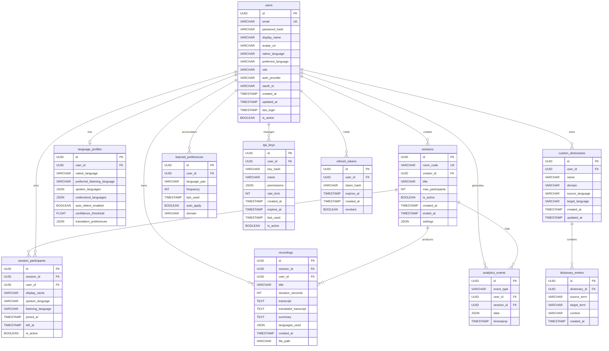

---

## 6. API Design

### 6.1 Authentication Endpoints

#### `POST /api/auth/register`

Register a new user account.

**Request:**
```json
{
    "email": "user@example.com",
    "password": "secureP@ss123",
    "display_name": "Alice",
    "native_language": "en"
}
```

**Response (201 Created):**
```json
{
    "id": "550e8400-e29b-41d4-a716-446655440000",
    "email": "user@example.com",
    "display_name": "Alice",
    "native_language": "en",
    "role": "user",
    "created_at": "2026-07-10T12:00:00Z"
}
```

**Errors:** `409 Conflict` (email exists), `422 Unprocessable Entity` (validation)

---

#### `POST /api/auth/login`

Authenticate and receive tokens.

**Request:**
```json
{
    "email": "user@example.com",
    "password": "secureP@ss123"
}
```

**Response (200 OK):**
```json
{
    "access_token": "eyJhbGciOiJIUzI1NiIs...",
    "refresh_token": "dGhpcyBpcyBhIHJlZnJl...",
    "token_type": "bearer",
    "expires_in": 1800,
    "user": {
        "id": "550e8400-...",
        "email": "user@example.com",
        "display_name": "Alice",
        "role": "user"
    }
}
```

**Errors:** `401 Unauthorized` (invalid credentials), `403 Forbidden` (account deactivated)

---

#### `POST /api/auth/refresh`

Refresh access token using refresh token.

**Request:**
```json
{
    "refresh_token": "dGhpcyBpcyBhIHJlZnJl..."
}
```

**Response (200 OK):**
```json
{
    "access_token": "eyJhbGciOiJIUzI1NiIs...",
    "refresh_token": "bmV3IHJlZnJlc2ggdG9r...",
    "token_type": "bearer",
    "expires_in": 1800
}
```

**Errors:** `401 Unauthorized` (token revoked/expired)

---

#### `POST /api/auth/oauth/google`

Authenticate via Google OAuth 2.0.

**Request:**
```json
{
    "code": "4/0AY0e-g7..."
}
```

**Response (200 OK):**
```json
{
    "access_token": "eyJhbGciOiJIUzI1NiIs...",
    "refresh_token": "dGhpcyBpcyBhIHJlZnJl...",
    "token_type": "bearer",
    "expires_in": 1800,
    "is_new_user": true,
    "user": {
        "id": "550e8400-...",
        "email": "user@gmail.com",
        "display_name": "Alice",
        "avatar_url": "https://lh3.googleusercontent.com/...",
        "auth_provider": "google"
    }
}
```

---

#### `POST /api/auth/logout`

Revoke refresh token (requires auth).

**Headers:** `Authorization: Bearer <access_token>`

**Response (200 OK):**
```json
{
    "message": "Successfully logged out"
}
```

---

#### `GET /api/auth/me`

Get current user profile.

**Headers:** `Authorization: Bearer <access_token>`

**Response (200 OK):**
```json
{
    "id": "550e8400-...",
    "email": "user@example.com",
    "display_name": "Alice",
    "avatar_url": null,
    "native_language": "en",
    "preferred_language": "ja",
    "role": "user",
    "auth_provider": "local",
    "created_at": "2026-07-10T12:00:00Z",
    "last_login": "2026-07-10T18:00:00Z",
    "language_profile": {
        "spoken_languages": ["en", "hi"],
        "understood_languages": ["en", "hi", "es"],
        "auto_detect_enabled": true,
        "confidence_threshold": 0.7
    }
}
```

---

### 6.2 Translation Endpoints

#### `POST /api/translate`

Translate text between languages.

**Headers:** `Authorization: Bearer <access_token>`

**Request:**
```json
{
    "text": "नमस्ते, आप कैसे हैं?",
    "source": "hi",
    "target": "ja",
    "dictionary_id": "optional-uuid"
}
```

**Response (200 OK):**
```json
{
    "translated": "こんにちは、お元気ですか？",
    "detected_lang": "hi",
    "confidence": 0.98,
    "source": "hi",
    "target": "ja",
    "provider": "google",
    "cached": false,
    "dictionary_applied": false
}
```

---

#### `POST /api/detect`

Detect language of text.

**Request:**
```json
{
    "text": "Bonjour, comment allez-vous?"
}
```

**Response (200 OK):**
```json
{
    "language": "fr",
    "confidence": 0.99,
    "dialect": null,
    "alternatives": [
        { "language": "it", "confidence": 0.02 }
    ]
}
```

---

#### `GET /api/languages`

List all supported languages.

**Response (200 OK):**
```json
{
    "languages": [
        {
            "code": "en",
            "name": "English",
            "native_name": "English",
            "flag": "🇺🇸",
            "supported_features": {
                "translation": true,
                "stt": true,
                "tts": true,
                "detection": true
            }
        },
        {
            "code": "hi",
            "name": "Hindi",
            "native_name": "हिन्दी",
            "flag": "🇮🇳",
            "supported_features": {
                "translation": true,
                "stt": true,
                "tts": true,
                "detection": true
            }
        },
        {
            "code": "ja",
            "name": "Japanese",
            "native_name": "日本語",
            "flag": "🇯🇵",
            "supported_features": {
                "translation": true,
                "stt": true,
                "tts": true,
                "detection": true
            }
        }
    ],
    "total": 107
}
```

---

### 6.3 Session Endpoints

#### `POST /api/sessions`

Create a new session room.

**Headers:** `Authorization: Bearer <access_token>`

**Request:**
```json
{
    "title": "Hindi-Japanese Study Group",
    "max_participants": 10,
    "settings": {
        "auto_record": false,
        "captions_enabled": true,
        "tts_enabled": true
    }
}
```

**Response (201 Created):**
```json
{
    "id": "660e8400-...",
    "room_code": "XK7M2P",
    "title": "Hindi-Japanese Study Group",
    "max_participants": 10,
    "creator_id": "550e8400-...",
    "is_active": true,
    "created_at": "2026-07-10T12:00:00Z",
    "join_url": "https://transvoix.app/join/XK7M2P",
    "settings": { ... }
}
```

---

#### `GET /api/sessions/{session_id}`

Get session details.

**Response (200 OK):**
```json
{
    "id": "660e8400-...",
    "room_code": "XK7M2P",
    "title": "Hindi-Japanese Study Group",
    "creator": { "id": "...", "display_name": "Alice" },
    "participants": [
        {
            "id": "...",
            "display_name": "Bob",
            "spoken_language": "hi",
            "listening_language": "ja",
            "is_active": true,
            "joined_at": "2026-07-10T12:05:00Z"
        }
    ],
    "is_active": true,
    "participant_count": 3,
    "created_at": "2026-07-10T12:00:00Z"
}
```

---

#### `POST /api/sessions/join`

Join a session by room code.

**Request:**
```json
{
    "room_code": "XK7M2P",
    "display_name": "Guest User",
    "spoken_language": "ja",
    "listening_language": "hi"
}
```

**Response (200 OK):**
```json
{
    "session_id": "660e8400-...",
    "participant_id": "770e8400-...",
    "websocket_url": "wss://transvoix.app/ws/session/660e8400-...?token=eyJ...",
    "participants": [ ... ],
    "settings": { ... }
}
```

---

#### `POST /api/sessions/{session_id}/end`

End a session (creator only).

**Response (200 OK):**
```json
{
    "message": "Session ended",
    "duration_seconds": 3600,
    "total_translations": 245,
    "recording_id": "880e8400-..."
}
```

---

#### `GET /api/sessions` — List user's sessions (paginated)

#### `DELETE /api/sessions/{session_id}` — Delete a session (creator only)

---

### 6.4 User Endpoints

#### `GET /api/users/profile`

Get detailed user profile with language settings.

#### `PUT /api/users/profile`

Update user profile.

**Request:**
```json
{
    "display_name": "Alice Updated",
    "native_language": "en",
    "preferred_language": "ja",
    "avatar_url": "https://..."
}
```

---

#### `GET /api/users/language-profile`

Get language profile.

#### `PUT /api/users/language-profile`

Update language profile.

**Request:**
```json
{
    "native_language": "en",
    "preferred_listening_language": "ja",
    "spoken_languages": ["en", "hi", "es"],
    "understood_languages": ["en", "hi", "es", "fr"],
    "auto_detect_enabled": true,
    "confidence_threshold": 0.75
}
```

---

### 6.5 Dictionary Endpoints

#### `POST /api/dictionaries`

Create a custom dictionary.

**Request:**
```json
{
    "name": "Medical Terms EN-JA",
    "domain": "medical",
    "source_language": "en",
    "target_language": "ja"
}
```

#### `GET /api/dictionaries` — List user's dictionaries

#### `GET /api/dictionaries/{id}` — Get dictionary with entries

#### `POST /api/dictionaries/{id}/entries`

Add a dictionary entry.

**Request:**
```json
{
    "source_term": "myocardial infarction",
    "target_term": "心筋梗塞",
    "context": "Cardiology: acute MI"
}
```

#### `DELETE /api/dictionaries/{id}/entries/{entry_id}` — Delete an entry

#### `DELETE /api/dictionaries/{id}` — Delete a dictionary

---

### 6.6 Analytics Endpoints

#### `GET /api/analytics/translations`

Get translation statistics.

**Query Params:** `start_date`, `end_date`, `granularity` (hour/day/week)

**Response (200 OK):**
```json
{
    "total_translations": 12450,
    "unique_language_pairs": 23,
    "average_confidence": 0.94,
    "top_pairs": [
        { "pair": "hi→en", "count": 3200 },
        { "pair": "en→ja", "count": 2800 },
        { "pair": "ja→hi", "count": 1500 }
    ],
    "translations_over_time": [
        { "date": "2026-07-01", "count": 450 },
        { "date": "2026-07-02", "count": 520 }
    ]
}
```

---

#### `GET /api/analytics/sessions`

Get session statistics.

#### `GET /api/analytics/languages`

Get language distribution.

#### `GET /api/analytics/engagement`

Get user engagement metrics.

---

### 6.7 Recording Endpoints

#### `POST /api/recordings/start`

Start recording a session.

**Request:**
```json
{
    "session_id": "660e8400-...",
    "title": "Study Session Recording"
}
```

#### `POST /api/recordings/{id}/stop` — Stop recording

#### `GET /api/recordings` — List recordings (paginated)

#### `GET /api/recordings/{id}` — Get recording details with transcript

#### `GET /api/recordings/{id}/export?format=srt` — Export captions

#### `DELETE /api/recordings/{id}` — Delete recording

---

### 6.8 API Key Endpoints

#### `POST /api/keys`

Create an API key.

**Request:**
```json
{
    "name": "Production Bot",
    "permissions": ["translate", "detect", "sessions"],
    "rate_limit": 500,
    "ttl_days": 90
}
```

**Response (201 Created):**
```json
{
    "id": "990e8400-...",
    "key": "tv_live_abc123xyz789...",
    "name": "Production Bot",
    "permissions": ["translate", "detect", "sessions"],
    "rate_limit": 500,
    "expires_at": "2026-10-08T12:00:00Z",
    "message": "Save this key — it will not be shown again"
}
```

#### `GET /api/keys` — List API keys (hashed, no plaintext)

#### `DELETE /api/keys/{id}` — Revoke an API key

---

## 7. WebSocket Protocol

### 7.1 Connection

```
wss://transvoix.app/ws/session/{session_id}?token={jwt_access_token}
```

**Connection Handshake:**
1. Client sends HTTP Upgrade request with JWT in query string
2. Server validates JWT, extracts user_id and role
3. Server checks session exists and is active
4. Server checks participant limit not exceeded
5. Server accepts upgrade → WebSocket established
6. Server sends `connected` message with session state

**Initial Server Message:**
```json
{
    "type": "connected",
    "session_id": "660e8400-...",
    "participant_id": "770e8400-...",
    "participants": [
        {
            "id": "...",
            "display_name": "Alice",
            "spoken_language": "en",
            "listening_language": "ja",
            "is_active": true
        }
    ],
    "settings": {
        "captions_enabled": true,
        "tts_enabled": true,
        "auto_record": false
    }
}
```

### 7.2 Client → Server Messages

#### `speech` — Send recognized speech text

```json
{
    "type": "speech",
    "text": "नमस्ते, आप कैसे हैं?",
    "lang": "hi",
    "is_final": true,
    "confidence": 0.95
}
```

#### `join` — Join session with language preferences

```json
{
    "type": "join",
    "display_name": "Bob",
    "spoken_lang": "hi",
    "listen_lang": "ja"
}
```

#### `language_change` — Update language preferences mid-session

```json
{
    "type": "language_change",
    "spoken_lang": "en",
    "listen_lang": "ja"
}
```

#### `typing` — Send typing indicator / text input

```json
{
    "type": "typing",
    "text": "Let me type this instead"
}
```

#### `leave` — Leave the session gracefully

```json
{
    "type": "leave"
}
```

#### `ping` — Keep-alive heartbeat

```json
{
    "type": "ping",
    "timestamp": "2026-07-10T12:00:00Z"
}
```

### 7.3 Server → Client Messages

#### `translation` — Translated speech delivered to listener

```json
{
    "type": "translation",
    "speaker": "Bob",
    "speaker_id": "770e8400-...",
    "original": "नमस्ते, आप कैसे हैं?",
    "translated": "こんにちは、お元気ですか？",
    "source_lang": "hi",
    "target_lang": "ja",
    "confidence": 0.92,
    "emotion": "neutral",
    "timestamp": "2026-07-10T12:05:30.123Z"
}
```

#### `participant_joined` — New participant notification

```json
{
    "type": "participant_joined",
    "participant": {
        "id": "880e8400-...",
        "display_name": "Carol",
        "spoken_language": "ja",
        "listening_language": "en",
        "joined_at": "2026-07-10T12:06:00Z"
    }
}
```

#### `participant_left` — Participant departure notification

```json
{
    "type": "participant_left",
    "participant_id": "880e8400-...",
    "display_name": "Carol",
    "timestamp": "2026-07-10T12:30:00Z"
}
```

#### `language_updated` — Participant changed languages

```json
{
    "type": "language_updated",
    "participant_id": "770e8400-...",
    "display_name": "Bob",
    "spoken_language": "en",
    "listening_language": "ja",
    "timestamp": "2026-07-10T12:10:00Z"
}
```

#### `caption` — Real-time caption update

```json
{
    "type": "caption",
    "speaker": "Bob",
    "speaker_id": "770e8400-...",
    "text": "Hello, how are you?",
    "translated_text": "こんにちは、お元気ですか？",
    "source_lang": "hi",
    "target_lang": "ja",
    "is_final": true,
    "timestamp": "2026-07-10T12:05:30.123Z"
}
```

#### `error` — Error notification

```json
{
    "type": "error",
    "code": "TRANSLATION_FAILED",
    "message": "Translation service temporarily unavailable. Retrying...",
    "recoverable": true,
    "timestamp": "2026-07-10T12:05:31.000Z"
}
```

#### `pong` — Server heartbeat response

```json
{
    "type": "pong",
    "timestamp": "2026-07-10T12:00:00Z"
}
```

### 7.4 Error Codes

| Code | Description | Recoverable |
|---|---|---|
| `AUTH_FAILED` | JWT invalid or expired | No (reconnect with new token) |
| `SESSION_NOT_FOUND` | Session does not exist | No |
| `SESSION_FULL` | Max participants reached | No |
| `SESSION_ENDED` | Session has been ended | No |
| `TRANSLATION_FAILED` | Translation service error | Yes (auto-retry) |
| `RATE_LIMITED` | Too many messages | Yes (back off) |
| `INVALID_MESSAGE` | Malformed message | Yes (resend) |
| `LANGUAGE_NOT_SUPPORTED` | Language pair unsupported | Yes (change language) |

---

## 8. Sequence Diagrams

### 8.1 User Login Flow

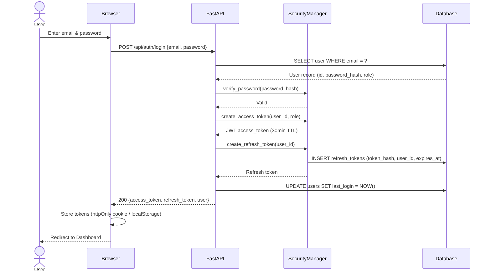

### 8.2 Real-Time Translation Flow

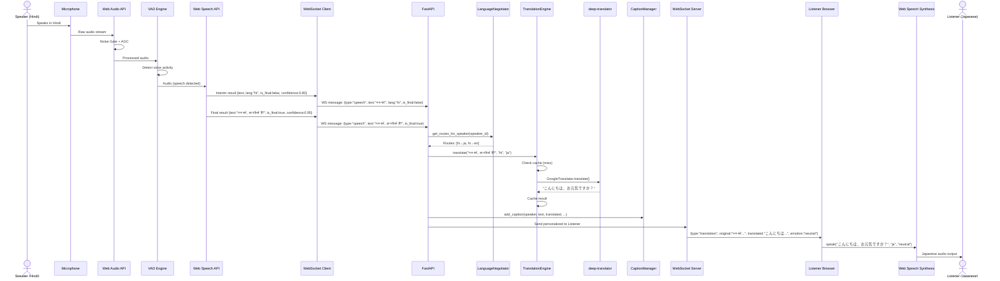

### 8.3 Room Creation & Join Flow

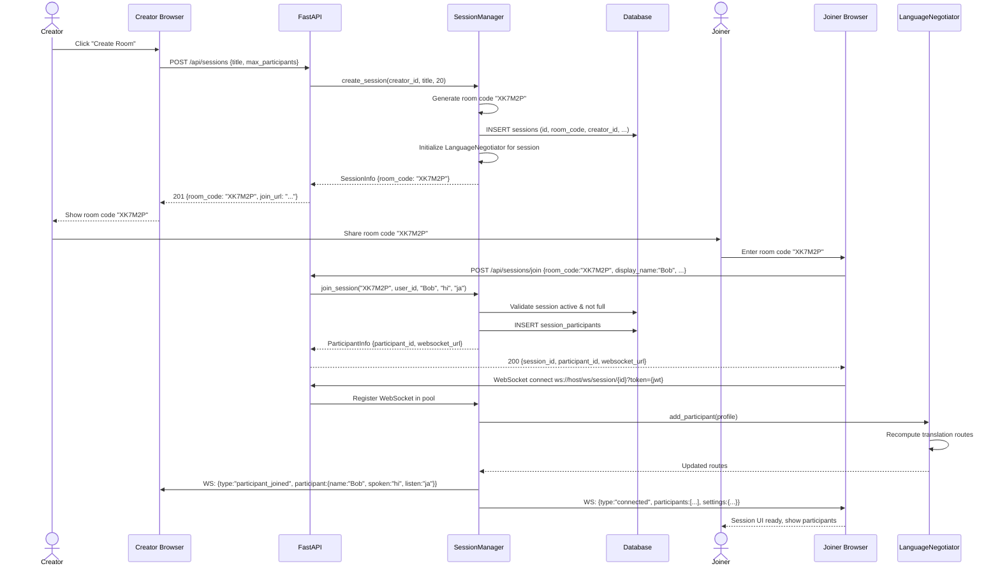

### 8.4 Language Negotiation Flow

```mermaid
sequenceDiagram
    actor Participant as Bob
    participant Browser
    participant WSC as WebSocket Client
    participant FastAPI
    participant LN as LanguageNegotiator
    participant LD as langdetect
    participant SM as SessionManager
    participant AL as AdaptiveLearner
    participant Others as Other Participants

    Participant->>Browser: Speaks (expected: Hindi)
    Browser->>WSC: {type:"speech", text:"Hello world", lang:"hi", confidence:0.92}
    WSC->>FastAPI: WS message

    FastAPI->>LD: detect("Hello world")
    LD-->>FastAPI: {language: "en", confidence: 0.99}

    FastAPI->>LN: detect_and_negotiate(bob_id, "Hello world", "hi", 0.99)

    Note over LN: Detected "en" with 0.99 confidence<br/>Declared was "hi"<br/>0.99 >= threshold (0.7)<br/>→ Update to "en"

    LN->>LN: Update Bob's spoken_lang to "en"
    LN->>LN: Recompute all translation routes

    LN-->>FastAPI: Resolved language: "en"

    FastAPI->>AL: log_translation(bob_id, "en", ...)

    FastAPI->>SM: broadcast language_updated
    SM->>Others: WS: {type:"language_updated", participant_id:"bob", spoken_language:"en"}
    SM->>Browser: WS: {type:"language_updated", participant_id:"bob", spoken_language:"en"}

    Note over FastAPI: Now translate "Hello world"<br/>from "en" (not "hi") to each<br/>listener's language

    FastAPI->>FastAPI: Proceed with translation using corrected source="en"
```

### 8.5 Adaptive Learning Flow

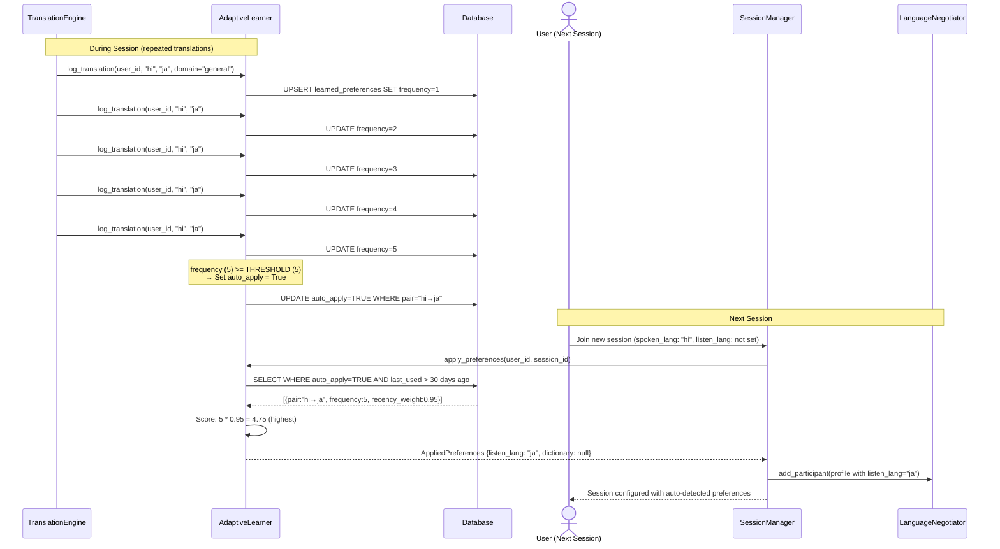

---

## 9. State Machine Diagrams

### 9.1 Connection State Machine

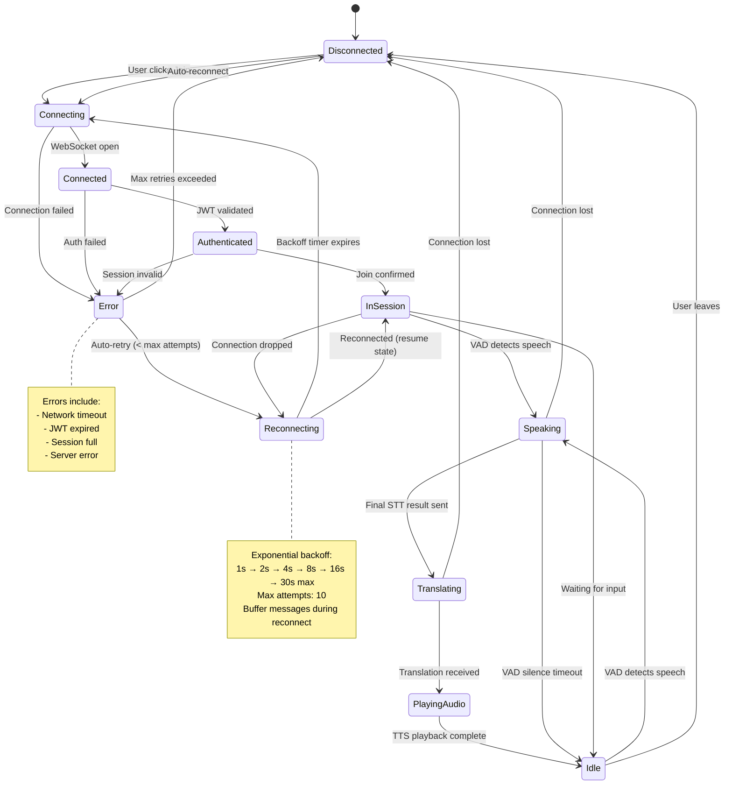

### 9.2 Translation Pipeline State

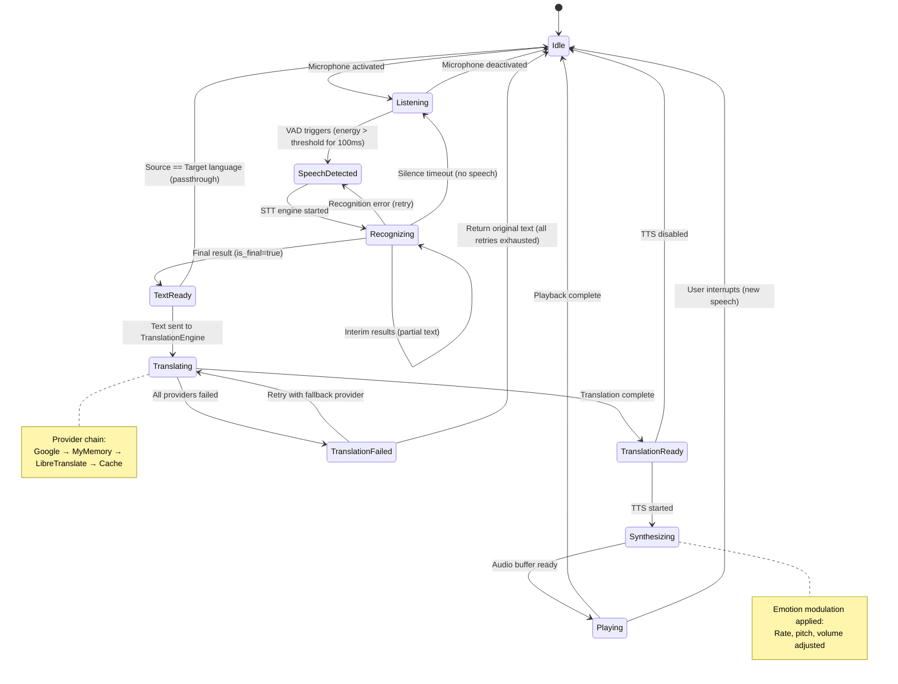

### 9.3 Session Lifecycle

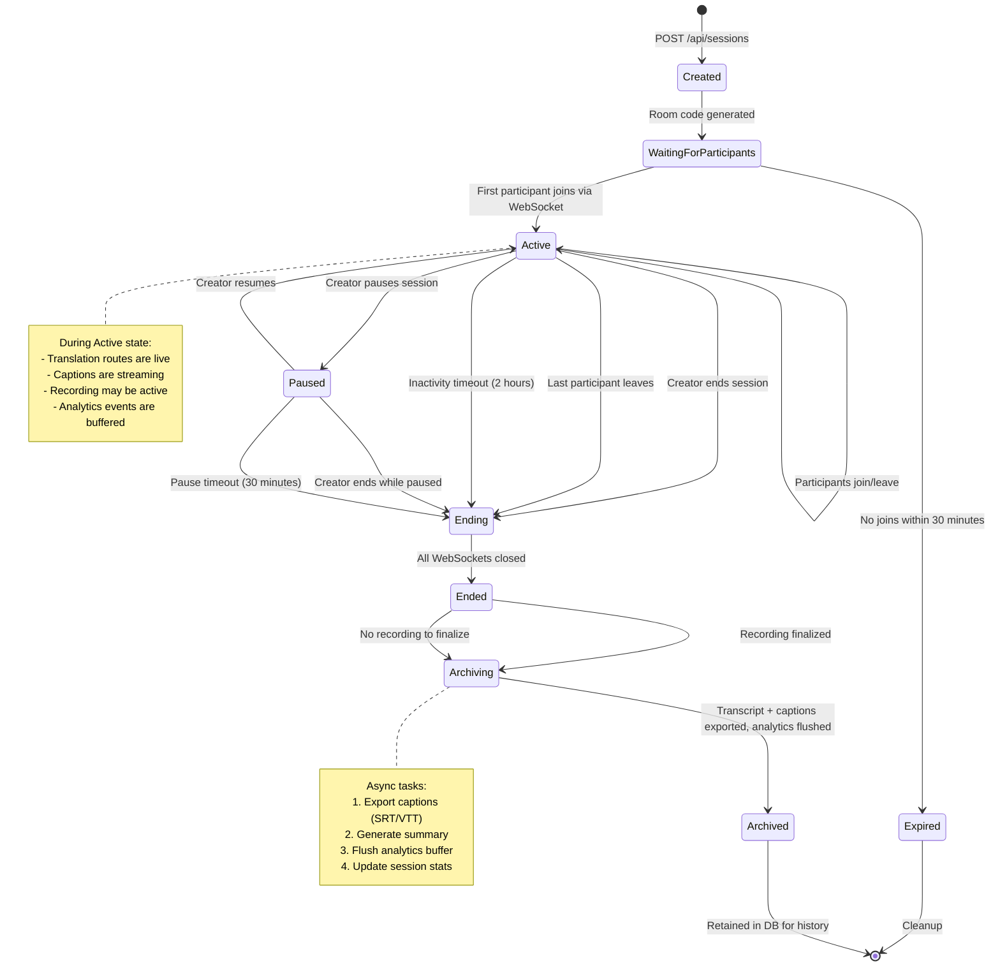

---

## 10. Browser Extension Architecture

### 10.1 Overview

The TransVoix browser extension injects real-time translation capabilities into existing communication platforms (Google Meet, Zoom Web, Discord, Microsoft Teams, etc.) without requiring participants to install or use the TransVoix web app directly.

### 10.2 Extension Structure (Manifest V3)

```json
{
    "manifest_version": 3,
    "name": "TransVoix - Universal Translator",
    "version": "1.0.0",
    "description": "Real-time voice translation for Google Meet, Zoom, Discord, and more",
    "permissions": [
        "activeTab",
        "storage",
        "offscreen",
        "tabCapture"
    ],
    "host_permissions": [
        "https://meet.google.com/*",
        "https://*.zoom.us/*",
        "https://discord.com/*",
        "https://teams.microsoft.com/*",
        "https://transvoix.app/*"
    ],
    "background": {
        "service_worker": "background.js",
        "type": "module"
    },
    "content_scripts": [
        {
            "matches": [
                "https://meet.google.com/*",
                "https://*.zoom.us/*",
                "https://discord.com/*",
                "https://teams.microsoft.com/*"
            ],
            "js": ["content_script.js"],
            "css": ["content_styles.css"],
            "run_at": "document_idle"
        }
    ],
    "action": {
        "default_popup": "popup.html",
        "default_icon": {
            "16": "icons/icon16.png",
            "48": "icons/icon48.png",
            "128": "icons/icon128.png"
        }
    },
    "icons": {
        "16": "icons/icon16.png",
        "48": "icons/icon48.png",
        "128": "icons/icon128.png"
    },
    "web_accessible_resources": [
        {
            "resources": ["inject.js", "caption_overlay.css"],
            "matches": ["<all_urls>"]
        }
    ]
}
```

### 10.3 Component Architecture

```
┌──────────────────────────────────────────────────────────────────┐
│                    Browser Extension                              │
│                                                                   │
│  ┌──────────────────┐    ┌───────────────────────────────────┐   │
│  │    Popup UI       │    │    Background Service Worker       │   │
│  │                   │    │                                    │   │
│  │  - Language select│    │  - WebSocket to TransVoix backend │   │
│  │  - Status display │    │  - Auth token management          │   │
│  │  - Quick settings │    │  - Message routing                │   │
│  │  - Session info   │    │  - Platform detection             │   │
│  └──────────────────┘    │  - Offscreen audio management     │   │
│                           └───────────────────────────────────┘   │
│                                                                   │
│  ┌────────────────────────────────────────────────────────────┐   │
│  │                  Content Script                             │   │
│  │                                                             │   │
│  │  ┌──────────────┐  ┌──────────────┐  ┌────────────────┐   │   │
│  │  │ Platform      │  │ Audio        │  │ Caption        │   │   │
│  │  │ Detector      │  │ Interceptor  │  │ Overlay        │   │   │
│  │  │               │  │              │  │ (Shadow DOM)   │   │   │
│  │  │ - Detect Meet │  │ - Capture    │  │                │   │   │
│  │  │ - Detect Zoom │  │   remote     │  │ - Floating     │   │   │
│  │  │ - Detect      │  │   audio      │  │   captions     │   │   │
│  │  │   Discord     │  │ - Inject     │  │ - Speaker ID   │   │   │
│  │  │ - Detect Teams│  │   translated │  │ - Drag/resize  │   │   │
│  │  │               │  │   audio      │  │ - Opacity ctrl │   │   │
│  │  └──────────────┘  └──────────────┘  └────────────────┘   │   │
│  └────────────────────────────────────────────────────────────┘   │
└──────────────────────────────────────────────────────────────────┘
```

### 10.4 Content Script — Platform Detection

```javascript
class PlatformDetector {
    detect() {
        const url = window.location.href;
        if (url.includes('meet.google.com'))       return 'google-meet';
        if (url.includes('zoom.us'))                return 'zoom';
        if (url.includes('discord.com'))            return 'discord';
        if (url.includes('teams.microsoft.com'))    return 'teams';
        return 'unknown';
    }

    getAdapter(platform) {
        const adapters = {
            'google-meet':  new GoogleMeetAdapter(),
            'zoom':         new ZoomAdapter(),
            'discord':      new DiscordAdapter(),
            'teams':        new TeamsAdapter(),
        };
        return adapters[platform] || null;
    }
}
```

### 10.5 Audio Injection — WebRTC Interception

**Capture Strategy:**
1. Intercept `RTCPeerConnection` constructor before the platform's scripts load
2. Hook `addTrack()` and `ontrack` to capture remote audio `MediaStreamTrack` objects
3. Route remote audio through Web Audio API `MediaStreamSource` → `AnalyserNode` → processing
4. Create a `MediaStreamDestination` for translated audio output
5. Replace the original remote track with the translated audio track

```javascript
// Injected before page scripts load (via content_script run_at: document_start)
const OriginalRTCPeerConnection = window.RTCPeerConnection;

window.RTCPeerConnection = function(...args) {
    const pc = new OriginalRTCPeerConnection(...args);

    pc.addEventListener('track', (event) => {
        if (event.track.kind === 'audio') {
            // Route through TransVoix audio processing
            TransVoixExtension.interceptAudioTrack(event.track, event.streams[0]);
        }
    });

    return pc;
};
```

### 10.6 Caption Overlay — Shadow DOM Injection

```javascript
class CaptionOverlay {
    constructor() {
        // Use Shadow DOM to isolate styles from host page
        this.host = document.createElement('div');
        this.host.id = 'transvoix-caption-host';
        this.shadow = this.host.attachShadow({ mode: 'closed' });

        // Inject isolated styles
        const style = document.createElement('style');
        style.textContent = `
            .tv-caption-container {
                position: fixed;
                bottom: 80px;
                left: 50%;
                transform: translateX(-50%);
                width: 80%;
                max-width: 800px;
                z-index: 2147483647;
                pointer-events: none;
            }
            .tv-caption-bubble {
                background: rgba(0, 0, 0, 0.85);
                color: white;
                padding: 12px 20px;
                border-radius: 12px;
                font-family: 'Inter', sans-serif;
                font-size: 16px;
                line-height: 1.5;
                margin-bottom: 8px;
                backdrop-filter: blur(10px);
                pointer-events: auto;
                cursor: move;
            }
            .tv-speaker-name {
                color: #7c8aff;
                font-weight: 600;
                font-size: 13px;
                margin-bottom: 4px;
            }
        `;
        this.shadow.appendChild(style);

        // Create caption container
        this.container = document.createElement('div');
        this.container.className = 'tv-caption-container';
        this.shadow.appendChild(this.container);

        document.body.appendChild(this.host);
    }

    addCaption(speaker, text, translatedText) {
        const bubble = document.createElement('div');
        bubble.className = 'tv-caption-bubble';
        bubble.innerHTML = `
            <div class="tv-speaker-name">${speaker}</div>
            <div class="tv-original">${text}</div>
            <div class="tv-translated">${translatedText}</div>
        `;
        this.container.appendChild(bubble);

        // Auto-remove after 8 seconds
        setTimeout(() => bubble.remove(), 8000);
    }
}
```

### 10.7 Handshake Protocol — Extension-to-Extension

When two participants in the same call both have the TransVoix extension:

```
Participant A (Extension)          TransVoix Server          Participant B (Extension)
        │                               │                            │
        │── Register extension ────────→│                            │
        │   {platform: "google-meet",   │                            │
        │    meeting_id: "abc-def",     │                            │
        │    user_lang: "hi"}           │                            │
        │                               │←── Register extension ─────│
        │                               │    {platform: "google-meet",
        │                               │     meeting_id: "abc-def",
        │                               │     user_lang: "ja"}
        │                               │                            │
        │←── peer_detected ────────────│──── peer_detected ─────────→│
        │   {peer_id, peer_lang: "ja"} │    {peer_id, peer_lang: "hi"}
        │                               │                            │
        │←─────────── Relay translations via TransVoix WS ──────────→│
        │                               │                            │
```

**Fallback:** If only one participant has the extension, the extension captures their microphone audio locally, sends text to TransVoix, and overlays captions. No audio injection into the call occurs.

---

## 11. AI Model Pipeline

### 11.1 Pipeline Architecture

```
┌───────────────────────────────────────────────────────────────┐
│                     AI Model Pipeline                         │
│                                                               │
│  ┌─────────────────────────────────────────────────────────┐  │
│  │  Stage 1: AUDIO CAPTURE                                 │  │
│  │  Current: Web Audio API (getUserMedia)                  │  │
│  │  Future:  + Echo cancellation (Speex/RNNoise WASM)      │  │
│  └────────────────────────┬────────────────────────────────┘  │
│                           ▼                                   │
│  ┌─────────────────────────────────────────────────────────┐  │
│  │  Stage 2: AUDIO PREPROCESSING                           │  │
│  │  Current: Built-in browser noise suppression + AGC      │  │
│  │  Future:  DeepFilterNet (real-time neural noise removal) │  │
│  └────────────────────────┬────────────────────────────────┘  │
│                           ▼                                   │
│  ┌─────────────────────────────────────────────────────────┐  │
│  │  Stage 3: VOICE ACTIVITY DETECTION                      │  │
│  │  Current: Energy-based VAD (AnalyserNode RMS)           │  │
│  │  Future:  Silero VAD (ONNX, ~2ms latency per frame)     │  │
│  └────────────────────────┬────────────────────────────────┘  │
│                           ▼                                   │
│  ┌─────────────────────────────────────────────────────────┐  │
│  │  Stage 4: SPEAKER DIARIZATION                           │  │
│  │  Current: N/A (single speaker per mic assumed)          │  │
│  │  Future:  pyannote/speaker-diarization-3.1              │  │
│  │           (identifies who is speaking in multi-speaker)  │  │
│  └────────────────────────┬────────────────────────────────┘  │
│                           ▼                                   │
│  ┌─────────────────────────────────────────────────────────┐  │
│  │  Stage 5: SPEECH-TO-TEXT (STT)                          │  │
│  │  Current: Web Speech API (SpeechRecognition)            │  │
│  │  Future:  Whisper large-v3 (self-hosted, GPU)           │  │
│  └────────────────────────┬────────────────────────────────┘  │
│                           ▼                                   │
│  ┌─────────────────────────────────────────────────────────┐  │
│  │  Stage 6: LANGUAGE DETECTION                            │  │
│  │  Current: langdetect (Python library)                   │  │
│  │  Future:  fastText lid.176.bin (higher accuracy)        │  │
│  └────────────────────────┬────────────────────────────────┘  │
│                           ▼                                   │
│  ┌─────────────────────────────────────────────────────────┐  │
│  │  Stage 7: CONTEXT ENGINE                                │  │
│  │  Current: N/A                                           │  │
│  │  Future:  Sliding window (last 10 utterances)           │  │
│  │           Pronoun resolution, topic tracking            │  │
│  └────────────────────────┬────────────────────────────────┘  │
│                           ▼                                   │
│  ┌─────────────────────────────────────────────────────────┐  │
│  │  Stage 8: TRANSLATION                                   │  │
│  │  Current: deep-translator (Google/MyMemory/Libre)       │  │
│  │  Future:  NLLB-200 (Meta, 200 languages, self-hosted)   │  │
│  └────────────────────────┬────────────────────────────────┘  │
│                           ▼                                   │
│  ┌─────────────────────────────────────────────────────────┐  │
│  │  Stage 9: CUSTOM DICTIONARY OVERLAY                     │  │
│  │  Current: String replacement (exact match)              │  │
│  │  Future:  Fuzzy matching + context-aware replacement    │  │
│  └────────────────────────┬────────────────────────────────┘  │
│                           ▼                                   │
│  ┌─────────────────────────────────────────────────────────┐  │
│  │  Stage 10: EMOTION DETECTION                            │  │
│  │  Current: Text sentiment (keyword-based heuristics)     │  │
│  │  Future:  SpeechBrain emotion recognition (audio)       │  │
│  └────────────────────────┬────────────────────────────────┘  │
│                           ▼                                   │
│  ┌─────────────────────────────────────────────────────────┐  │
│  │  Stage 11: VOICE CLONING / TTS                          │  │
│  │  Current: Web Speech Synthesis API (browser built-in)   │  │
│  │  Future:  XTTS-v2 or Chatterbox (speaker cloning)      │  │
│  └────────────────────────┬────────────────────────────────┘  │
│                           ▼                                   │
│  ┌─────────────────────────────────────────────────────────┐  │
│  │  Stage 12: EMOTION INJECTION                            │  │
│  │  Current: Pitch/rate/volume modulation via TTS params   │  │
│  │  Future:  Emotional TTS (StyleTTS2 / VALL-E X)          │  │
│  └────────────────────────┬────────────────────────────────┘  │
│                           ▼                                   │
│  ┌─────────────────────────────────────────────────────────┐  │
│  │  Stage 13: AUDIO STREAMING                              │  │
│  │  Current: WebSocket (JSON text messages)                │  │
│  │  Future:  WebRTC DataChannel (lower latency, P2P)       │  │
│  └─────────────────────────────────────────────────────────┘  │
└───────────────────────────────────────────────────────────────┘
```

### 11.2 Stage Details

#### Stage 1: Audio Capture

| Property | Current | Production |
|---|---|---|
| **Implementation** | `navigator.mediaDevices.getUserMedia()` | Same + custom constraints |
| **Sample Rate** | 48 kHz (browser default) | 16 kHz (optimal for speech) |
| **Channels** | Mono | Mono |
| **Echo Cancellation** | Browser built-in | + RNNoise WASM module |
| **Latency** | ~10ms | ~10ms |
| **Fallback** | Prompt user for microphone permission | Show step-by-step guide |

#### Stage 2: Audio Preprocessing

| Property | Current | Production |
|---|---|---|
| **Implementation** | Browser `noiseSuppression` + `autoGainControl` constraints | DeepFilterNet (ONNX Runtime Web) |
| **Noise Reduction** | Basic spectral subtraction | Neural noise removal (20dB+ improvement) |
| **AGC** | Browser built-in | Custom LUFS-based AGC (-14 LUFS target) |
| **Latency** | <5ms | ~20ms |
| **Fallback** | If constraints rejected, proceed with raw audio | Fall back to browser built-in |

#### Stage 3: Voice Activity Detection (VAD)

| Property | Current | Production |
|---|---|---|
| **Implementation** | RMS energy threshold via `AnalyserNode` | Silero VAD v5 (ONNX) |
| **Accuracy** | ~85% (struggles with background noise) | ~99% |
| **Latency** | <1ms | ~2ms per 30ms frame |
| **Configuration** | Threshold: -50 dB, silence timeout: 1.5s | Adaptive threshold, 512ms silence |
| **Fallback** | If AnalyserNode unavailable, use always-on | Fall back to energy-based VAD |

#### Stage 4: Speaker Diarization

| Property | Current | Production |
|---|---|---|
| **Implementation** | Not implemented (one speaker per mic) | pyannote/speaker-diarization-3.1 |
| **Accuracy** | N/A | DER < 10% |
| **Use Case** | N/A | Shared microphone, meeting recordings |
| **Latency** | N/A | ~500ms (server-side) |
| **Fallback** | Assume single speaker per WebSocket | If diarization fails, assume single speaker |

#### Stage 5: Speech-to-Text (STT)

| Property | Current | Production |
|---|---|---|
| **Implementation** | Web Speech API (`SpeechRecognition`) | Whisper large-v3 (self-hosted GPU) |
| **Languages** | Depends on browser (Chrome: ~60+) | 100+ languages |
| **Accuracy (WER)** | ~10-15% (varies by language) | ~3-5% (Whisper large-v3) |
| **Streaming** | Yes (interim + final results) | Yes (whisper-streaming) |
| **Latency** | ~200-500ms | ~300ms with streaming |
| **Fallback** | If Web Speech API unavailable, use typed input | Fall back to Web Speech API |

#### Stage 6: Language Detection

| Property | Current | Production |
|---|---|---|
| **Implementation** | `langdetect` (Python library) | `fastText` lid.176.bin |
| **Languages** | 55 | 176 |
| **Accuracy** | ~95% (short texts lower) | ~98% |
| **Min Text Length** | ~20 characters for reliable detection | ~10 characters |
| **Latency** | <5ms | <1ms |
| **Fallback** | If confidence < 0.5, use user's declared language | Fall back to langdetect |

#### Stage 7: Context Engine

| Property | Current | Production |
|---|---|---|
| **Implementation** | Not implemented | Sliding window context buffer |
| **Window Size** | N/A | Last 10 utterances per speaker |
| **Features** | N/A | Pronoun resolution, topic tracking, coreference |
| **Latency** | N/A | <10ms (in-memory lookup) |
| **Fallback** | Each utterance translated independently | If context unavailable, translate without context |

#### Stage 8: Translation

| Property | Current | Production |
|---|---|---|
| **Implementation** | `deep-translator` (Google/MyMemory/LibreTranslate) | NLLB-200 (self-hosted) or Google Cloud Translation API |
| **Languages** | 107 (Google), 80 (MyMemory) | 200 (NLLB-200) |
| **Quality** | Good (API-dependent) | State-of-the-art for low-resource pairs |
| **Latency** | 100-500ms (network round-trip) | 50-200ms (local GPU) |
| **Cost** | Free tier limits | Self-hosted (GPU cost) or API pricing |
| **Fallback** | Google → MyMemory → LibreTranslate → cached | NLLB-200 → Google API → deep-translator → cache |

#### Stage 9: Custom Dictionary Overlay

| Property | Current | Production |
|---|---|---|
| **Implementation** | Exact string replacement (`str.replace()`) | Fuzzy matching (Levenshtein distance) + context-aware |
| **Matching** | Case-sensitive exact | Case-insensitive, morphological variants |
| **Context** | Not considered | Surrounding words used for disambiguation |
| **Latency** | <1ms | <5ms (per dictionary lookup) |
| **Fallback** | If dictionary not found, skip overlay | If fuzzy match confidence < 0.8, skip |

#### Stage 10: Emotion Detection

| Property | Current | Production |
|---|---|---|
| **Implementation** | Keyword-based text sentiment heuristics | SpeechBrain emotion recognition + text sentiment (ensemble) |
| **Emotions** | neutral, happy, sad, angry, excited | + surprise, fear, disgust, contempt |
| **Input** | Text only | Audio + text (multimodal) |
| **Accuracy** | ~60% | ~85% |
| **Latency** | <1ms | ~50ms (audio model) |
| **Fallback** | Default to "neutral" | Fall back to text-only heuristics |

#### Stage 11: Voice Cloning / TTS

| Property | Current | Production |
|---|---|---|
| **Implementation** | Web Speech Synthesis API | XTTS-v2 or Chatterbox TTS |
| **Voice Quality** | Robotic / synthetic | Near-human, speaker-cloned |
| **Speaker Cloning** | Not supported | 6-second voice sample → cloned voice |
| **Languages** | Depends on browser/OS voices | 17 (XTTS-v2) |
| **Latency** | ~50ms | ~200-500ms (GPU) |
| **Fallback** | If no voice for language, skip TTS | Fall back to Web Speech Synthesis |

#### Stage 12: Emotion Injection

| Property | Current | Production |
|---|---|---|
| **Implementation** | `SpeechSynthesisUtterance.rate/pitch/volume` modulation | StyleTTS2 / VALL-E X emotional conditioning |
| **Method** | Discrete profiles (happy, sad, etc.) | Continuous emotion embedding |
| **Naturalness** | Low (mechanical modulation) | High (learned prosody patterns) |
| **Latency** | 0ms (parameter setting) | Included in TTS stage |
| **Fallback** | Default to neutral profile | Fall back to rate/pitch modulation |

#### Stage 13: Audio Streaming

| Property | Current | Production |
|---|---|---|
| **Implementation** | WebSocket (text-based JSON messages) | WebRTC DataChannel (binary audio) |
| **Transport** | TCP (via WS) | UDP (via DTLS/SRTP) |
| **Latency** | ~50-100ms | ~10-30ms |
| **NAT Traversal** | Server-relayed | STUN/TURN (P2P when possible) |
| **Fallback** | N/A (WebSocket is the baseline) | Fall back to WebSocket |

---

## 12. Scalability Architecture

### 12.1 Tier 1 — Development (100 Users)

**Target:** Local development, demos, and small team usage.

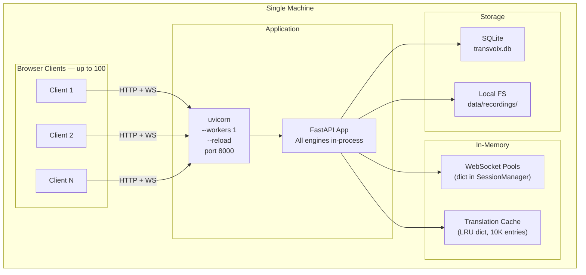

| Component | Specification |
|---|---|
| **Compute** | Single machine (4 CPU, 8GB RAM) |
| **Application** | 1x uvicorn process with auto-reload |
| **Database** | SQLite (single file, WAL mode) |
| **Cache** | In-memory Python dict (LRU, 10K entries) |
| **WebSocket** | In-process dict, no external state |
| **Static Files** | Served by FastAPI `StaticFiles` |
| **Recording Storage** | Local filesystem |
| **Deployment** | `uvicorn main:app --reload` |
| **Monitoring** | Console logs |

---

### 12.2 Tier 2 — Growth (10,000 Users)

**Target:** Public launch, moderate user base.

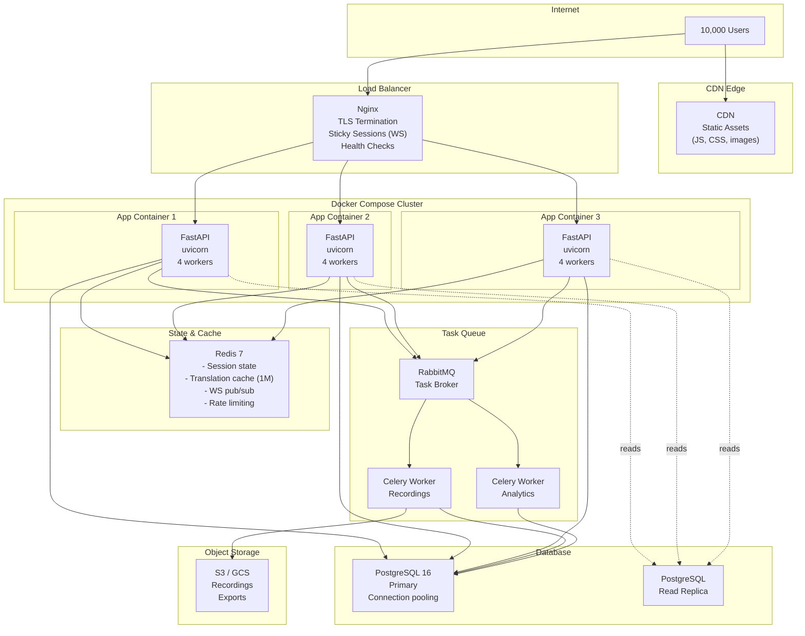

| Component | Specification |
|---|---|
| **Compute** | 3-5x Docker containers (2 CPU, 4GB RAM each) |
| **Load Balancer** | Nginx with sticky sessions for WebSocket affinity |
| **Database** | PostgreSQL 16 (primary + 1 read replica, PgBouncer connection pool) |
| **Cache** | Redis 7 (6GB, LRU eviction, pub/sub for WS fan-out) |
| **Task Queue** | Celery + RabbitMQ (recording processing, analytics aggregation) |
| **Object Storage** | S3/GCS for recordings and caption exports |
| **CDN** | CloudFront/Cloudflare for static assets |
| **Monitoring** | Prometheus + Grafana, Sentry for error tracking |
| **Deployment** | Docker Compose, CI/CD via GitHub Actions |

**Key Architectural Changes from Tier 1:**
- SQLite → **PostgreSQL** (concurrent writes, JSONB, full-text search)
- In-memory cache → **Redis** (shared cache across instances)
- In-process WebSocket pools → **Redis Pub/Sub** (cross-instance message fan-out)
- Synchronous recording processing → **Celery workers** (non-blocking)
- Local filesystem → **S3/GCS** (durable, scalable storage)

---

### 12.3 Tier 3 — Scale (1,000,000 Users)

**Target:** Global platform with millions of concurrent users.

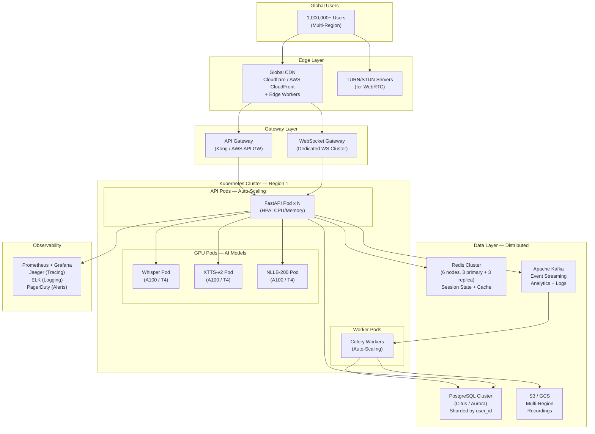

| Component | Specification |
|---|---|
| **Orchestration** | Kubernetes (EKS / GKE) with Horizontal Pod Autoscaler |
| **API Pods** | Auto-scale 10-100 pods based on CPU/memory (2 CPU, 4GB each) |
| **GPU Pods** | Dedicated GPU nodes (NVIDIA A100/T4) for Whisper, XTTS-v2, NLLB-200 |
| **WebSocket Gateway** | Dedicated WS cluster with connection pooling (100K connections/node) |
| **Database** | PostgreSQL with Citus (sharded by user_id) or AWS Aurora |
| **Cache** | Redis Cluster (6 nodes, 48GB total, 99.99% availability) |
| **Event Streaming** | Apache Kafka (analytics, audit logs, event sourcing) |
| **Object Storage** | S3 multi-region replication |
| **CDN** | Cloudflare Enterprise (global PoPs, DDoS protection) |
| **WebRTC** | TURN/STUN servers for P2P audio (Twilio / coturn) |
| **Monitoring** | Prometheus + Grafana + Jaeger + ELK + PagerDuty |
| **Deployment** | GitOps (ArgoCD), Canary deployments, Blue/Green |

**Key Architectural Changes from Tier 2:**
- Docker Compose → **Kubernetes** (auto-scaling, self-healing)
- Nginx → **Dedicated WS Gateway + API Gateway** (protocol-specific scaling)
- Single Redis → **Redis Cluster** (distributed state)
- RabbitMQ → **Apache Kafka** (event streaming, replay, higher throughput)
- PostgreSQL → **Sharded PostgreSQL** (horizontal data scaling)
- CPU translation → **GPU pods** (Whisper, XTTS-v2, NLLB-200)
- Single region → **Multi-region** (geographic distribution)
- WebSocket → **WebRTC** option (lower latency for audio)

### 12.4 Scaling Decision Matrix

| Metric | Tier 1 (Dev) | Tier 2 (Growth) | Tier 3 (Scale) |
|---|---|---|---|
| **Concurrent Users** | 100 | 10,000 | 1,000,000+ |
| **Concurrent Sessions** | 10 | 1,000 | 100,000+ |
| **Translations/sec** | 10 | 1,000 | 100,000+ |
| **WebSocket Connections** | 100 | 10,000 | 1,000,000+ |
| **Database Size** | <1 GB | 10-100 GB | 1+ TB |
| **Monthly Cost** | $0 (local) | $500-2,000 | $50,000-200,000 |
| **Deployment Time** | Instant (local) | 5 min (CI/CD) | 15 min (canary rollout) |
| **Uptime SLA** | None | 99.9% | 99.99% |

---

## Appendix A: Technology Stack Summary

| Layer | Technology | Purpose |
|---|---|---|
| **Frontend** | HTML / CSS / JavaScript (Vanilla) | User interface |
| **Audio** | Web Audio API | Audio capture and processing |
| **STT** | Web Speech API | Speech-to-text |
| **TTS** | Web Speech Synthesis API | Text-to-speech |
| **Real-Time** | WebSocket (native) | Bidirectional communication |
| **Backend** | FastAPI (Python 3.11+) | REST API + WebSocket server |
| **ASGI Server** | uvicorn | ASGI server for FastAPI |
| **Translation** | deep-translator | Multi-provider translation |
| **Language Detection** | langdetect | Language identification |
| **Database** | SQLite via aiosqlite (dev) / PostgreSQL (prod) | Persistent storage |
| **Caching** | In-memory dict (dev) / Redis (prod) | Translation and session cache |
| **Authentication** | PyJWT + bcrypt | JWT tokens + password hashing |
| **Task Queue** | Celery + RabbitMQ (prod) | Async background tasks |

## Appendix B: File Structure

```
transvoix/
├── main.py                         # FastAPI application entry point
├── config.py                       # Configuration and environment variables
├── requirements.txt                # Python dependencies
├── Dockerfile                      # Docker container definition
├── docker-compose.yml              # Multi-container orchestration
│
├── api/                            # API layer
│   ├── routes/
│   │   ├── auth.py                 # Authentication endpoints
│   │   ├── sessions.py             # Session management endpoints
│   │   ├── translate.py            # Translation endpoints
│   │   ├── users.py                # User profile endpoints
│   │   ├── dictionaries.py         # Custom dictionary endpoints
│   │   ├── recordings.py           # Recording endpoints
│   │   ├── analytics.py            # Analytics endpoints
│   │   └── keys.py                 # API key endpoints
│   ├── websocket/
│   │   └── handler.py              # WebSocket connection handler
│   ├── middleware/
│   │   ├── auth.py                 # JWT authentication middleware
│   │   ├── cors.py                 # CORS configuration
│   │   ├── rate_limit.py           # Rate limiting middleware
│   │   └── logging.py              # Request logging middleware
│   └── schemas/
│       ├── auth.py                 # Auth request/response models
│       ├── session.py              # Session models
│       ├── translation.py          # Translation models
│       └── user.py                 # User models
│
├── engines/                        # Engine layer (business logic)
│   ├── translation_engine.py
│   ├── language_negotiator.py
│   ├── session_manager.py
│   ├── adaptive_learner.py
│   ├── caption_manager.py
│   ├── recording_manager.py
│   ├── security_manager.py
│   └── analytics_engine.py
│
├── database/                       # Data layer
│   ├── connection.py               # Database connection management
│   ├── models.py                   # SQLAlchemy / dataclass models
│   └── migrations/                 # Schema migrations
│
├── frontend/                       # Presentation layer
│   ├── index.html
│   ├── css/
│   │   └── styles.css
│   ├── js/
│   │   ├── app.js                  # Main application logic
│   │   ├── audio_processor.js      # Web Audio API processing
│   │   ├── voice_engine.js         # TTS and voice management
│   │   ├── websocket_client.js     # WebSocket connection manager
│   │   └── caption_overlay.js      # Caption display
│   └── assets/
│       ├── icons/
│       └── fonts/
│
├── extension/                      # Browser extension
│   ├── manifest.json
│   ├── background.js
│   ├── content_script.js
│   ├── popup.html
│   ├── popup.js
│   └── icons/
│
├── data/                           # Runtime data (gitignored)
│   ├── transvoix.db               # SQLite database
│   └── recordings/                # Recording files
│
├── tests/                          # Test suite
│   ├── test_translation_engine.py
│   ├── test_session_manager.py
│   ├── test_language_negotiator.py
│   └── test_api/
│
└── docs/                           # Documentation
    └── SDD.md                      # This document
```

---

> **Document Version History**
>
> | Version | Date | Author | Changes |
> |---|---|---|---|
> | 1.0.0 | 2026-07-10 | TransVoix Engineering | Initial comprehensive SDD |
