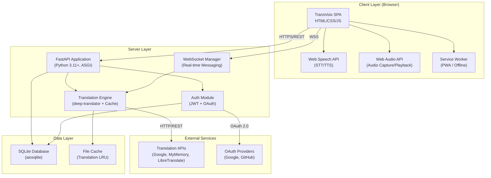

# Software Requirements Specification

## TransVoix — Universal Real-Time AI Communication Platform

| Field              | Value                                      |
| ------------------ | ------------------------------------------ |
| **Document Title** | Software Requirements Specification (SRS)  |
| **Product**        | TransVoix v1.0                             |
| **Standard**       | IEEE 830-1998                              |
| **Status**         | Draft                                      |
| **Date**           | 2026-07-10                                 |
| **Authors**        | TransVoix Engineering Team                 |
| **Classification** | Internal — Engineering Review              |

---

> [!NOTE]
> This document conforms to the IEEE 830-1998 Recommended Practice for Software Requirements Specifications. All requirement identifiers are unique, traceable, and testable.

---

## Revision History

| Version | Date       | Author                 | Description                          |
| ------- | ---------- | ---------------------- | ------------------------------------ |
| 0.1     | 2026-07-10 | TransVoix Engineering  | Initial draft — full IEEE 830 SRS    |

---

## Table of Contents

1. [Introduction](#1-introduction)
2. [Overall Description](#2-overall-description)
3. [Functional Requirements](#3-functional-requirements)
4. [Non-Functional Requirements](#4-non-functional-requirements)
5. [External Interface Requirements](#5-external-interface-requirements)
6. [System Features](#6-system-features)
7. [Acceptance Criteria](#7-acceptance-criteria)

---

## 1. Introduction

### 1.1 Purpose

This Software Requirements Specification (SRS) defines the complete functional and non-functional requirements for **TransVoix v1.0**, a Universal Real-Time AI Communication Platform. The document serves as the authoritative contract between stakeholders, designers, developers, testers, and project managers for the design, implementation, validation, and maintenance of the TransVoix system.

**Intended Audience:**

| Audience             | Usage                                                    |
| -------------------- | -------------------------------------------------------- |
| Software Engineers   | Implementation reference and technical constraints       |
| QA Engineers         | Test case derivation and acceptance criteria              |
| Product Managers     | Feature scope verification and prioritization             |
| UX Designers         | Interface requirements and accessibility constraints      |
| DevOps Engineers     | Deployment, scaling, and infrastructure requirements      |
| Security Auditors    | Security requirements and compliance verification         |
| External Reviewers   | Engineering review and standards compliance               |

### 1.2 Scope

**TransVoix** is a web-based, real-time multilingual communication platform that enables users to converse across language barriers through instant speech-to-text recognition, AI-powered translation, and text-to-speech synthesis — all within a browser, requiring no installation.

**Core Capabilities:**

- **Real-Time Translation** — Text and speech translation across 50+ languages with sub-second latency.
- **Speech Processing** — Browser-native speech recognition (STT) and synthesis (TTS) via the Web Speech API.
- **Language Negotiation** — Automatic detection and routing of languages between participants.
- **Live Captions** — Dual-track captioning (original + translated) with export to SRT/TXT/JSON.
- **Session Management** — Multi-participant rooms (up to 20 users) with WebSocket-based real-time communication.
- **Progressive Web App** — Installable, offline-capable, responsive across all devices.

**Out of Scope (v1.0):**

- Native mobile applications (iOS/Android).
- Video streaming or WebRTC peer-to-peer media.
- Real-time document co-editing.
- Machine learning model training or fine-tuning within the platform.
- Enterprise SSO (SAML/LDAP) — planned for v2.0.

### 1.3 Definitions, Acronyms, and Abbreviations

| Term / Acronym | Definition                                                                                                  |
| -------------- | ----------------------------------------------------------------------------------------------------------- |
| **STT**        | Speech-to-Text — the process of converting spoken audio into written text.                                   |
| **TTS**        | Text-to-Speech — the process of synthesizing spoken audio from written text.                                 |
| **VAD**        | Voice Activity Detection — algorithm that detects the presence or absence of human speech in audio.          |
| **WebRTC**     | Web Real-Time Communication — browser API for peer-to-peer audio/video; used here conceptually for future.   |
| **SSML**       | Speech Synthesis Markup Language — XML-based markup for controlling TTS output (prosody, emphasis, pauses).  |
| **SRT**        | SubRip Text — a widely-used subtitle file format with timestamps and sequential numbering.                   |
| **E2E**        | End-to-End — refers to encryption or testing covering the full data path from origin to destination.         |
| **BLEU**       | Bilingual Evaluation Understudy — metric for evaluating machine translation quality (0–1 scale).             |
| **MOS**        | Mean Opinion Score — subjective quality measure for speech/audio (1–5 scale).                                |
| **LRU**        | Least Recently Used — cache eviction strategy that discards the least recently accessed items first.         |
| **ASGI**       | Asynchronous Server Gateway Interface — Python standard for async web servers and frameworks.                |
| **JWT**        | JSON Web Token — compact, URL-safe token format for securely transmitting claims between parties.            |
| **OAuth**      | Open Authorization — industry-standard protocol for token-based authorization.                               |
| **GDPR**       | General Data Protection Regulation — EU regulation governing personal data protection and privacy.           |
| **PWA**        | Progressive Web App — web application using modern APIs for native app-like capabilities.                    |
| **SPA**        | Single-Page Application — web app that dynamically rewrites the current page rather than loading new pages.  |
| **WCAG**       | Web Content Accessibility Guidelines — W3C standard for making web content accessible.                       |
| **XSS**        | Cross-Site Scripting — security vulnerability where malicious scripts are injected into web content.         |
| **CSRF**       | Cross-Site Request Forgery — attack that forces authenticated users to execute unwanted actions.             |
| **CORS**       | Cross-Origin Resource Sharing — HTTP mechanism that allows restricted resources on a web page from another domain. |
| **REST**       | Representational State Transfer — architectural style for distributed hypermedia systems.                    |
| **WSS**        | WebSocket Secure — encrypted WebSocket protocol running over TLS.                                            |
| **CDN**        | Content Delivery Network — distributed server system for delivering web content with low latency.            |
| **API**        | Application Programming Interface — defined set of protocols for building and integrating application software. |
| **RBAC**       | Role-Based Access Control — method of restricting system access based on user roles.                         |
| **P95**        | 95th Percentile — statistical measure indicating the value below which 95% of observations fall.            |
| **UUID**       | Universally Unique Identifier — 128-bit identifier standard (RFC 4122).                                     |

### 1.4 References

| # | Reference                                                                                         | Version / Date |
| - | ------------------------------------------------------------------------------------------------- | -------------- |
| 1 | IEEE Std 830-1998 — Recommended Practice for Software Requirements Specifications                 | 1998           |
| 2 | IEEE Std 29148-2018 — Systems and Software Engineering — Life Cycle Processes — Requirements Engineering | 2018     |
| 3 | W3C Web Speech API Specification                                                                  | 2024 Draft     |
| 4 | W3C Web Audio API Specification                                                                   | 2021 (CR)      |
| 5 | RFC 6455 — The WebSocket Protocol                                                                 | 2011           |
| 6 | RFC 7519 — JSON Web Token (JWT)                                                                   | 2015           |
| 7 | RFC 6749 — The OAuth 2.0 Authorization Framework                                                  | 2012           |
| 8 | WCAG 2.1 — Web Content Accessibility Guidelines                                                   | 2018           |
| 9 | GDPR — Regulation (EU) 2016/679                                                                   | 2016           |
| 10| FastAPI Documentation                                                                             | 0.115+         |
| 11| deep-translator Python Library Documentation                                                      | 1.11+          |
| 12| SQLite Documentation                                                                              | 3.45+          |
| 13| aiosqlite Documentation                                                                           | 0.20+          |
| 14| SubRip (SRT) Format Specification                                                                 | —              |
| 15| PWA — Web App Manifest Specification (W3C)                                                        | 2024           |

### 1.5 Overview

The remainder of this SRS is organized as follows:

- **Section 2 — Overall Description**: Provides product context, user classes, operating environment, constraints, and assumptions.
- **Section 3 — Functional Requirements**: Enumerates all functional requirements (FR-001 through FR-105) organized by subsystem.
- **Section 4 — Non-Functional Requirements**: Enumerates all non-functional requirements (NFR-001 through NFR-055) covering performance, security, scalability, reliability, usability, compatibility, and maintainability.
- **Section 5 — External Interface Requirements**: Specifies user, hardware, software, and communication interfaces.
- **Section 6 — System Features**: Provides detailed feature specifications for the five core features including stimulus/response sequences and acceptance criteria.
- **Section 7 — Acceptance Criteria**: Defines pass/fail acceptance criteria for all major features.

---

## 2. Overall Description

### 2.1 Product Perspective

TransVoix is a **self-contained web application** that operates as both a standalone translation tool and a collaborative communication platform. It is **not** a component of a larger system, though it exposes REST and WebSocket APIs that enable third-party integration.

**System Context Diagram:**



**System Boundaries:**

| Boundary        | Inside TransVoix                              | Outside TransVoix                      |
| --------------- | --------------------------------------------- | -------------------------------------- |
| Translation     | Caching, routing, fallback chain, batching     | Translation model inference (API)      |
| Speech          | Audio capture, VAD orchestration               | STT/TTS engine (browser-native)        |
| Authentication  | JWT issuance, session management               | OAuth provider identity verification   |
| Data Storage    | SQLite schema, queries, migrations             | Database engine internals              |

### 2.2 Product Functions

**High-Level Function Summary:**

| # | Function Category         | Description                                                                |
| - | ------------------------- | -------------------------------------------------------------------------- |
| 1 | Authentication            | User registration, login (credentials + OAuth), guest mode, session mgmt   |
| 2 | Real-Time Translation     | Instant text translation across 50+ languages with auto-detection          |
| 3 | Speech Recognition        | Browser-based continuous STT with interim results and multi-language support|
| 4 | Speech Synthesis          | TTS with voice selection, pitch/rate/volume control, emotion modulation     |
| 5 | Language Negotiation      | Automatic language detection, routing matrix, confidence-based switching    |
| 6 | Session Management        | Room creation, multi-participant messaging, WebSocket real-time comms       |
| 7 | Live Captions             | Dual-track captions (original + translated), draggable overlay, export      |
| 8 | Recording & Export        | Audio recording, transcript generation, SRT/TXT/JSON export                |
| 9 | User Profile Management   | Language profiles, custom dictionaries, voice preferences, privacy controls |
| 10| Administration            | User management, analytics dashboard, system monitoring, rate limit config  |

### 2.3 User Classes and Characteristics

| User Class             | Description                                                                                             | Technical Proficiency | Frequency of Use | Security Level |
| ---------------------- | ------------------------------------------------------------------------------------------------------- | --------------------- | ----------------- | -------------- |
| **End User (Casual)**  | Individual using TransVoix for personal multilingual conversations, travel, or learning.                 | Low–Medium            | Occasional        | Standard       |
| **Business User**      | Professional using TransVoix for cross-lingual meetings, customer support, or international collaboration.| Medium                | Daily             | Enhanced       |
| **Developer**          | Technical user integrating TransVoix APIs into third-party applications or building extensions.           | High                  | Variable          | API Key        |
| **Administrator**      | System operator managing users, monitoring performance, configuring rate limits, and maintaining uptime.  | High                  | Daily             | Privileged     |
| **Guest / Anonymous**  | Unauthenticated user accessing basic translation features without creating an account.                   | Low                   | One-time          | Minimal        |

**User Class Priorities:**

1. End User (Casual) — Primary target; all UX decisions optimize for this class.
2. Business User — Secondary target; features like recording, export, and multi-participant sessions serve this class.
3. Guest / Anonymous — Tertiary; minimal friction entry point for user acquisition.
4. Developer — Quaternary; API documentation and key management.
5. Administrator — Support class; back-office tooling.

### 2.4 Operating Environment

#### 2.4.1 Server Environment

| Component        | Requirement                                                      |
| ---------------- | ---------------------------------------------------------------- |
| **Runtime**      | Python 3.11+ (CPython)                                           |
| **Framework**    | FastAPI 0.115+ with Uvicorn ASGI server                          |
| **Database**     | SQLite 3.45+ via aiosqlite 0.20+                                 |
| **Translation**  | deep-translator 1.11+ (Google Translator, MyMemory, Libre)       |
| **OS**           | Linux (Ubuntu 22.04+), Windows 10/11, macOS 13+                  |
| **Memory**       | Minimum 2 GB RAM; Recommended 4 GB+                              |
| **Storage**      | Minimum 1 GB; Recommended 10 GB+ (recordings, cache)             |
| **Network**      | Stable internet connection for translation API access             |

#### 2.4.2 Client Environment

| Component              | Requirement                                              |
| ---------------------- | -------------------------------------------------------- |
| **Chrome**             | 90+ (full Web Speech API + Web Audio API support)        |
| **Firefox**            | 85+ (full support; Web Speech API requires fallback)     |
| **Safari**             | 15+ (limited Web Speech API; fallback mechanisms)        |
| **Edge**               | 90+ (Chromium-based; full support)                       |
| **Mobile Browsers**    | Chrome Mobile 90+, Safari iOS 15+                        |
| **Minimum Resolution** | 320px viewport width                                     |
| **Maximum Resolution** | 4K (3840×2160)                                           |
| **PWA Installation**   | Supported on Chrome, Edge, Safari (iOS 16.4+)            |

#### 2.4.3 Network Environment

| Parameter          | Requirement                                    |
| ------------------ | ---------------------------------------------- |
| **Protocol**       | HTTPS (TLS 1.2+), WSS                          |
| **Bandwidth**      | Minimum 256 Kbps per participant                |
| **Latency**        | Maximum 200ms round-trip for acceptable UX      |
| **Ports**          | 443 (HTTPS/WSS), 80 (HTTP redirect only)        |

### 2.5 Design and Implementation Constraints

| ID    | Constraint                                                                                                              | Rationale                                               |
| ----- | ----------------------------------------------------------------------------------------------------------------------- | ------------------------------------------------------- |
| C-001 | Web Speech API is **only available in Chromium-based browsers** with full STT support; Firefox and Safari have partial/no support. | Browser vendor implementation decisions.                 |
| C-002 | Safari restricts Web Speech API — `SpeechRecognition` is unavailable; only `SpeechSynthesis` is supported.               | Apple's WebKit implementation limitations.               |
| C-003 | Free translation APIs (Google via deep-translator) impose **rate limits** (~5,000 chars/request, ~100K chars/hour).       | Third-party API terms of service.                        |
| C-004 | WebSocket connections are limited by server memory; each connection consumes ~50 KB.                                      | Uvicorn/ASGI server resource constraints.                |
| C-005 | SQLite supports only **one writer at a time** (WAL mode allows concurrent reads); not suitable for >1000 concurrent writes/sec. | SQLite architectural design.                             |
| C-006 | All frontend code must be **vanilla HTML/CSS/JS** — no frontend frameworks (React, Vue, Angular).                         | Project architecture decision for simplicity.            |
| C-007 | Audio recording is constrained by browser `MediaRecorder` API capabilities and codec support.                             | Browser API limitations.                                 |
| C-008 | The system must operate without GPU acceleration; all ML inference is delegated to external APIs.                          | Cost and deployment simplicity.                          |
| C-009 | JWT tokens must not exceed 8 KB to remain compatible with HTTP header size limits across all target browsers.              | HTTP specification and proxy constraints.                |
| C-010 | All persistent data must be stored in SQLite; no external database servers are required for v1.0.                          | Deployment simplicity and zero-configuration requirement.|

### 2.6 Assumptions and Dependencies

**Assumptions:**

| ID   | Assumption                                                                                                       |
| ---- | ---------------------------------------------------------------------------------------------------------------- |
| A-001| Users have a modern browser (see §2.4.2) with JavaScript enabled.                                                 |
| A-002| Users grant microphone permission when using speech features.                                                      |
| A-003| The server has persistent internet access for translation API calls.                                               |
| A-004| Translation API providers (Google, MyMemory) maintain backward-compatible APIs.                                    |
| A-005| Browser vendors continue supporting the Web Speech API and Web Audio API.                                          |
| A-006| SQLite performance is sufficient for the target concurrent user load (≤100 sessions).                              |
| A-007| Users accept that translation quality depends on third-party API accuracy.                                         |
| A-008| The deployment environment supports Python 3.11+ and can install pip packages.                                     |

**Dependencies:**

| ID   | Dependency                  | Type     | Impact if Unavailable                                    |
| ---- | --------------------------- | -------- | -------------------------------------------------------- |
| D-001| Google Translate (via deep-translator) | External | Primary translation fails; fallback to MyMemory/Libre   |
| D-002| MyMemory Translation API    | External | Secondary translation fails; fallback to LibreTranslate  |
| D-003| LibreTranslate              | External | Tertiary translation fails; cached results only           |
| D-004| Google OAuth 2.0            | External | Google login unavailable; local auth still works          |
| D-005| GitHub OAuth                | External | GitHub login unavailable; local auth still works          |
| D-006| Web Speech API (Browser)    | Client   | STT/TTS unavailable; text-only mode activated             |
| D-007| Web Audio API (Browser)     | Client   | Audio capture unavailable; manual text input only         |
| D-008| SQLite / aiosqlite          | Internal | Application cannot start; critical dependency             |
| D-009| FastAPI / Uvicorn           | Internal | Application cannot start; critical dependency             |

---

## 3. Functional Requirements

> [!IMPORTANT]
> All functional requirements are numbered sequentially (FR-001 through FR-105). Each requirement is atomic, testable, and traceable. Priority levels: **Must** (required for v1.0), **Should** (high-value, may defer), **Could** (desirable, deferred if constrained).

---

### 3.1 Authentication & Authorization (FR-001 — FR-015)

| ID     | Requirement                                                                                                                                     | Priority | Depends On |
| ------ | ----------------------------------------------------------------------------------------------------------------------------------------------- | -------- | ---------- |
| FR-001 | The system **shall** provide a user registration endpoint (`POST /api/auth/register`) accepting `email`, `username`, and `password`.             | Must     | —          |
| FR-002 | The system **shall** hash all passwords using bcrypt with a minimum work factor of 12 before storage.                                            | Must     | FR-001     |
| FR-003 | The system **shall** issue a JWT access token (RS256-signed, 15-minute expiry) upon successful authentication.                                   | Must     | FR-001     |
| FR-004 | The system **shall** issue a JWT refresh token (7-day expiry) alongside the access token, stored as an HttpOnly secure cookie.                   | Must     | FR-003     |
| FR-005 | The system **shall** provide a token refresh endpoint (`POST /api/auth/refresh`) that validates the refresh token and issues a new access token.  | Must     | FR-004     |
| FR-006 | The system **shall** support OAuth 2.0 Authorization Code flow for Google login (`GET /api/auth/google`).                                        | Should   | —          |
| FR-007 | The system **shall** support OAuth 2.0 Authorization Code flow for GitHub login (`GET /api/auth/github`).                                        | Should   | —          |
| FR-008 | The system **shall** create a local user account on first OAuth login, linking the OAuth provider ID to the internal user record.                 | Should   | FR-006, FR-007 |
| FR-009 | The system **shall** support **Guest / Anonymous mode** — users can access basic translation features without authentication.                     | Must     | —          |
| FR-010 | Guest sessions **shall** expire after 24 hours and **shall not** persist data (language profiles, dictionaries).                                  | Must     | FR-009     |
| FR-011 | The system **shall** implement Role-Based Access Control (RBAC) with three roles: `user`, `admin`, `enterprise`.                                 | Must     | FR-001     |
| FR-012 | The `admin` role **shall** grant access to user management, analytics dashboard, and system configuration endpoints.                              | Must     | FR-011     |
| FR-013 | The system **shall** provide an API key management interface (`POST /api/keys`, `DELETE /api/keys/{id}`) for developer users.                     | Should   | FR-011     |
| FR-014 | API keys **shall** be scoped to specific permissions (read, write, translate) and rate-limited independently.                                     | Should   | FR-013     |
| FR-015 | The system **shall** invalidate all tokens for a user upon password change or account deactivation.                                               | Must     | FR-003     |

---

### 3.2 Translation Engine (FR-016 — FR-030)

| ID     | Requirement                                                                                                                                     | Priority | Depends On |
| ------ | ----------------------------------------------------------------------------------------------------------------------------------------------- | -------- | ---------- |
| FR-016 | The system **shall** translate text between any pair of 50+ supported languages via the `POST /api/translate` endpoint.                           | Must     | —          |
| FR-017 | The translation endpoint **shall** accept `source_lang` (optional), `target_lang` (required), and `text` (required, max 5000 chars).             | Must     | FR-016     |
| FR-018 | When `source_lang` is omitted, the system **shall** auto-detect the source language with ≥90% accuracy for inputs ≥20 characters.                | Must     | FR-016     |
| FR-019 | The system **shall** return auto-detected language code and confidence score (0.0–1.0) in the response.                                           | Must     | FR-018     |
| FR-020 | The system **shall** handle **code-switching** (mixed-language input) by detecting the dominant language and translating the full text.            | Should   | FR-018     |
| FR-021 | The system **shall** support **context-aware translation** by accepting an optional `context` parameter (preceding conversation text, max 1000 chars). | Should | FR-016     |
| FR-022 | The system **shall** integrate **custom dictionaries** — user-defined term pairs that override translation output for specified terms.             | Should   | FR-016     |
| FR-023 | The system **shall** implement an **LRU translation cache** (configurable size, default 10,000 entries) to avoid redundant API calls.              | Must     | FR-016     |
| FR-024 | Cache keys **shall** be computed as `SHA-256(source_lang + target_lang + normalized_text)`.                                                        | Must     | FR-023     |
| FR-025 | The system **shall** support **batch translation** — accepting an array of up to 50 text segments in a single request (`POST /api/translate/batch`). | Should  | FR-016     |
| FR-026 | The system **shall** implement a **translation fallback chain**: Google Translate → MyMemory → LibreTranslate → cached result → error.            | Must     | FR-016     |
| FR-027 | When the primary translation provider fails, the system **shall** automatically attempt the next provider within 2 seconds.                       | Must     | FR-026     |
| FR-028 | The system **shall** log all translation requests with timestamp, source/target languages, character count, provider used, and latency.            | Must     | FR-016     |
| FR-029 | The system **shall** expose a `GET /api/languages` endpoint returning all supported language codes, names (in English and native script), and directionality (LTR/RTL). | Must | — |
| FR-030 | The system **shall** support **translation quality feedback** — users can rate translations (1–5) which is logged for future quality analysis.     | Could    | FR-016     |

---

### 3.3 Speech Processing (FR-031 — FR-045)

| ID     | Requirement                                                                                                                                     | Priority | Depends On |
| ------ | ----------------------------------------------------------------------------------------------------------------------------------------------- | -------- | ---------- |
| FR-031 | The client **shall** capture microphone audio using the Web Audio API `getUserMedia()` with echo cancellation and noise suppression enabled.      | Must     | —          |
| FR-032 | The client **shall** implement **Voice Activity Detection (VAD)** using audio energy thresholds to avoid sending silence to the STT engine.       | Must     | FR-031     |
| FR-033 | The VAD **shall** use configurable parameters: silence threshold (default -50 dB), speech threshold (default -30 dB), and silence duration (default 1.5s). | Should | FR-032  |
| FR-034 | The client **shall** perform **continuous speech recognition** using the Web Speech API `SpeechRecognition` interface with `continuous = true`.    | Must     | FR-031     |
| FR-035 | The client **shall** display **interim (partial) recognition results** in real-time as the user speaks.                                           | Must     | FR-034     |
| FR-036 | The client **shall** send **final recognition results** to the server for translation upon speech segment completion.                              | Must     | FR-034     |
| FR-037 | The system **shall** support multi-language speech recognition — the recognition language is set based on the user's selected source language.     | Must     | FR-034     |
| FR-038 | The client **shall** provide a visual **audio level indicator** (VU meter) showing real-time microphone input levels.                              | Should   | FR-031     |
| FR-039 | The client **shall** perform **speech synthesis (TTS)** of translated text using the Web Speech API `SpeechSynthesis` interface.                   | Must     | —          |
| FR-040 | The TTS **shall** allow voice selection from the browser's available voices, filtered by the target language.                                      | Must     | FR-039     |
| FR-041 | The TTS **shall** provide user-adjustable **pitch** (0.5–2.0), **rate** (0.5–2.0), and **volume** (0.0–1.0) controls.                             | Must     | FR-039     |
| FR-042 | The system **shall** support **emotion modulation** in TTS via SSML tags (emphasis, prosody) where supported by the browser.                      | Could    | FR-039     |
| FR-043 | When the Web Speech API is unavailable (Firefox STT, Safari STT), the system **shall** gracefully degrade to **text-only input mode**.             | Must     | FR-034     |
| FR-044 | The client **shall** display a clear notification when speech features are unavailable, with guidance on supported browsers.                       | Must     | FR-043     |
| FR-045 | The client **shall** allow users to **manually stop/start** speech recognition via a toggle button with clear visual state indication.             | Must     | FR-034     |

---

### 3.4 Language Negotiation (FR-046 — FR-060)

| ID     | Requirement                                                                                                                                     | Priority | Depends On |
| ------ | ----------------------------------------------------------------------------------------------------------------------------------------------- | -------- | ---------- |
| FR-046 | Each authenticated user **shall** have a **language profile** consisting of: primary language, secondary languages (up to 5), and proficiency levels. | Must   | FR-001     |
| FR-047 | The system **shall** automatically detect the browser's locale (`navigator.language`) and suggest it as the default primary language.              | Must     | —          |
| FR-048 | When two participants join a session, the system **shall** compute a **translation routing matrix** determining who translates to whom.            | Must     | FR-046     |
| FR-049 | The routing matrix **shall** identify shared languages (no translation needed) and determine optimal source→target pairs for each participant.     | Must     | FR-048     |
| FR-050 | The system **shall** dynamically update the translation routing matrix when a participant changes their language preference mid-session.           | Must     | FR-048     |
| FR-051 | The system **shall** implement **automatic language detection per message** — each message's source language is detected independently.             | Should   | FR-018     |
| FR-052 | Language detection **shall** include a confidence threshold (configurable, default 0.7); below the threshold, the user's profile language is used. | Should   | FR-051     |
| FR-053 | The system **shall** support **one-sided negotiation** — a participant can set their output language independently of their input language.        | Must     | FR-046     |
| FR-054 | The system **shall** broadcast language profile changes to all session participants via WebSocket.                                                  | Must     | FR-050     |
| FR-055 | The system **shall** maintain a language capability registry mapping each language code to available translation providers and speech capabilities.  | Should   | —          |
| FR-056 | The system **shall** detect and handle **RTL (right-to-left) languages** (Arabic, Hebrew, Farsi, Urdu) with appropriate text directionality.       | Must     | FR-029     |
| FR-057 | The system **shall** support language grouping by family (Romance, Germanic, CJK, etc.) in the language selector UI.                               | Could    | FR-029     |
| FR-058 | Guest users **shall** have language negotiation based solely on browser locale detection and manual selection (no stored profile).                  | Must     | FR-009     |
| FR-059 | The system **shall** display the detected language alongside each message in the chat interface.                                                    | Should   | FR-051     |
| FR-060 | The system **shall** provide a `GET /api/negotiate` endpoint that accepts two language profiles and returns the optimal routing configuration.      | Should   | FR-048     |

---

### 3.5 Session Management (FR-061 — FR-075)

| ID     | Requirement                                                                                                                                     | Priority | Depends On |
| ------ | ----------------------------------------------------------------------------------------------------------------------------------------------- | -------- | ---------- |
| FR-061 | The system **shall** allow authenticated users to **create a translation session** (room) via `POST /api/sessions`.                               | Must     | FR-001     |
| FR-062 | Each session **shall** be identified by a unique UUID and a human-readable **room code** (6 alphanumeric characters).                              | Must     | FR-061     |
| FR-063 | The system **shall** allow users to **join a session** by entering the room code or following a shareable link.                                    | Must     | FR-062     |
| FR-064 | Sessions **shall** support up to **20 concurrent participants**.                                                                                   | Must     | FR-061     |
| FR-065 | The system **shall** establish a **WebSocket connection** (`WSS /ws/{session_id}`) for each participant upon joining a session.                    | Must     | FR-063     |
| FR-066 | The WebSocket **shall** use a JSON message protocol with fields: `type`, `sender_id`, `content`, `source_lang`, `target_lang`, `timestamp`.       | Must     | FR-065     |
| FR-067 | The system **shall** broadcast **participant join events** (type: `user_joined`) to all session members with the new participant's display name and language. | Must | FR-065 |
| FR-068 | The system **shall** broadcast **participant leave events** (type: `user_left`) to all session members.                                            | Must     | FR-065     |
| FR-069 | The system **shall** persist session metadata (creation time, participants, settings) in the database.                                              | Must     | FR-061     |
| FR-070 | The system **shall** persist the **last 500 messages** per session for history retrieval upon reconnection.                                         | Should   | FR-069     |
| FR-071 | The system **shall** implement **WebSocket reconnection** — upon connection drop, the client retries with exponential backoff (1s, 2s, 4s, 8s, max 30s). | Must | FR-065 |
| FR-072 | Upon reconnection, the system **shall** send missed messages (delta sync) based on the client's last received message timestamp.                   | Should   | FR-071     |
| FR-073 | Sessions **shall** automatically close after **2 hours of inactivity** (no messages from any participant).                                         | Must     | FR-069     |
| FR-074 | The session creator **shall** have host privileges: muting participants, ending the session, and modifying session settings.                        | Should   | FR-061     |
| FR-075 | The system **shall** provide a `GET /api/sessions/{id}/participants` endpoint returning the current participant list with online status.            | Must     | FR-065     |

---

### 3.6 Captions & Recording (FR-076 — FR-090)

| ID     | Requirement                                                                                                                                     | Priority | Depends On |
| ------ | ----------------------------------------------------------------------------------------------------------------------------------------------- | -------- | ---------- |
| FR-076 | The system **shall** display **dual-track live captions**: original language text (top) and translated text (bottom).                              | Must     | FR-016, FR-034 |
| FR-077 | Captions **shall** update in real-time as interim speech recognition results arrive.                                                               | Must     | FR-035     |
| FR-078 | The caption overlay **shall** be **draggable** — users can reposition it anywhere on the screen.                                                   | Must     | —          |
| FR-079 | The caption overlay **shall** be **resizable** — users can adjust the width and height of the caption container.                                   | Should   | FR-078     |
| FR-080 | The caption overlay **shall** support configurable font size (12px–36px), font family, text color, and background opacity.                         | Should   | FR-078     |
| FR-081 | The system **shall** maintain a **complete transcript** of all messages in a session, including original and translated text with timestamps.       | Must     | FR-066     |
| FR-082 | The system **shall** export transcripts in **SRT format** with sequential numbering and timestamps (`HH:MM:SS,mmm --> HH:MM:SS,mmm`).             | Must     | FR-081     |
| FR-083 | The system **shall** export transcripts in **plain text (TXT) format** with timestamps and speaker labels.                                         | Must     | FR-081     |
| FR-084 | The system **shall** export transcripts in **JSON format** with structured fields: `speaker`, `original_text`, `translated_text`, `source_lang`, `target_lang`, `timestamp`. | Must | FR-081 |
| FR-085 | The client **shall** support **audio recording** of the session using the `MediaRecorder` API, storing audio as WebM/Opus or WAV.                  | Should   | FR-031     |
| FR-086 | Audio recording **shall** require explicit user consent (opt-in) and display a visible recording indicator to all participants.                     | Must     | FR-085     |
| FR-087 | The system **shall** allow users to **download recorded audio** as a file from the session interface.                                              | Should   | FR-085     |
| FR-088 | The system **shall** generate an **automated meeting summary** from the session transcript, highlighting key topics and action items.               | Could    | FR-081     |
| FR-089 | Captions **shall** auto-scroll to the latest message, with an option to pause auto-scroll and manually review history.                              | Must     | FR-076     |
| FR-090 | The system **shall** support **caption search** — users can search through the transcript by keyword.                                               | Could    | FR-081     |

---

### 3.7 User Management (FR-091 — FR-105)

| ID     | Requirement                                                                                                                                     | Priority | Depends On |
| ------ | ----------------------------------------------------------------------------------------------------------------------------------------------- | -------- | ---------- |
| FR-091 | The system **shall** provide CRUD operations for **language profiles** (`/api/users/{id}/languages`).                                              | Must     | FR-046     |
| FR-092 | The system **shall** provide CRUD operations for **custom dictionaries** (`/api/users/{id}/dictionaries`).                                         | Should   | FR-022     |
| FR-093 | Custom dictionaries **shall** support up to 1,000 term pairs per user, each with source term, target term, source language, and target language.   | Should   | FR-092     |
| FR-094 | The system **shall** persist **voice settings** (preferred voice, pitch, rate, volume) per user per language.                                       | Should   | FR-041     |
| FR-095 | The system **shall** support **adaptive learning preferences** — tracking frequently used language pairs and surfacing them as suggestions.         | Could    | FR-091     |
| FR-096 | The system **shall** provide a **user settings page** for managing profile, language preferences, voice settings, and notification preferences.     | Must     | FR-091     |
| FR-097 | The system **shall** provide **privacy controls**: users can opt out of translation logging, analytics, and data sharing.                           | Must     | —          |
| FR-098 | The system **shall** support **data export** — users can download all their personal data (profile, dictionaries, transcripts) as a JSON archive.   | Must     | —          |
| FR-099 | The system **shall** support **account deletion** — upon request, all user data is permanently deleted within 30 days (GDPR right to erasure).     | Must     | —          |
| FR-100 | The system **shall** provide a **data deletion confirmation** endpoint and send email confirmation upon deletion request.                           | Must     | FR-099     |
| FR-101 | The system **shall** display a **privacy policy** and **terms of service** accessible from all pages.                                               | Must     | —          |
| FR-102 | The system **shall** support **user avatar upload** (JPEG/PNG, max 2 MB) with automatic resizing to 128×128 pixels.                                | Could    | FR-001     |
| FR-103 | The system **shall** support **display name customization** separate from the username.                                                             | Should   | FR-001     |
| FR-104 | The system **shall** maintain a **session history** page listing the user's past sessions with date, duration, participants, and language pairs.     | Should   | FR-069     |
| FR-105 | The system **shall** provide an **admin dashboard** with metrics: active users, sessions/day, translations/day, error rate, and API usage.          | Should   | FR-012     |

---

## 4. Non-Functional Requirements

> [!IMPORTANT]
> All non-functional requirements are numbered NFR-001 through NFR-055. Each defines a measurable quality attribute with acceptance thresholds.

---

### 4.1 Performance (NFR-001 — NFR-010)

| ID      | Requirement                                                                                                          | Metric / Threshold                    | Priority |
| ------- | -------------------------------------------------------------------------------------------------------------------- | ------------------------------------- | -------- |
| NFR-001 | Translation API round-trip latency **shall** not exceed **1 second** at the 95th percentile (P95).                    | P95 ≤ 1000ms                          | Must     |
| NFR-002 | Speech recognition (STT) latency from utterance end to final result **shall** not exceed **500ms** at P95.            | P95 ≤ 500ms                           | Must     |
| NFR-003 | WebSocket message delivery latency (server send → client receive) **shall** not exceed **100ms** at P95.              | P95 ≤ 100ms                           | Must     |
| NFR-004 | The system **shall** support at least **100 concurrent active sessions** per server instance.                          | ≥ 100 sessions                        | Must     |
| NFR-005 | The system **shall** support at least **500 concurrent WebSocket connections** per server instance.                     | ≥ 500 connections                     | Should   |
| NFR-006 | Initial page load (first contentful paint) **shall** complete within **2 seconds** on a 4G connection.                 | FCP ≤ 2000ms                          | Must     |
| NFR-007 | Time to Interactive (TTI) **shall** not exceed **3 seconds** on a 4G connection.                                       | TTI ≤ 3000ms                          | Should   |
| NFR-008 | UI animations **shall** maintain **60 frames per second** (16.67ms per frame) with no visible jank.                    | ≥ 60fps                               | Should   |
| NFR-009 | Translation cache hit rate **shall** exceed **30%** under typical usage patterns.                                       | Cache hit ≥ 30%                       | Should   |
| NFR-010 | The API **shall** return error responses within **200ms** for invalid requests (validation failures, auth errors).      | P95 ≤ 200ms                           | Must     |

---

### 4.2 Scalability (NFR-011 — NFR-018)

| ID      | Requirement                                                                                                          | Metric / Threshold                    | Priority |
| ------- | -------------------------------------------------------------------------------------------------------------------- | ------------------------------------- | -------- |
| NFR-011 | The backend **shall** be designed as **stateless** — no server-local state beyond the current request/connection.      | Stateless architecture                | Must     |
| NFR-012 | The system **shall** support **horizontal scaling** by deploying multiple Uvicorn instances behind a load balancer.    | ≥ 4 instances                         | Should   |
| NFR-013 | Session state (at scale) **shall** be externalizable to **Redis** for cross-instance access.                           | Redis-compatible                      | Should   |
| NFR-014 | Static assets (HTML, CSS, JS, images) **shall** be servable from a **CDN** with appropriate cache headers.             | CDN-compatible                        | Should   |
| NFR-015 | Database connections **shall** use **connection pooling** with configurable pool size (default: 10 connections).        | Pool size: 5–50                       | Must     |
| NFR-016 | The system **shall** support **WebSocket connection distribution** across instances via sticky sessions or Redis pub/sub. | Multi-instance WS                   | Should   |
| NFR-017 | The translation cache **shall** be configurable to use **in-memory (default)** or **Redis-backed** storage.            | Configurable backend                  | Should   |
| NFR-018 | The system **shall** handle **graceful shutdown** — completing in-flight requests and closing WebSocket connections cleanly upon SIGTERM. | Clean shutdown               | Must     |

---

### 4.3 Security (NFR-019 — NFR-032)

| ID      | Requirement                                                                                                          | Metric / Threshold                    | Priority |
| ------- | -------------------------------------------------------------------------------------------------------------------- | ------------------------------------- | -------- |
| NFR-019 | All client-server communication **shall** use **HTTPS (TLS 1.2+)** and **WSS** — no plaintext HTTP in production.     | 100% encrypted                        | Must     |
| NFR-020 | JWT access tokens **shall** be signed using **RS256** (RSA with SHA-256) with a minimum 2048-bit key.                  | RS256, 2048-bit                       | Must     |
| NFR-021 | The system **shall** enforce **rate limiting** at 100 requests per minute per IP address for REST endpoints.            | 100 req/min/IP                        | Must     |
| NFR-022 | The system **shall** enforce **rate limiting** at 10 WebSocket messages per second per connection.                      | 10 msg/sec/conn                       | Must     |
| NFR-023 | All user text input **shall** be **sanitized** against XSS (HTML entity encoding, script tag stripping).               | Zero XSS vectors                      | Must     |
| NFR-024 | All state-changing REST endpoints **shall** be protected against **CSRF** using SameSite cookies and CSRF tokens.      | CSRF protection                       | Must     |
| NFR-025 | The system **shall** implement **CORS** with a whitelist of allowed origins (no wildcard `*` in production).            | Origin whitelist                      | Must     |
| NFR-026 | Audio recording **shall** require explicit **voice consent** from all participants before initiating.                    | Explicit consent                      | Must     |
| NFR-027 | Sensitive data (passwords, tokens) **shall** be **encrypted at rest** in the SQLite database using application-level encryption. | AES-256 or equivalent           | Should   |
| NFR-028 | The system **shall** comply with **GDPR** — data portability (FR-098), right to erasure (FR-099), consent management.  | GDPR compliant                        | Must     |
| NFR-029 | API keys **shall** be stored as **salted hashes** — plaintext keys are shown only once at creation time.               | Hash-only storage                     | Should   |
| NFR-030 | The system **shall** implement **Content Security Policy (CSP)** headers restricting inline scripts and external resources. | CSP enforced                       | Should   |
| NFR-031 | The system **shall** log all authentication events (login, logout, failed attempts) with IP address and timestamp.      | 100% auth event logging               | Must     |
| NFR-032 | The system **shall** lock accounts after **5 consecutive failed login attempts** for 15 minutes.                        | Lockout: 5 attempts / 15 min          | Should   |

---

### 4.4 Reliability (NFR-033 — NFR-039)

| ID      | Requirement                                                                                                          | Metric / Threshold                    | Priority |
| ------- | -------------------------------------------------------------------------------------------------------------------- | ------------------------------------- | -------- |
| NFR-033 | The system **shall** target **99.9% uptime** (≤8.76 hours downtime per year), excluding planned maintenance.           | 99.9% availability                    | Should   |
| NFR-034 | Upon translation API failure, the system **shall** gracefully degrade by attempting the **fallback chain** (FR-026).    | Automatic fallback                    | Must     |
| NFR-035 | WebSocket connections **shall** automatically reconnect using **exponential backoff** (1s–30s) upon disconnection.      | Auto-reconnect ≤ 30s                  | Must     |
| NFR-036 | The system **shall** provide **offline capability** — previously cached translations are available without network.     | Offline cache                         | Should   |
| NFR-037 | The system **shall** handle **database write conflicts** gracefully using SQLite WAL mode and retry logic (3 retries).  | WAL + 3 retries                       | Must     |
| NFR-038 | The system **shall** implement **health check endpoints** (`GET /health`, `GET /health/ready`) for monitoring.          | HTTP 200 when healthy                 | Must     |
| NFR-039 | The system **shall** recover from **unhandled exceptions** without crashing — global exception handlers return 500 with error ID. | Zero unhandled crashes         | Must     |

---

### 4.5 Usability (NFR-040 — NFR-046)

| ID      | Requirement                                                                                                          | Metric / Threshold                    | Priority |
| ------- | -------------------------------------------------------------------------------------------------------------------- | ------------------------------------- | -------- |
| NFR-040 | The UI **shall** comply with **WCAG 2.1 Level AA** accessibility guidelines.                                          | WCAG 2.1 AA                           | Must     |
| NFR-041 | All interactive elements **shall** be accessible via **keyboard navigation** (Tab, Enter, Escape, Arrow keys).         | 100% keyboard accessible              | Must     |
| NFR-042 | All interactive elements **shall** have appropriate **ARIA labels** for screen reader compatibility.                    | ARIA-labeled                          | Must     |
| NFR-043 | The UI **shall** be **responsive** from 320px viewport width (mobile) to 3840px (4K desktop).                          | 320px–3840px                          | Must     |
| NFR-044 | Color contrast ratios **shall** meet WCAG AA minimums: 4.5:1 for normal text, 3:1 for large text.                      | ≥ 4.5:1 / ≥ 3:1                      | Must     |
| NFR-045 | The system **shall** support both **light and dark themes** with user preference persistence.                           | Dual theme                            | Should   |
| NFR-046 | New users **shall** be able to complete their first translation within **30 seconds** without reading documentation.    | ≤ 30s to first action                 | Must     |

---

### 4.6 Browser Compatibility (NFR-047 — NFR-051)

| ID      | Requirement                                                                                                          | Support Level                         | Priority |
| ------- | -------------------------------------------------------------------------------------------------------------------- | ------------------------------------- | -------- |
| NFR-047 | **Chrome 90+** — full support for all features including Web Speech API STT/TTS, Web Audio API, and WebSocket.         | Full                                  | Must     |
| NFR-048 | **Firefox 85+** — full support; Web Speech API STT requires fallback (text-input mode) if `SpeechRecognition` is unavailable. | Full with fallback              | Must     |
| NFR-049 | **Safari 15+** — limited Web Speech API support; `SpeechRecognition` unavailable; `SpeechSynthesis` available; text-input fallback for STT. | Partial with fallback        | Must     |
| NFR-050 | **Edge 90+** — full support (Chromium-based, equivalent to Chrome).                                                    | Full                                  | Must     |
| NFR-051 | For any unsupported API, the system **shall** display a **graceful fallback UI** with clear messaging about feature availability. | Graceful degradation           | Must     |

---

### 4.7 Maintainability (NFR-052 — NFR-055)

| ID      | Requirement                                                                                                          | Metric / Threshold                    | Priority |
| ------- | -------------------------------------------------------------------------------------------------------------------- | ------------------------------------- | -------- |
| NFR-052 | The codebase **shall** follow a **modular architecture** — each subsystem (auth, translation, speech, sessions) in its own module. | Module isolation               | Must     |
| NFR-053 | The system **shall** implement **structured logging** (JSON format) with severity levels (DEBUG, INFO, WARNING, ERROR, CRITICAL). | Structured JSON logs            | Must     |
| NFR-054 | The system **shall** implement **error tracking** with unique error IDs returned to the client for support correlation. | Error IDs in responses                | Must     |
| NFR-055 | The API **shall** support **versioning** via URL prefix (`/api/v1/`, `/api/v2/`) for backward-compatible evolution.    | URL-based versioning                  | Should   |

---

## 5. External Interface Requirements

### 5.1 User Interfaces

#### 5.1.1 General UI Requirements

| ID     | Requirement                                                                                              |
| ------ | -------------------------------------------------------------------------------------------------------- |
| UI-001 | The application **shall** be a Single-Page Application (SPA) built with vanilla HTML, CSS, and JavaScript. |
| UI-002 | The UI **shall** use a responsive layout system supporting viewports from 320px to 3840px.                |
| UI-003 | The UI **shall** implement a consistent design system with defined color palette, typography, and spacing. |
| UI-004 | All interactive elements **shall** have unique, descriptive HTML `id` attributes.                         |
| UI-005 | The UI **shall** provide visual feedback for all user actions within 100ms (button press states, loading indicators). |

#### 5.1.2 Screen Inventory

| Screen                   | Description                                                                            | Access Level    |
| ------------------------ | -------------------------------------------------------------------------------------- | --------------- |
| Landing Page             | Product introduction, feature showcase, quick-start translation widget.                  | Public          |
| Login / Register         | Authentication forms (email/password, OAuth buttons, guest access link).                 | Public          |
| Translation Dashboard    | Primary workspace: text input, translation output, language selectors, speech controls.  | Authenticated + Guest |
| Session Room             | Multi-participant real-time communication with captions, chat, and voice controls.       | Authenticated   |
| User Settings            | Language profile, voice preferences, custom dictionaries, privacy controls.              | Authenticated   |
| Session History          | List of past sessions with metadata and transcript download options.                     | Authenticated   |
| Admin Dashboard          | System metrics, user management, rate limit configuration, error logs.                   | Admin only      |
| API Key Management       | Create, view, revoke API keys with scope configuration.                                  | Developer role  |

#### 5.1.3 Translation Dashboard Layout

```
┌─────────────────────────────────────────────────────────────────┐
│  [Logo]  TransVoix          [Theme] [Settings] [User Avatar ▼] │
├─────────────────────────────────────────────────────────────────┤
│                                                                 │
│  ┌──────────────────────┐   ┌──────────────────────┐            │
│  │ Source Language  [▼]  │   │ Target Language  [▼]  │            │
│  │ [Auto-Detect]        │   │                       │            │
│  ├──────────────────────┤   ├──────────────────────┤            │
│  │                      │   │                       │            │
│  │  [Source Text Area]  │   │ [Translated Text Area] │            │
│  │                      │   │                       │            │
│  │                      │   │                       │            │
│  ├──────────────────────┤   ├──────────────────────┤            │
│  │ 🎤 [Mic] [VU Meter]  │   │ 🔊 [Play] [Voice ▼]  │            │
│  └──────────────────────┘   └──────────────────────┘            │
│                                                                 │
│  ┌──────────────────────────────────────────────────┐           │
│  │ [Swap Languages ⇄]  [History]  [Export ▼]  [New Session] │   │
│  └──────────────────────────────────────────────────┘           │
│                                                                 │
│  ┌──────────────────────────────────────────────────┐           │
│  │            Caption Overlay (Draggable)            │           │
│  │  Original: "Bonjour, comment allez-vous ?"       │           │
│  │  Translated: "Hello, how are you?"               │           │
│  └──────────────────────────────────────────────────┘           │
│                                                                 │
├─────────────────────────────────────────────────────────────────┤
│  [Privacy Policy]  [Terms]  [Help]            © 2026 TransVoix │
└─────────────────────────────────────────────────────────────────┘
```

### 5.2 Hardware Interfaces

| ID     | Interface           | Direction | Description                                                                                   |
| ------ | ------------------- | --------- | --------------------------------------------------------------------------------------------- |
| HW-001 | Microphone          | Input     | Audio input device accessed via `navigator.mediaDevices.getUserMedia({ audio: true })`. Required for STT. Supports built-in, USB, and Bluetooth microphones. |
| HW-002 | Speakers / Headphones| Output   | Audio output device for TTS playback via `SpeechSynthesis` and `AudioContext`. Supports built-in speakers, wired headphones, and Bluetooth audio. |
| HW-003 | Bluetooth Audio     | I/O       | Bluetooth audio devices are accessed transparently through the browser's media device APIs. No direct Bluetooth protocol handling is required. |
| HW-004 | Display             | Output    | Minimum 320px viewport width; touch screen support for mobile devices. Responsive layout adapts to display dimensions. |
| HW-005 | Keyboard            | Input     | Standard keyboard input for text entry, navigation (Tab, Enter, Escape), and shortcuts.        |
| HW-006 | Touch Screen        | Input     | Touch events for mobile interaction — tap, swipe, pinch-to-zoom on captions and controls.      |

### 5.3 Software Interfaces

| ID     | Interface                   | Type         | Protocol     | Description                                                                       |
| ------ | --------------------------- | ------------ | ------------ | --------------------------------------------------------------------------------- |
| SW-001 | Google Translate (via deep-translator) | External API | HTTPS/REST | Primary translation engine. Max 5,000 chars/request. Free tier rate limits apply. |
| SW-002 | MyMemory Translation API    | External API | HTTPS/REST   | Secondary fallback. 1,000 words/day (anonymous), 10,000/day (registered).          |
| SW-003 | LibreTranslate              | External API | HTTPS/REST   | Tertiary fallback. Self-hostable; public instances have rate limits.                |
| SW-004 | Google OAuth 2.0            | External API | HTTPS/OAuth  | Google identity provider for social login. Returns user profile and email.          |
| SW-005 | GitHub OAuth                | External API | HTTPS/OAuth  | GitHub identity provider for social login. Returns user profile and email.          |
| SW-006 | Web Speech API (SpeechRecognition) | Browser API | Local       | Client-side STT engine. Availability depends on browser (Chrome/Edge: full, Firefox/Safari: limited). |
| SW-007 | Web Speech API (SpeechSynthesis)  | Browser API | Local        | Client-side TTS engine. Available across all target browsers with varying voice quality. |
| SW-008 | Web Audio API               | Browser API  | Local        | Audio capture, processing (gain, analysis), and playback. Used for VU meter and recording. |
| SW-009 | MediaRecorder API           | Browser API  | Local        | Audio recording to WebM/Opus or WAV format. Used for session recording feature.     |
| SW-010 | Service Worker API          | Browser API  | Local        | PWA offline caching, background sync, and push notifications.                       |
| SW-011 | SQLite (via aiosqlite)      | Internal     | File I/O     | Persistent storage for users, sessions, translations, dictionaries. WAL mode for concurrent reads. |

### 5.4 Communication Interfaces

| ID     | Interface              | Protocol        | Direction | Description                                                                         |
| ------ | ---------------------- | --------------- | --------- | ----------------------------------------------------------------------------------- |
| CI-001 | REST API               | HTTPS (TLS 1.2+)| Bidirectional | JSON request/response API for CRUD operations, authentication, translation.       |
| CI-002 | WebSocket              | WSS (TLS 1.2+)  | Bidirectional | Full-duplex real-time messaging for session communication. JSON message format.    |
| CI-003 | HTTP/2                 | HTTPS            | Bidirectional | Multiplexed HTTP for parallel API requests and static asset delivery.             |
| CI-004 | Server-Sent Events     | HTTPS            | Server→Client | Optional fallback for WebSocket-incompatible environments (long-polling alternative). |
| CI-005 | OAuth Redirect         | HTTPS            | Bidirectional | OAuth 2.0 authorization code flow redirect URIs for Google and GitHub.            |

**REST API Base URL:** `https://{host}/api/v1/`

**WebSocket Endpoint:** `wss://{host}/ws/{session_id}?token={jwt}`

**Message Format (WebSocket):**

```json
{
  "type": "message | translation | user_joined | user_left | typing | language_change | error",
  "sender_id": "uuid-string",
  "sender_name": "Display Name",
  "content": {
    "original_text": "Bonjour",
    "translated_text": "Hello",
    "source_lang": "fr",
    "target_lang": "en"
  },
  "timestamp": "2026-07-10T12:00:00.000Z",
  "message_id": "uuid-string"
}
```

---

## 6. System Features

> [!NOTE]
> This section provides detailed specifications for the five core system features, including stimulus/response sequences, functional requirements mapping, and acceptance criteria.

---

### 6.1 Feature 1: Real-Time Translation

#### 6.1.1 Description

Real-Time Translation is the core feature of TransVoix, enabling instant text translation between 50+ languages. It integrates speech input (STT), text translation (API), and speech output (TTS) into a seamless, sub-second pipeline.

**Priority:** Must — Critical path feature.

#### 6.1.2 Stimulus / Response Sequences

**Sequence 1 — Text Translation:**

| Step | Actor  | Action                                                    |
| ---- | ------ | --------------------------------------------------------- |
| 1    | User   | Types text into the source text area.                      |
| 2    | Client | Debounces input (300ms) and sends `POST /api/translate`.   |
| 3    | Server | Checks translation cache for matching entry.               |
| 4a   | Server | **Cache hit**: Returns cached translation immediately.     |
| 4b   | Server | **Cache miss**: Calls primary translation API (Google).    |
| 5    | Server | If primary API fails, attempts fallback chain.             |
| 6    | Server | Caches successful translation. Returns response.           |
| 7    | Client | Displays translated text in the target text area.          |

**Sequence 2 — Speech-to-Translation:**

| Step | Actor  | Action                                                    |
| ---- | ------ | --------------------------------------------------------- |
| 1    | User   | Clicks microphone button to start speech input.            |
| 2    | Client | Activates Web Speech API `SpeechRecognition`.              |
| 3    | Client | Displays interim recognition results in source text area.  |
| 4    | Client | On `result` event (isFinal=true), sends final text to server. |
| 5    | Server | Translates text (same as Sequence 1, steps 3–6).          |
| 6    | Client | Displays translated text and auto-plays TTS.              |

**Sequence 3 — Session Translation:**

| Step | Actor  | Action                                                    |
| ---- | ------ | --------------------------------------------------------- |
| 1    | User A | Speaks or types a message in Language A.                   |
| 2    | Client A | Sends message via WebSocket to server.                   |
| 3    | Server | Determines User B's target language from routing matrix.   |
| 4    | Server | Translates message from Language A to Language B.          |
| 5    | Server | Broadcasts original + translated message to User B via WebSocket. |
| 6    | Client B | Displays dual-track caption and optionally plays TTS.    |

#### 6.1.3 Functional Requirements Mapping

FR-016, FR-017, FR-018, FR-019, FR-020, FR-021, FR-022, FR-023, FR-024, FR-025, FR-026, FR-027, FR-028, FR-029, FR-030.

#### 6.1.4 Acceptance Criteria

| AC ID  | Criterion                                                                                       | Pass Condition                 |
| ------ | ----------------------------------------------------------------------------------------------- | ------------------------------ |
| AC-1.1 | Text translation returns correct result for "Hello" (EN→FR) = "Bonjour".                         | Exact or semantically correct  |
| AC-1.2 | Translation latency ≤ 1s at P95 across 100 consecutive requests.                                 | P95 ≤ 1000ms                   |
| AC-1.3 | Language auto-detection correctly identifies English, Spanish, French, German, Chinese, Arabic.   | ≥ 90% accuracy per language    |
| AC-1.4 | Cache hit returns translation in ≤ 50ms.                                                          | P95 ≤ 50ms                    |
| AC-1.5 | Fallback chain activates when primary API returns HTTP 429 or 5xx.                                | Fallback within 2s             |
| AC-1.6 | Batch translation processes 50 segments in a single request.                                      | All 50 translated correctly    |

---

### 6.2 Feature 2: Language Negotiation

#### 6.2.1 Description

Language Negotiation automatically determines the optimal translation routing between session participants based on their language profiles, browser locales, and real-time language detection. It ensures each participant receives messages in their preferred language without manual configuration.

**Priority:** Must — Required for multi-participant sessions.

#### 6.2.2 Stimulus / Response Sequences

**Sequence 1 — Session Join Negotiation:**

| Step | Actor   | Action                                                                       |
| ---- | ------- | ---------------------------------------------------------------------------- |
| 1    | User A  | Creates a session with language profile: Primary=EN.                          |
| 2    | User B  | Joins session with language profile: Primary=FR.                              |
| 3    | Server  | Computes routing matrix: A→B requires EN→FR; B→A requires FR→EN.             |
| 4    | Server  | Broadcasts routing configuration to both participants.                        |
| 5    | Client  | Configures local translation settings based on routing matrix.                |

**Sequence 2 — Mid-Session Language Change:**

| Step | Actor   | Action                                                                       |
| ---- | ------- | ---------------------------------------------------------------------------- |
| 1    | User B  | Changes preferred language from FR to DE via language selector.                |
| 2    | Client B| Sends `language_change` message via WebSocket.                                |
| 3    | Server  | Recomputes routing matrix: A→B now requires EN→DE; B→A requires DE→EN.       |
| 4    | Server  | Broadcasts updated routing to all participants.                               |

**Sequence 3 — Auto-Detection Override:**

| Step | Actor   | Action                                                                       |
| ---- | ------- | ---------------------------------------------------------------------------- |
| 1    | User A  | Sends a message detected as Spanish (confidence: 0.95) despite EN profile.    |
| 2    | Server  | Confidence (0.95) exceeds threshold (0.7); uses detected language (ES) for this message. |
| 3    | Server  | Translates ES→FR for User B instead of EN→FR.                                 |
| 4    | Server  | Includes `detected_lang: es` and `confidence: 0.95` in the message metadata.  |

#### 6.2.3 Functional Requirements Mapping

FR-046, FR-047, FR-048, FR-049, FR-050, FR-051, FR-052, FR-053, FR-054, FR-055, FR-056, FR-057, FR-058, FR-059, FR-060.

#### 6.2.4 Acceptance Criteria

| AC ID  | Criterion                                                                                       | Pass Condition                 |
| ------ | ----------------------------------------------------------------------------------------------- | ------------------------------ |
| AC-2.1 | Two participants with different languages receive correctly routed translations.                   | 100% correct routing           |
| AC-2.2 | Routing matrix updates within 1s of a language change event.                                      | ≤ 1s update latency            |
| AC-2.3 | Browser locale detection correctly identifies ≥ 20 languages.                                     | ≥ 20 locales detected          |
| AC-2.4 | Auto-detection override activates when confidence ≥ threshold.                                    | Correct override behavior      |
| AC-2.5 | RTL languages (Arabic, Hebrew) display correctly in the chat interface.                           | Correct directionality         |

---

### 6.3 Feature 3: Live Captions

#### 6.3.1 Description

Live Captions provides dual-track real-time captioning — displaying both the original spoken/typed text and its translation simultaneously. Captions update in real-time with interim speech results and support export to multiple formats.

**Priority:** Must — Core UX differentiator.

#### 6.3.2 Stimulus / Response Sequences

**Sequence 1 — Live Caption Display:**

| Step | Actor   | Action                                                                       |
| ---- | ------- | ---------------------------------------------------------------------------- |
| 1    | User A  | Speaks into microphone.                                                       |
| 2    | Client A| STT produces interim results; displayed as original caption (fading).         |
| 3    | Client A| STT produces final result; sent to server for translation.                    |
| 4    | Server  | Translates and broadcasts to User B.                                          |
| 5    | Client B| Displays dual-track caption: original (FR) on top, translated (EN) below.    |
| 6    | Client B| Caption auto-scrolls to latest entry.                                         |

**Sequence 2 — Caption Export:**

| Step | Actor   | Action                                                                       |
| ---- | ------- | ---------------------------------------------------------------------------- |
| 1    | User    | Clicks "Export" button and selects format (SRT/TXT/JSON).                     |
| 2    | Client  | Requests transcript from server or generates from local cache.                |
| 3    | Client  | Formats transcript into selected format.                                      |
| 4    | Client  | Triggers browser download of the formatted file.                              |

#### 6.3.3 Functional Requirements Mapping

FR-076, FR-077, FR-078, FR-079, FR-080, FR-081, FR-082, FR-083, FR-084, FR-085, FR-086, FR-087, FR-088, FR-089, FR-090.

#### 6.3.4 Acceptance Criteria

| AC ID  | Criterion                                                                                       | Pass Condition                 |
| ------ | ----------------------------------------------------------------------------------------------- | ------------------------------ |
| AC-3.1 | Dual-track captions display original and translated text simultaneously.                          | Both tracks visible            |
| AC-3.2 | Interim results update captions in real-time (< 200ms from recognition event).                    | ≤ 200ms update                 |
| AC-3.3 | Caption overlay is draggable to any position on screen.                                           | Free positioning               |
| AC-3.4 | SRT export produces valid SRT file with correct timestamps.                                       | Valid SRT format               |
| AC-3.5 | JSON export includes all required fields (speaker, original, translated, langs, timestamp).        | Schema-compliant               |
| AC-3.6 | Caption auto-scroll follows latest message; pauses when user scrolls up.                          | Correct scroll behavior        |

---

### 6.4 Feature 4: Voice Synthesis

#### 6.4.1 Description

Voice Synthesis converts translated text into spoken audio using the browser's Web Speech API `SpeechSynthesis` interface, enabling participants to hear translations in natural-sounding voices with adjustable prosody.

**Priority:** Must — Completes the speech-to-speech pipeline.

#### 6.4.2 Stimulus / Response Sequences

**Sequence 1 — Auto-Play TTS:**

| Step | Actor   | Action                                                                       |
| ---- | ------- | ---------------------------------------------------------------------------- |
| 1    | Server  | Delivers translated message to client via WebSocket.                          |
| 2    | Client  | Creates `SpeechSynthesisUtterance` with translated text.                      |
| 3    | Client  | Sets voice (user preference or default for target language).                  |
| 4    | Client  | Sets pitch, rate, volume from user preferences.                               |
| 5    | Client  | Calls `speechSynthesis.speak(utterance)`.                                     |
| 6    | Client  | Highlights caption text as it is spoken (word boundary events).               |

**Sequence 2 — Manual Replay:**

| Step | Actor   | Action                                                                       |
| ---- | ------- | ---------------------------------------------------------------------------- |
| 1    | User    | Clicks play button on a specific translated message.                          |
| 2    | Client  | Creates utterance with that message's text, voice, and prosody settings.      |
| 3    | Client  | Plays the audio through the device speakers.                                  |

#### 6.4.3 Functional Requirements Mapping

FR-039, FR-040, FR-041, FR-042, FR-043, FR-044, FR-045.

#### 6.4.4 Acceptance Criteria

| AC ID  | Criterion                                                                                       | Pass Condition                 |
| ------ | ----------------------------------------------------------------------------------------------- | ------------------------------ |
| AC-4.1 | TTS plays translated text in the correct target language voice.                                   | Correct language voice         |
| AC-4.2 | Pitch, rate, and volume controls produce audible changes in speech output.                         | Measurable audio difference    |
| AC-4.3 | Voice selector shows only voices available for the target language.                                | Language-filtered list         |
| AC-4.4 | TTS gracefully handles missing voices by falling back to default voice.                            | No error, fallback plays       |
| AC-4.5 | When TTS is unavailable (browser limitation), text-only mode activates without error.              | Graceful degradation           |

---

### 6.5 Feature 5: Session Management

#### 6.5.1 Description

Session Management enables multi-participant real-time communication rooms. Users create or join sessions using unique room codes, communicate over WebSocket connections, and benefit from automatic reconnection, message persistence, and host controls.

**Priority:** Must — Enables collaborative use cases.

#### 6.5.2 Stimulus / Response Sequences

**Sequence 1 — Session Creation and Join:**

| Step | Actor   | Action                                                                       |
| ---- | ------- | ---------------------------------------------------------------------------- |
| 1    | User A  | Clicks "New Session" button.                                                  |
| 2    | Client A| Sends `POST /api/sessions` with session preferences.                          |
| 3    | Server  | Creates session with UUID and 6-char room code. Returns session details.      |
| 4    | Client A| Establishes WebSocket connection to `wss://.../ws/{session_id}`.              |
| 5    | User B  | Enters room code or follows shared link.                                      |
| 6    | Client B| Sends `POST /api/sessions/{code}/join`.                                       |
| 7    | Server  | Validates room code, adds User B to participants.                             |
| 8    | Server  | Broadcasts `user_joined` event to all participants.                           |
| 9    | Client B| Establishes WebSocket connection. Receives participant list and recent messages.|

**Sequence 2 — Reconnection:**

| Step | Actor   | Action                                                                       |
| ---- | ------- | ---------------------------------------------------------------------------- |
| 1    | Network | WebSocket connection drops (network interruption).                            |
| 2    | Client  | Detects disconnection via `onclose` event.                                    |
| 3    | Client  | Displays "Reconnecting..." indicator.                                         |
| 4    | Client  | Attempts reconnection with exponential backoff (1s, 2s, 4s, 8s, 16s, 30s).   |
| 5    | Server  | Accepts reconnection, sends missed messages (delta sync).                     |
| 6    | Client  | Displays "Connected" indicator. Resumes normal operation.                     |

**Sequence 3 — Session Termination:**

| Step | Actor   | Action                                                                       |
| ---- | ------- | ---------------------------------------------------------------------------- |
| 1    | Host    | Clicks "End Session" button.                                                  |
| 2    | Server  | Broadcasts `session_ended` event to all participants.                         |
| 3    | Server  | Closes all WebSocket connections for the session.                             |
| 4    | Server  | Persists final session state (transcript, metadata) to database.              |
| 5    | Clients | Display "Session ended" message with option to export transcript.             |

#### 6.5.3 Functional Requirements Mapping

FR-061, FR-062, FR-063, FR-064, FR-065, FR-066, FR-067, FR-068, FR-069, FR-070, FR-071, FR-072, FR-073, FR-074, FR-075.

#### 6.5.4 Acceptance Criteria

| AC ID  | Criterion                                                                                       | Pass Condition                 |
| ------ | ----------------------------------------------------------------------------------------------- | ------------------------------ |
| AC-5.1 | Session creation returns a unique UUID and 6-character alphanumeric room code.                     | Valid UUID + 6-char code       |
| AC-5.2 | Room code join successfully connects the user to the correct session.                              | Correct session association    |
| AC-5.3 | Session supports 20 simultaneous participants with real-time messaging.                            | 20 users, ≤ 100ms latency     |
| AC-5.4 | WebSocket reconnection succeeds within 30 seconds after network interruption.                      | Reconnect ≤ 30s               |
| AC-5.5 | Missed messages are delivered upon reconnection (delta sync).                                      | Zero message loss              |
| AC-5.6 | Session auto-closes after 2 hours of inactivity.                                                   | Auto-close at 2h              |
| AC-5.7 | Host can mute a participant and end the session.                                                    | Host controls functional      |

---

## 7. Acceptance Criteria

> [!IMPORTANT]
> This section consolidates acceptance criteria across all major features. Each criterion is independently testable and defines a clear pass/fail condition. All "Must" priority criteria must pass for v1.0 release.

---

### 7.1 Authentication & Authorization

| AC ID    | Feature Area      | Criterion                                                                                           | Pass Condition                     | Priority |
| -------- | ----------------- | --------------------------------------------------------------------------------------------------- | ---------------------------------- | -------- |
| AC-A.01  | Registration      | New user registration with valid email/username/password creates account and returns JWT.             | HTTP 201 + valid JWT               | Must     |
| AC-A.02  | Registration      | Duplicate email registration returns HTTP 409 Conflict.                                               | HTTP 409                           | Must     |
| AC-A.03  | Login             | Valid credentials return JWT access token (15-min expiry) and refresh token (7-day expiry).            | Valid tokens returned              | Must     |
| AC-A.04  | Login             | Invalid credentials return HTTP 401 with generic error (no information leakage).                      | HTTP 401, generic message          | Must     |
| AC-A.05  | Token Refresh     | Valid refresh token returns new access token without re-authentication.                                | New valid JWT                      | Must     |
| AC-A.06  | Token Refresh     | Expired refresh token returns HTTP 401.                                                                | HTTP 401                           | Must     |
| AC-A.07  | Guest Mode        | Unauthenticated user can perform translation without login.                                            | Translation succeeds               | Must     |
| AC-A.08  | OAuth             | Google OAuth flow redirects to Google, authenticates, and returns with valid JWT.                       | JWT issued                         | Should   |
| AC-A.09  | RBAC              | Non-admin user cannot access admin endpoints (HTTP 403).                                               | HTTP 403                           | Must     |
| AC-A.10  | Account Lockout   | 5 consecutive failed logins lock the account for 15 minutes.                                           | HTTP 429 on 6th attempt            | Should   |

### 7.2 Translation Engine

| AC ID    | Feature Area      | Criterion                                                                                           | Pass Condition                     | Priority |
| -------- | ----------------- | --------------------------------------------------------------------------------------------------- | ---------------------------------- | -------- |
| AC-T.01  | Basic Translation | EN→FR translation of "Hello, how are you?" returns semantically correct French text.                  | Correct translation                | Must     |
| AC-T.02  | Auto-Detection    | Source language auto-detection correctly identifies ≥ 10 languages with ≥ 90% accuracy.               | ≥ 90% accuracy                     | Must     |
| AC-T.03  | Performance       | P95 translation latency ≤ 1000ms over 100 requests.                                                   | P95 ≤ 1000ms                       | Must     |
| AC-T.04  | Cache             | Second identical translation request returns cached result in ≤ 50ms.                                  | P95 ≤ 50ms                         | Must     |
| AC-T.05  | Fallback          | When Google API returns 429, system automatically uses MyMemory within 2 seconds.                      | Fallback within 2s                 | Must     |
| AC-T.06  | Batch             | Batch request with 50 text segments returns all translations in a single response.                     | 50 translations returned           | Should   |
| AC-T.07  | Languages List    | `GET /api/languages` returns ≥ 50 languages with code, name, native name, and directionality.          | ≥ 50 languages                     | Must     |
| AC-T.08  | Custom Dictionary | User-defined term pair overrides translation output for the specified term.                             | Custom term in output              | Should   |
| AC-T.09  | Code-Switching    | Mixed EN/ES input is detected and translated as a complete unit.                                       | Coherent translation               | Should   |
| AC-T.10  | Error Handling    | Invalid language code returns HTTP 400 with descriptive error message.                                  | HTTP 400, descriptive error        | Must     |

### 7.3 Speech Processing

| AC ID    | Feature Area      | Criterion                                                                                           | Pass Condition                     | Priority |
| -------- | ----------------- | --------------------------------------------------------------------------------------------------- | ---------------------------------- | -------- |
| AC-S.01  | Mic Access        | Clicking microphone button triggers browser permission prompt; granting it enables audio capture.      | Audio capture active               | Must     |
| AC-S.02  | STT               | Clear English speech is recognized with ≥ 85% word accuracy.                                           | ≥ 85% word accuracy                | Must     |
| AC-S.03  | Interim Results   | Partial recognition results appear within 300ms of speech onset.                                       | ≤ 300ms interim display            | Must     |
| AC-S.04  | TTS               | Translated text is spoken in the correct target language voice.                                         | Correct language voice             | Must     |
| AC-S.05  | Voice Controls    | Adjusting pitch/rate/volume produces audible changes in TTS output.                                    | Audible difference                 | Must     |
| AC-S.06  | Fallback          | On Firefox (no STT), text-only input mode activates with informational banner.                          | Text input available, banner shown | Must     |
| AC-S.07  | VAD               | Silence (>1.5s) stops recognition segment; speech resumption starts a new segment.                      | Correct segmentation               | Must     |
| AC-S.08  | Multi-Language    | STT correctly recognizes speech in ≥ 5 different languages when language is set.                        | ≥ 5 languages recognized           | Must     |

### 7.4 Session Management

| AC ID    | Feature Area      | Criterion                                                                                           | Pass Condition                     | Priority |
| -------- | ----------------- | --------------------------------------------------------------------------------------------------- | ---------------------------------- | -------- |
| AC-SM.01 | Creation          | `POST /api/sessions` returns session with UUID, room code, and WebSocket URL.                          | Valid session object               | Must     |
| AC-SM.02 | Join              | User joins session via room code and receives participant list and recent messages.                     | Correct data received              | Must     |
| AC-SM.03 | Real-Time         | Message sent by User A appears on User B's screen within 500ms.                                        | ≤ 500ms end-to-end                 | Must     |
| AC-SM.04 | Capacity          | Session supports 20 concurrent participants without errors.                                             | 20 users connected                 | Must     |
| AC-SM.05 | Reconnection      | WebSocket reconnects within 30s after simulated network interruption.                                   | Reconnect ≤ 30s                    | Must     |
| AC-SM.06 | Delta Sync        | After reconnection, client receives all messages sent during disconnection.                              | Zero message loss                  | Should   |
| AC-SM.07 | Auto-Close        | Session with no activity for 2 hours is automatically closed.                                           | Session closed at 2h               | Must     |
| AC-SM.08 | Events            | All participants receive `user_joined` and `user_left` events.                                          | Events received by all             | Must     |

### 7.5 Captions & Recording

| AC ID    | Feature Area      | Criterion                                                                                           | Pass Condition                     | Priority |
| -------- | ----------------- | --------------------------------------------------------------------------------------------------- | ---------------------------------- | -------- |
| AC-C.01  | Dual-Track        | Both original and translated text display simultaneously in the caption overlay.                       | Both tracks visible                | Must     |
| AC-C.02  | Draggable         | Caption overlay can be repositioned by click-and-drag to any screen position.                          | Free positioning                   | Must     |
| AC-C.03  | SRT Export        | Exported SRT file conforms to SRT format specification with correct timestamps.                        | Valid SRT file                     | Must     |
| AC-C.04  | TXT Export        | Exported TXT file contains timestamps, speaker labels, and message text.                               | Readable transcript                | Must     |
| AC-C.05  | JSON Export       | Exported JSON contains all fields: speaker, original, translated, langs, timestamp.                    | Schema validation passes           | Must     |
| AC-C.06  | Recording Consent | Audio recording does not start until all participants consent.                                          | Consent required                   | Must     |
| AC-C.07  | Auto-Scroll       | Captions auto-scroll to latest; scrolling up pauses auto-scroll.                                       | Correct scroll behavior            | Must     |

### 7.6 Non-Functional Acceptance

| AC ID    | Category        | Criterion                                                                                           | Pass Condition                     | Priority |
| -------- | --------------- | --------------------------------------------------------------------------------------------------- | ---------------------------------- | -------- |
| AC-NF.01 | Performance     | Page loads (FCP) within 2s on simulated 4G connection.                                                | FCP ≤ 2000ms                       | Must     |
| AC-NF.02 | Performance     | UI animations maintain 60fps during normal operation (Chrome DevTools audit).                          | ≥ 60fps                           | Should   |
| AC-NF.03 | Security        | All endpoints enforce HTTPS; HTTP requests redirect to HTTPS.                                          | 100% HTTPS                        | Must     |
| AC-NF.04 | Security        | Rate limiter blocks requests exceeding 100/min/IP with HTTP 429.                                       | HTTP 429 at limit                  | Must     |
| AC-NF.05 | Security        | XSS payload `<script>alert(1)</script>` is sanitized and rendered as text.                             | No script execution                | Must     |
| AC-NF.06 | Accessibility   | Lighthouse Accessibility score ≥ 90.                                                                   | Score ≥ 90                         | Must     |
| AC-NF.07 | Accessibility   | All core features are operable via keyboard-only navigation.                                            | 100% keyboard operable            | Must     |
| AC-NF.08 | Responsiveness  | UI renders correctly at 320px, 768px, 1024px, 1440px, and 3840px viewport widths.                      | No layout breakage                 | Must     |
| AC-NF.09 | Reliability     | Health check endpoint returns HTTP 200 when all services are operational.                               | HTTP 200                           | Must     |
| AC-NF.10 | Browser         | Core features work on Chrome 90, Firefox 85, Safari 15, and Edge 90.                                    | No blocking errors                 | Must     |

---

## Appendix A: Requirement Traceability Matrix

| Subsystem                  | Functional Reqs       | Non-Functional Reqs       | Acceptance Criteria      |
| -------------------------- | --------------------- | ------------------------- | ------------------------ |
| Authentication & Auth      | FR-001 — FR-015       | NFR-019 — NFR-032         | AC-A.01 — AC-A.10       |
| Translation Engine         | FR-016 — FR-030       | NFR-001, NFR-009          | AC-T.01 — AC-T.10       |
| Speech Processing          | FR-031 — FR-045       | NFR-002, NFR-047 — NFR-051| AC-S.01 — AC-S.08       |
| Language Negotiation       | FR-046 — FR-060       | NFR-001                   | AC-2.1 — AC-2.5         |
| Session Management         | FR-061 — FR-075       | NFR-003 — NFR-005, NFR-033— NFR-039 | AC-SM.01 — AC-SM.08 |
| Captions & Recording       | FR-076 — FR-090       | NFR-008                   | AC-C.01 — AC-C.07       |
| User Management            | FR-091 — FR-105       | NFR-028, NFR-040 — NFR-046| AC-NF.06 — AC-NF.08     |

## Appendix B: Glossary Cross-Reference

See [§1.3 Definitions, Acronyms, and Abbreviations](#13-definitions-acronyms-and-abbreviations) for all term definitions.

## Appendix C: Supported Languages (Partial List)

| Code  | Language         | Native Name       | Directionality | STT Support | TTS Support |
| ----- | ---------------- | ----------------- | -------------- | ----------- | ----------- |
| en    | English          | English           | LTR            | ✅          | ✅          |
| es    | Spanish          | Español           | LTR            | ✅          | ✅          |
| fr    | French           | Français          | LTR            | ✅          | ✅          |
| de    | German           | Deutsch           | LTR            | ✅          | ✅          |
| it    | Italian          | Italiano          | LTR            | ✅          | ✅          |
| pt    | Portuguese       | Português         | LTR            | ✅          | ✅          |
| ru    | Russian          | Русский           | LTR            | ✅          | ✅          |
| zh    | Chinese (Simp.)  | 中文              | LTR            | ✅          | ✅          |
| ja    | Japanese         | 日本語            | LTR            | ✅          | ✅          |
| ko    | Korean           | 한국어            | LTR            | ✅          | ✅          |
| ar    | Arabic           | العربية           | RTL            | ✅          | ✅          |
| hi    | Hindi            | हिन्दी            | LTR            | ✅          | ✅          |
| he    | Hebrew           | עברית             | RTL            | ✅          | ✅          |
| fa    | Persian          | فارسی             | RTL            | ✅          | ✅          |
| ur    | Urdu             | اردو              | RTL            | ✅          | ✅          |
| tr    | Turkish          | Türkçe            | LTR            | ✅          | ✅          |
| nl    | Dutch            | Nederlands        | LTR            | ✅          | ✅          |
| pl    | Polish           | Polski            | LTR            | ✅          | ✅          |
| sv    | Swedish          | Svenska           | LTR            | ✅          | ✅          |
| th    | Thai             | ไทย               | LTR            | ✅          | ✅          |

> [!NOTE]
> Full language list (50+ languages) is available at runtime via the `GET /api/languages` endpoint (FR-029). STT/TTS support depends on browser and installed voice packs.

---

**End of Document**

*This SRS is a living document. All changes must be tracked in the Revision History table and approved through the engineering review process.*
